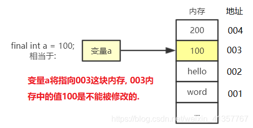
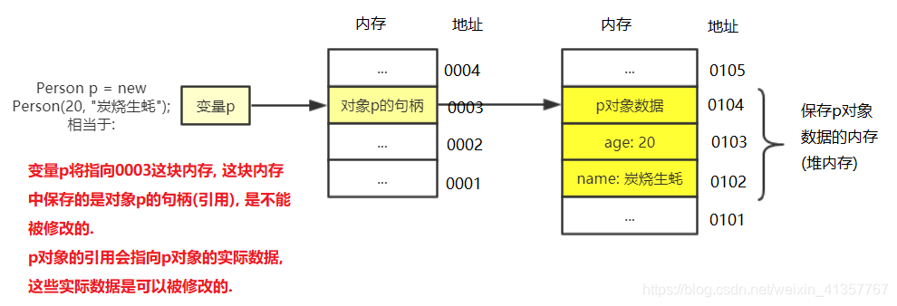

# final关键字的理解

## 一、修饰基本数据类型

当final修饰的是一个基本数据类型数据时, 这个数据的值在初始化后将不能被改变。final修饰基本数据类型时的内存示意图：



变量a在初始化后将永远指向003这块内存, 而这块内存在初始化后将永远保存数值100。

```java
final int a=100;
a=30;//编译器会报错提示无法将值赋给final变量a
```

## 二、修饰引用类型

当final修饰的是一个引用类型数据时, 也就是修饰一个对象时, 引用在初始化后将永远指向一个内存地址, 不可修改. 但是该内存地址中保存的对象信息, 是可以进行修改的.下面是final修饰引用数据类型的示意图



在上图中, 变量p指向了0003这块内存, 0003内存中保存的是对象p的句柄(存放对象p数据的内存地址), 这个句柄值是不能被修改的, 也就是变量p永远指向p对象. 但是p对象的数据是可以修改的。

```java
// 代码示例
public static void main(String[] args) {
    final Person p = new Person(20, "炭烧生蚝");
    p.setAge(18);   //可以修改p对象的数据
    System.out.println(p.getAge()); //输出18

    Person pp = new Person(30, "蚝生烧炭");
    p = pp; //这行代码会报错, 不能通过编译, 因为p经final修饰永远指向上面定义的p对象, 不能指向pp对象. 
}
```

## 三、final和常量池

final修饰的常量在编译期间会被放入常量池中。好处是: 不需要重复地创建相同的变量. 而常量池是Java的一项重要技术, 由final修饰的变量会在编译阶段放入到调用类的常量池中.

```java
/**
首先要介绍一点: 整数-127-128是默认加载到常量池里的, 也就是说如果涉及到-127-128的整数操作, 默认在编译期就能确定整数的值. 所以这里我故意选用数字2019(大于128), 避免数字默认就存在常量池中.
*/
public static void main(String[] args) {
    int n1 = 2019;          //普通变量
    final int n2 = 2019;    //final修饰的变量

    String s = "20190522";  
    String s1 = n1 + "0522";	//拼接字符串"20190512"
    String s2 = n2 + "0522";	

    System.out.println(s == s1);	//false
    System.out.println(s == s2);	//true
}
```

- 首先根据final修饰的常量会在编译期放到常量池的原则, n2会在编译期间放到常量池中.
- 然后s变量所对应的"20190522"字符串会放入到字符串常量池中, 并对外提供一个引用返回给s变量.
- 这时候拼接字符串s1, 由于n1对应的数据没有放入常量池中, 所以s1暂时无法拼接, 需要等程序加载运行时才能确定s1对应的值.
- 但在拼接s2的时候, 由于n2已经存在于常量池, 所以可以直接与"0522"拼接, 拼接出的结果是"20190522". 这时系统会查看字符串常量池, 发现已经存在字符串20190522, 所以直接返回20190522的引用. 所以s2和s指向的是同一个引用, 这个引用指向的是字符串常量池中的20190522.
- 当程序执行时, n1变量才有具体的指向.
- 当拼接s1的时候, 会创建一个新的String类型对象, 也就是说字符串常量池中的20190522会对外提供一个新的引用.
- 所以当s1与s用"=="判断时, 由于对应的引用不同, 会返回false. 而s2和s指向同一个引用, 返回true.

另外这里可以总结下哪些情况下字符串会被放入常量池？

- 字符串字面量。例如 `String s = "hello";`，这个字符串字面量 `"hello"` 会被自动放入字符串常量池中。如果相同的字符串已经存在于池中，则不会创建新的对象，而是返回已存在的引用。
- 使用intern()。

```java
String s1 = new String("hello");
String s2 = s1.intern(); // s2 将指向常量池中的 "hello"
```

- 类中的静态字符串常量在类加载时会被放入常量池

```java
public class MyClass {
    public static final String MY_STRING = "constant string";
}
```

## 四、final的内存语义

见《Java并发编程的艺术》P57
