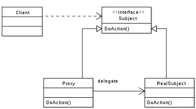

# 设计模式之代理模式

## 介绍

代理模式提供了对目标对象额外的访问方式，即通过代理对象访问目标对象，这样可以在不修改原目标对象的前提下，提供额外的功能操作，扩展目标对象的功能。

简言之，代理模式就是设置一个中间代理来控制访问原目标对象，以达到增强原对象的功能和简化访问方式。



**UML理解**

```
代理对象实现真实对象的同一个接口，然后代理对象引用真实对象，代理对象给真实对象的方法增强
```

举个例子，我们生活中经常到火车站去买车票，但是人一多的话，就会非常拥挤，于是就有了代售点，我们能从代售点买车票了。这其中就是代理模式的体现，代售点代理了火车站对象，提供购买车票的方法。

## 静态代理

这种代理方式需要代理对象和目标对象实现一样的接口。

```
优点：可以在不修改目标对象的前提下扩展目标对象的功能。
缺点：
1. 冗余。由于代理对象要实现与目标对象一致的接口，会产生过多的代理类。
2. 不易维护。一旦接口增加方法，目标对象与代理对象都要进行修改。
```

**举例：保存用户功能的静态代理实现**

- 接口类

```java
package com.proxy;
public interface IUserDao {
    public void save();
}
```

- 目标对象

```java
package com.proxy;
public class UserDao implements IUserDao{
    @Override
    public void save() {
        System.out.println("保存数据");
    }
}
```

- 静态代理对象：UserDapProxy 需要实现IUserDao接口！

```java
package com.proxy;
public class UserDaoProxy implements IUserDao{
    private IUserDao target;
    public UserDaoProxy(IUserDao target) {
        this.target = target;
    }
    @Override
    public void save() {
        System.out.println("开启事务");//扩展了额外功能
        target.save();
        System.out.println("提交事务");
    }
}

```

- 测试类：TestProxy

```java
package com.proxy;
import org.junit.Test;
public class StaticUserProxy {
    @Test
    public void testStaticProxy(){
        //目标对象
        IUserDao target = new UserDao();
        //代理对象
        UserDaoProxy proxy = new UserDaoProxy(target);
        proxy.save();
    }
}
```

## 动态代理

动态代理利用了JDK API，动态地在内存中构建代理对象，从而实现对目标对象的代理功能。动态代理又被称为JDK代理或接口代理。

静态代理与动态代理的区别主要在：

```
- 静态代理在编译时就已经实现，编译完成后代理类是一个实际的class文件
- 动态代理是在运行时动态生成的，即编译完成后没有实际的class文件，而是在运行时动态生成类字节码，并加载到JVM中
```

**特点：**
动态代理对象不需要实现接口，但是要求目标对象必须实现接口，否则不能使用动态代理。

JDK中生成代理对象主要涉及的类有:

- java.lang.reflect Proxy，主要方法为

```java
static Object    newProxyInstance(ClassLoader loader,  //指定当前目标对象使用类加载器
 Class<?>[] interfaces,    //目标对象实现的接口的类型
 InvocationHandler h      //事件处理器
) 
//返回一个指定接口的代理类实例，该接口可以将方法调用指派到指定的调用处理程序。
```

- java.lang.reflect InvocationHandler，主要方法为：

```java
 Object    invoke(Object proxy, Method method, Object[] args) 
// 在代理实例上处理方法调用并返回结果。
```

**举例：保存用户功能的动态代理实现**

- 接口类： IUserDao

```java
package com.proxy;
public interface IUserDao {
    public void save();
}
```

- 目标对象：UserDao

```java
package com.proxy;
public class UserDao implements IUserDao{
    @Override
    public void save() {
        System.out.println("保存数据");
    }
}
```

- 动态代理对象：UserProxyFactory

```java
package com.proxy;
import java.lang.reflect.InvocationHandler;
import java.lang.reflect.Method;
import java.lang.reflect.Proxy;
public class ProxyFactory {
    private Object target;// 维护一个目标对象
    public ProxyFactory(Object target) {
        this.target = target;
    }
    // 为目标对象生成代理对象
    public Object getProxyInstance() {
        return Proxy.newProxyInstance(target.getClass().getClassLoader(), target.getClass().getInterfaces(),
                new InvocationHandler() {
                    @Override
                    public Object invoke(Object proxy, Method method, Object[] args) throws Throwable {
                        System.out.println("开启事务");

                        // 执行目标对象方法
                        Object returnValue = method.invoke(target, args);

                        System.out.println("提交事务");
                        return null;
                    }
                });
    }
}
```

可以看出，是在运行时动态生成类字节码，目标对象自定义事件处理后用类加载器，并加载到JVM中。

- 测试类：TestProxy

```java
package com.proxy;
import org.junit.Test;
public class TestProxy {
    @Test
    public void testDynamicProxy (){
        IUserDao target = new UserDao();
        System.out.println(target.getClass());  //输出目标对象信息
        IUserDao proxy = (IUserDao) new ProxyFactory(target).getProxyInstance();
        System.out.println(proxy.getClass());  //输出代理对象信息
        proxy.save();  //执行代理方法
    }
}
```

## cglib代理

cglib (Code Generation Library )是一个第三方代码生成类库，运行时在内存中动态生成一个子类对象从而实现对目标对象功能的扩展。

**cglib特点**

- JDK的动态代理有一个限制，就是使用动态代理的对象必须实现一个或多个接口。如果想代理没有实现接口的类，就可以使用CGLIB实现。（例如上面的动态代理对象必须要实现一个接口）
- CGLIB是一个强大的高性能的代码生成包，它可以在运行期扩展Java类与实现Java接口。它广泛的被许多AOP的框架使用，例如Spring AOP和dynaop，为他们提供方法的interception（拦截）。
- CGLIB包的底层是通过使用一个小而快的字节码处理框架ASM，来转换字节码并生成新的类。不鼓励直接使用ASM，因为它需要你对JVM内部结构包括class文件的格式和指令集都很熟悉。

**cglib与动态代理最大的区别就是**

- 使用动态代理的对象必须实现一个或多个接口
- 使用cglib代理的对象则无需实现接口，达到代理类无侵入。

使用cglib需要引入cglib的jar包，如果你已经有spring-core的jar包，则无需引入，因为spring中包含了cglib。

**cglib的maven依赖**

```xml
<dependency>
    <groupId>cglib</groupId>
    <artifactId>cglib</artifactId>
    <version>3.2.5</version>
</dependency>
```

**举例：保存用户功能的动态代理实现**

- 目标对象：UserDao

```java
package com.cglib;
//不用像JDK动态代理那样还要实现接口
public class UserDao{
    public void save() {
        System.out.println("保存数据");
    }
}
```

- 代理对象：ProxyFactory

```java
package com.cglib;
import java.lang.reflect.Method;
import net.sf.cglib.proxy.Enhancer;
import net.sf.cglib.proxy.MethodInterceptor;
import net.sf.cglib.proxy.MethodProxy;
public class ProxyFactory implements MethodInterceptor{
    private Object target;//维护一个目标对象
    public ProxyFactory(Object target) {
        this.target = target;
    }
    //为目标对象生成代理对象
    public Object getProxyInstance() {
        //工具类
        Enhancer en = new Enhancer();
        //设置父类
        en.setSuperclass(target.getClass());
        //设置回调函数
        en.setCallback(this);
        //创建子类对象代理
        return en.create();
    }

    @Override
    public Object intercept(Object obj, Method method, Object[] args, MethodProxy proxy) throws Throwable {
        System.out.println("开启事务");
        // 执行目标对象的方法
        Object returnValue = method.invoke(target, args);
        System.out.println("关闭事务");
        return null;
    }
}
```

- 测试类：TestProxy

```java
package com.cglib;
import org.junit.Test;
public class TestProxy {
    @Test
    public void testCglibProxy(){
        //目标对象
        UserDao target = new UserDao();
        System.out.println(target.getClass());
        //代理对象
        UserDao proxy = (UserDao) new ProxyFactory(target).getProxyInstance();
        System.out.println(proxy.getClass());
        //执行代理对象方法
        proxy.save();
    }
}
```
## 总结

- 静态代理实现较简单，只要代理对象对目标对象进行包装，即可实现增强功能，但静态代理只能为一个目标对象服务，如果目标对象过多，则会产生很多代理类。静态代理在编译时产生class字节码文件，可以直接使用，效率高。（从JVM角度分析，类过多会占用方法区空间，类太多甚至会OOM）
- JDK动态代理需要目标对象实现业务接口，通过反射代理方法，比较消耗系统性能，但可以减少代理类的数量，使用更灵活。
- cglib代理无需实现接口，通过生成类字节码实现代理，比反射稍快，不存在性能问题，但cglib会继承目标对象，需要重写方法，所以目标对象不能为final类。


