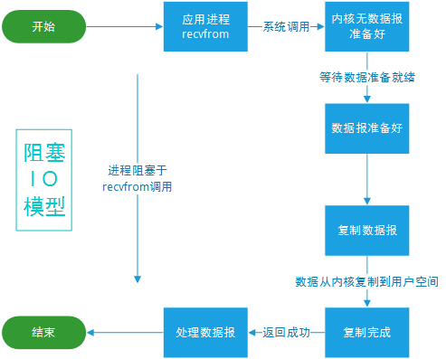
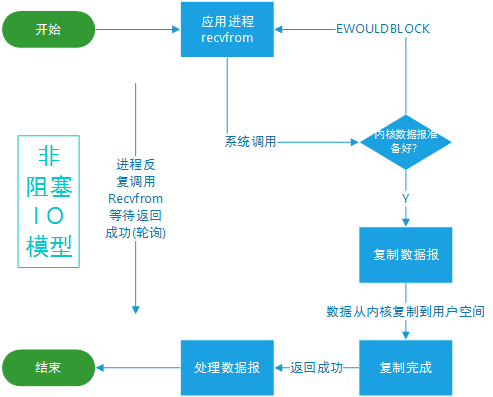

# 1.3.1 BIO、NIO

Java的IO分为两大类

- 阻塞IO（Blocking IO），基于字节流和字符流，以阻塞式IO操作为主。如FileInputStream、InputStreamReader等
- 非阻塞IO（NIO），基于通道（Channel）和缓冲区（Buffer）进行操作，允许线程在等待IO时执行其它任务。如ByteBuffer、FileChannel等

**阻塞 I/O（Blocking I/O）**：在这种模型中，I/O 操作是阻塞的，即执行 I/O 操作时，线程会被阻塞，直到操作完成。在阻塞 I/O 模型中，每个连接都需要一个线程来处理。因此，对于大量并发连接的场景，阻塞 I/O 模型的性能较差。

**非阻塞 I/O（Non-blocking I/O）**：在这种模型中，I/O 操作不会阻塞线程。当数据尚未准备好时，I/O 调用会立即返回。线程可以继续执行其他任务，然后在适当的时候再次尝试执行 I/O 操作。非阻塞 I/O 模型允许单个线程同时处理多个连接，但可能需要在应用程序级别进行复杂的调度和管理。

除了前面提到的阻塞 IO 和非阻塞 IO 模型，还有另外三种 IO 模型，分别是多路复用、信号驱动和异步 IO。

**I/O 多路复用（I/O Multiplexing）模型**使用操作系统提供的多路复用功能（如 select、poll、epoll 等），使得单个线程可以同时处理多个 I/O 事件。当某个连接上的数据准备好时，操作系统会通知应用程序。这样，应用程序可以在一个线程中处理多个并发连接，而不需要为每个连接创建一个线程。

**信号驱动 I/O（Signal-driven I/O）模型**中，应用程序可以向操作系统注册一个信号处理函数，当某个 I/O 事件发生时，操作系统会发送一个信号通知应用程序。应用程序在收到信号后处理相应的 I/O 事件。这种模型与非阻塞 I/O 类似，也需要在应用程序级别进行事件管理和调度。

**异步 I/O（Asynchronous I/O）模型**与同步 I/O 模型的主要区别在于，异步 I/O 操作会在后台运行，当操作完成时，操作系统会通知应用程序。应用程序不需要等待 I/O 操作的完成，可以继续执行其他任务。这种模型适用于处理大量并发连接，且可以简化应用程序的设计和开发。

- 同步：在执行 I/O 操作时，应用程序需要等待操作的完成。同步操作会导致线程阻塞，直到操作完成。同步 I/O 包括阻塞 I/O、非阻塞 I/O 和 I/O 多路复用。
- 异步：在执行 I/O 操作时，应用程序不需要等待操作的完成。异步操作允许应用程序在 I/O 操作进行时继续执行其他任务。异步 I/O 模型包括信号驱动 I/O 和异步 I/O。

假设你现在是个大厨（炖个老母鸡汤，切点土豆丝/姜丝/葱丝）：

- 同步/阻塞：你站在锅边，一直等到汤炖好，期间不能做其他事情，直到汤炖好才去处理其他任务。
- 同步/非阻塞：你不断地查看锅里的汤，看是否炖好。在检查的间隙，你可以处理其他任务，如切菜。但你需要不断地切换任务，确保汤炖好了就可以处理。
- 异步/信号驱动：你给锅安装一个传感器，当汤炖好时，传感器会发出信号提醒你。在此期间，你可以处理其他任务，而不用担心错过汤炖好的时机。
- 异步 I/O：你请了一个助手，让他负责炖汤。当汤炖好时，助手会通知你。你可以专心处理其他任务，而无需关心炖汤的过程。

**简单总结一下，IO 模型主要有五种：阻塞 I/O、非阻塞 I/O、多路复用、信号驱动和异步 I/O**。

- 阻塞 I/O：应用程序执行 I/O 操作时，会一直等待数据传输完成，期间无法执行其他任务。
- 非阻塞 I/O：应用程序执行 I/O 操作时，如果数据未准备好，立即返回错误状态，不等待数据传输完成，可执行其他任务。
- 多路复用：允许一个线程同时管理多个 I/O 连接，适用于高并发、低延迟和高吞吐量场景，减少线程数量和上下文切换开销。
- 信号驱动：依赖信号通知应用程序 I/O 事件，适用于低并发、低延迟和低吞吐量场景，需要为每个 I/O 事件创建信号和信号处理函数。
- 异步 I/O：应用程序发起 I/O 操作后，内核负责数据传输过程，完成后通知应用程序。应用程序无需等待数据传输，可执行其他任务。

注意：Hutool的文件工具是基于BIO，EasyExcel是基于NIO

