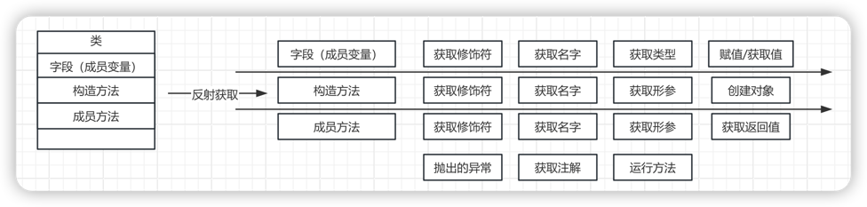
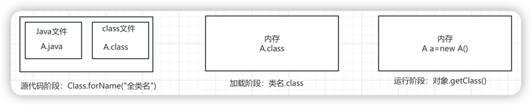

# 1.4.2 反射

## 一、概念

反射就是可以从类里面拿字段、构造方法、成员方法。



比如IDEA编辑器里面的提示信息就是用的反射。

* 利用**反射**创建的对象**可以无视修饰符**调用类里面的内容

* 可以跟**配置文件结合起来使用**，把要创建的对象信息和方法写在配置文件中。

  读取到什么类，就创建什么类的对象

  读取到什么方法，就调用什么方法

  此时当需求变更的时候不需要修改代码，只要修改配置文件即可。

## 二、反射获取class对象

获取class对象的三种方式：

- Class.forName("全类名")
- 类名.class
- 对象.getClass()

这三种方式对应Java里面三种不同的阶段



```java
//1.Class这个类里面的静态方法forName
//Class.forName("类的全类名")： 全类名 = 包名 + 类名
Class clazz1 = Class.forName("com.itheima.reflectdemo.Student");
//源代码阶段获取 --- 先把Student加载到内存中，再获取字节码文件的对象
//clazz 就表示Student这个类的字节码文件对象。
//就是当Student.class这个文件加载到内存之后，产生的字节码文件对象


//2.通过class属性获取
//类名.class
Class clazz2 = Student.class;

//因为class文件在硬盘中是唯一的，所以，当这个文件加载到内存之后产生的对象也是唯一的
System.out.println(clazz1 == clazz2);//true


//3.通过Student对象获取字节码文件对象
Student s = new Student();
Class clazz3 = s.getClass();
System.out.println(clazz1 == clazz2);//true
System.out.println(clazz2 == clazz3);//true
```

## 三、反射获取构造方法

get表示获取

​	Declared表示私有

​	最后的s表示所有，复数形式

​	如果当前获取到的是私有的，必须要临时修改访问权限，否则无法使用

| 方法名                                                       | 说明                              |
| ------------------------------------------------------------ | --------------------------------- |
| Constructor<?>[] getConstructors()                           | 获得所有的构造（只能public修饰）  |
| Constructor<?>[] getDeclaredConstructors()                   | 获得所有的构造（包含private修饰） |
| Constructor<T> getConstructor(Class<?>... parameterTypes)    | 获取指定构造（只能public修饰）    |
| Constructor<T> getDeclaredConstructor(Class<?>... parameterTypes) | 获取指定构造（包含private修饰）   |

代码示例：

```java
public class ReflectDemo2 {
    public static void main(String[] args) throws ClassNotFoundException, NoSuchMethodException {
        //1.获得整体（class字节码文件对象）
        Class clazz = Class.forName("com.itheima.reflectdemo.Student");


        //2.获取构造方法对象
        //获取所有构造方法（public）
        Constructor[] constructors1 = clazz.getConstructors();
        for (Constructor constructor : constructors1) {
            System.out.println(constructor);
        }

        System.out.println("=======================");

        //获取所有构造（带私有的）
        Constructor[] constructors2 = clazz.getDeclaredConstructors();

        for (Constructor constructor : constructors2) {
            System.out.println(constructor);
        }
        System.out.println("=======================");

        //获取指定的空参构造
        Constructor con1 = clazz.getConstructor();
        System.out.println(con1);

        Constructor con2 = clazz.getConstructor(String.class,int.class);
        System.out.println(con2);

        System.out.println("=======================");
        //获取指定的构造(所有构造都可以获取到，包括public包括private)
        Constructor con3 = clazz.getDeclaredConstructor();
        System.out.println(con3);
        //了解 System.out.println(con3 == con1);
        //每一次获取构造方法对象的时候，都会新new一个。

        Constructor con4 = clazz.getDeclaredConstructor(String.class);
        System.out.println(con4);
    }
}
```

### 1、获取构造方法并创建对象

涉及到的方法：newInstance

代码示例：

```java
//首先要有一个javabean类
public class Student {
    private String name;

    private int age;


    public Student() {

    }

    public Student(String name) {
        this.name = name;
    }

    private Student(String name, int age) {
        this.name = name;
        this.age = age;
    }


    /**
     * 获取
     * @return name
     */
    public String getName() {
        return name;
    }

    /**
     * 设置
     * @param name
     */
    public void setName(String name) {
        this.name = name;
    }

    /**
     * 获取
     * @return age
     */
    public int getAge() {
        return age;
    }

    /**
     * 设置
     * @param age
     */
    public void setAge(int age) {
        this.age = age;
    }

    public String toString() {
        return "Student{name = " + name + ", age = " + age + "}";
    }
}


//测试类中的代码：
//需求1：
//获取空参，并创建对象

//1.获取整体的字节码文件对象
Class clazz = Class.forName("com.itheima.a02reflectdemo1.Student");
//2.获取空参的构造方法
Constructor con = clazz.getConstructor();
//3.利用空参构造方法创建对象
Student stu = (Student) con.newInstance();
System.out.println(stu);


System.out.println("=============================================");


//测试类中的代码：
//需求2：
//获取带参构造，并创建对象
//1.获取整体的字节码文件对象
Class clazz = Class.forName("com.itheima.a02reflectdemo1.Student");
//2.获取有参构造方法
Constructor con = clazz.getDeclaredConstructor(String.class, int.class);
//3.临时修改构造方法的访问权限（暴力反射）
con.setAccessible(true);
//4.直接创建对象
Student stu = (Student) con.newInstance("zhangsan", 23);
System.out.println(stu);
```


## 四、反射获取成员变量

规则：

​	get表示获取

​	Declared表示私有

​	最后的s表示所有，复数形式

​	如果当前获取到的是私有的，必须要临时修改访问权限，否则无法使用

方法名：

| 方法名                              | 说明                                         |
| ----------------------------------- | -------------------------------------------- |
| Field[] getFields()                 | 返回所有成员变量对象的数组（只能拿public的） |
| Field[] getDeclaredFields()         | 返回所有成员变量对象的数组，存在就能拿到     |
| Field getField(String name)         | 返回单个成员变量对象（只能拿public的）       |
| Field getDeclaredField(String name) | 返回单个成员变量对象，存在就能拿到           |

代码示例：

```java
public class ReflectDemo4 {
    public static void main(String[] args) throws ClassNotFoundException, NoSuchFieldException {
        //获取成员变量对象

        //1.获取class对象
        Class clazz = Class.forName("com.itheima.reflectdemo.Student");

        //2.获取成员变量的对象（Field对象)只能获取public修饰的
        Field[] fields1 = clazz.getFields();
        for (Field field : fields1) {
            System.out.println(field);
        }

        System.out.println("===============================");

        //获取成员变量的对象（public + private）
        Field[] fields2 = clazz.getDeclaredFields();
        for (Field field : fields2) {
            System.out.println(field);
        }

        System.out.println("===============================");
        //获得单个成员变量对象
        //如果获取的属性是不存在的，那么会报异常
        //Field field3 = clazz.getField("aaa");
        //System.out.println(field3);//NoSuchFieldException

        Field field4 = clazz.getField("gender");
        System.out.println(field4);

        System.out.println("===============================");
        //获取单个成员变量（私有）
        Field field5 = clazz.getDeclaredField("name");
        System.out.println(field5);

    }
}


public class Student {
    private String name;

    private int age;

    public String gender;

    public String address;


    public Student() {
    }

    public Student(String name, int age, String address) {
        this.name = name;
        this.age = age;
        this.address = address;
    }


    public Student(String name, int age, String gender, String address) {
        this.name = name;
        this.age = age;
        this.gender = gender;
        this.address = address;
    }

    /**
     * 获取
     * @return name
     */
    public String getName() {
        return name;
    }

    /**
     * 设置
     * @param name
     */
    public void setName(String name) {
        this.name = name;
    }

    /**
     * 获取
     * @return age
     */
    public int getAge() {
        return age;
    }

    /**
     * 设置
     * @param age
     */
    public void setAge(int age) {
        this.age = age;
    }

    /**
     * 获取
     * @return gender
     */
    public String getGender() {
        return gender;
    }

    /**
     * 设置
     * @param gender
     */
    public void setGender(String gender) {
        this.gender = gender;
    }

    /**
     * 获取
     * @return address
     */
    public String getAddress() {
        return address;
    }

    /**
     * 设置
     * @param address
     */
    public void setAddress(String address) {
        this.address = address;
    }

    public String toString() {
        return "Student{name = " + name + ", age = " + age + ", gender = " + gender + ", address = " + address + "}";
    }
}

```

### 1、获取成员变量并获取值和修改值

| 方法                                | 说明   |
| ----------------------------------- | ------ |
| void set(Object obj, Object value） | 赋值   |
| Object get(Object obj)              | 获取值 |

代码示例：

```java
public class ReflectDemo5 {
    public static void main(String[] args) throws ClassNotFoundException, NoSuchFieldException, IllegalAccessException {
        Student s = new Student("zhangsan",23,"广州");
        Student ss = new Student("lisi",24,"北京");

        //需求：
        //利用反射获取成员变量并获取值和修改值

        //1.获取class对象
        Class clazz = Class.forName("com.itheima.reflectdemo.Student");

        //2.获取name成员变量
        //field就表示name这个属性的对象
        Field field = clazz.getDeclaredField("name");
        //临时修饰他的访问权限
        field.setAccessible(true);

        //3.设置(修改)name的值
        //参数一：表示要修改哪个对象的name？
        //参数二：表示要修改为多少？
        field.set(s,"wangwu");

        //3.获取name的值
        //表示我要获取这个对象的name的值
        String result = (String)field.get(s);

        //4.打印结果
        System.out.println(result);

        System.out.println(s);
        System.out.println(ss);

    }
}


public class Student {
    private String name;
    private int age;
    public String gender;
    public String address;


    public Student() {
    }

    public Student(String name, int age, String address) {
        this.name = name;
        this.age = age;
        this.address = address;
    }


    public Student(String name, int age, String gender, String address) {
        this.name = name;
        this.age = age;
        this.gender = gender;
        this.address = address;
    }

    /**
     * 获取
     * @return name
     */
    public String getName() {
        return name;
    }

    /**
     * 设置
     * @param name
     */
    public void setName(String name) {
        this.name = name;
    }

    /**
     * 获取
     * @return age
     */
    public int getAge() {
        return age;
    }

    /**
     * 设置
     * @param age
     */
    public void setAge(int age) {
        this.age = age;
    }

    /**
     * 获取
     * @return gender
     */
    public String getGender() {
        return gender;
    }

    /**
     * 设置
     * @param gender
     */
    public void setGender(String gender) {
        this.gender = gender;
    }

    /**
     * 获取
     * @return address
     */
    public String getAddress() {
        return address;
    }

    /**
     * 设置
     * @param address
     */
    public void setAddress(String address) {
        this.address = address;
    }

    public String toString() {
        return "Student{name = " + name + ", age = " + age + ", gender = " + gender + ", address = " + address + "}";
    }
}

```

## 五、反射获取成员方法

规则：

​	get表示获取

​	Declared表示私有

​	最后的s表示所有，复数形式

​	如果当前获取到的是私有的，必须要临时修改访问权限，否则无法使用

| 方法名                                                       | 说明                                         |
| ------------------------------------------------------------ | -------------------------------------------- |
| Method[] getMethods()                                        | 返回所有成员方法对象的数组（只能拿public的） |
| Method[] getDeclaredMethods()                                | 返回所有成员方法对象的数组，存在就能拿到     |
| Method getMethod(String name, Class<?>... parameterTypes)    | 返回单个成员方法对象（只能拿public的）       |
| Method getDeclaredMethod(String name, Class<?>... parameterTypes) | 返回单个成员方法对象，存在就能拿到           |

代码示例：

```java
public class ReflectDemo6 {
    public static void main(String[] args) throws ClassNotFoundException, NoSuchMethodException {
        //1.获取class对象
        Class<?> clazz = Class.forName("com.itheima.reflectdemo.Student");


        //2.获取方法
        //getMethods可以获取父类中public修饰的方法
        Method[] methods1 = clazz.getMethods();
        for (Method method : methods1) {
            System.out.println(method);
        }

        System.out.println("===========================");
        //获取所有的方法（包含私有）
        //但是只能获取自己类中的方法
        Method[] methods2 = clazz.getDeclaredMethods();
        for (Method method : methods2) {
            System.out.println(method);
        }

        System.out.println("===========================");
        //获取指定的方法（空参）
        Method method3 = clazz.getMethod("sleep");
        System.out.println(method3);

        Method method4 = clazz.getMethod("eat",String.class);
        System.out.println(method4);

        //获取指定的私有方法
        Method method5 = clazz.getDeclaredMethod("playGame");
        System.out.println(method5);
    }
}

```

### 1、获取成员方法并运行

方法

 Object invoke(Object obj, Object... args) ：运行方法

参数一：用obj对象调用该方法

参数二：调用方法的传递的参数（如果没有就不写）

返回值：方法的返回值（如果没有就不写）

代码示例：

```java
package com.itheima.a02reflectdemo1;

import java.lang.reflect.InvocationTargetException;
import java.lang.reflect.Method;

public class ReflectDemo6 {
    public static void main(String[] args) throws ClassNotFoundException, NoSuchMethodException, InvocationTargetException, IllegalAccessException {
        //1.获取字节码文件对象
        Class clazz = Class.forName("com.itheima.a02reflectdemo1.Student");
		
        //2.获取一个对象
        //需要用这个对象去调用方法
        Student s = new Student();
        
        //3.获取一个指定的方法
        //参数一：方法名
        //参数二：参数列表，如果没有可以不写
        Method eatMethod = clazz.getMethod("eat",String.class);
        
        //运行
        //参数一：表示方法的调用对象
        //参数二：方法在运行时需要的实际参数
        //注意点：如果方法有返回值，那么需要接收invoke的结果
        //如果方法没有返回值，则不需要接收
        String result = (String) eatMethod.invoke(s, "重庆小面");
        System.out.println(result);

    }
}


public class Student {
    private String name;
    private int age;
    public String gender;
    public String address;


    public Student() {

    }

    public Student(String name) {
        this.name = name;
    }

    private Student(String name, int age) {
        this.name = name;
        this.age = age;
    }

    /**
     * 获取
     * @return name
     */
    public String getName() {
        return name;
    }

    /**
     * 设置
     * @param name
     */
    public void setName(String name) {
        this.name = name;
    }

    /**
     * 获取
     * @return age
     */
    public int getAge() {
        return age;
    }

    /**
     * 设置
     * @param age
     */
    public void setAge(int age) {
        this.age = age;
    }

    public String toString() {
        return "Student{name = " + name + ", age = " + age + "}";
    }

    private void study(){
        System.out.println("学生在学习");
    }

    private void sleep(){
        System.out.println("学生在睡觉");
    }

    public String eat(String something){
        System.out.println("学生在吃" + something);
        return "学生已经吃完了，非常happy";
    }
}
```

## 六、反射的好处

​	你觉得反射好不好？好，有两个方向

​	第一个方向：无视修饰符访问类中的内容。但是这种操作在开发中一般不用，都是框架底层来用的。

​	第二个方向：反射可以跟配置文件结合起来使用，动态的创建对象，动态的调用方法。


