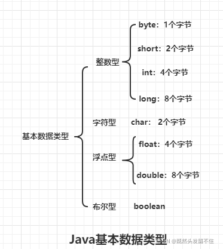
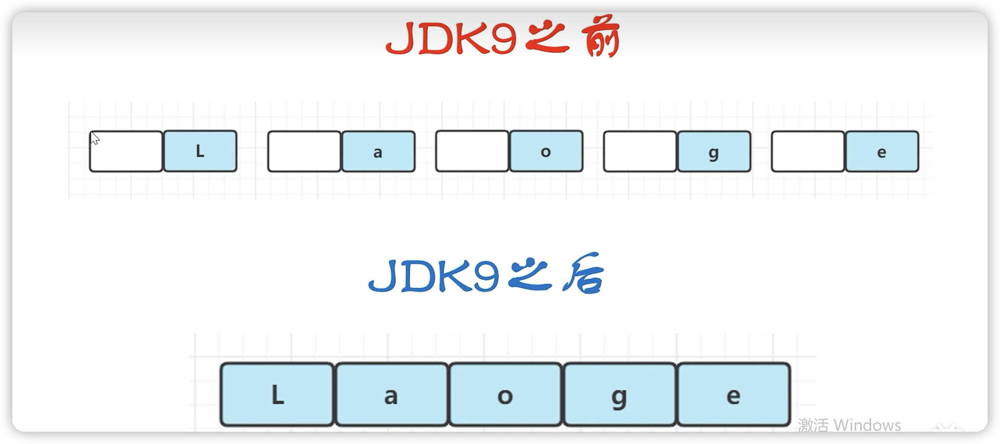
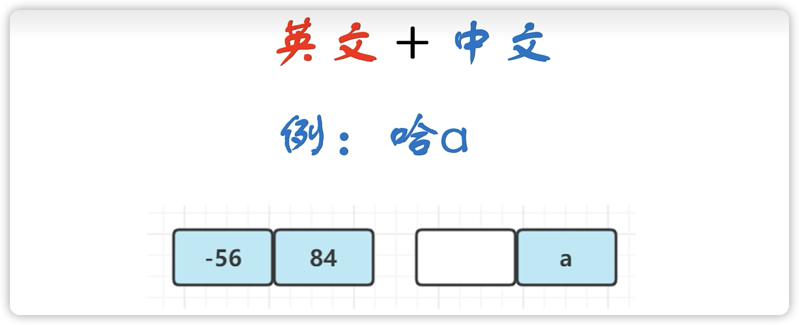
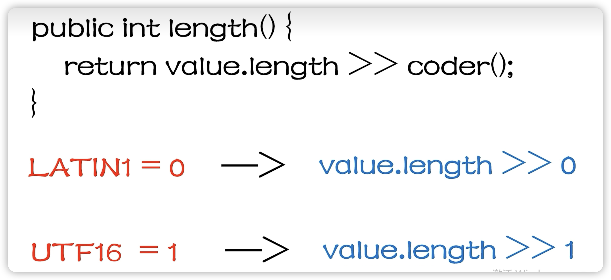
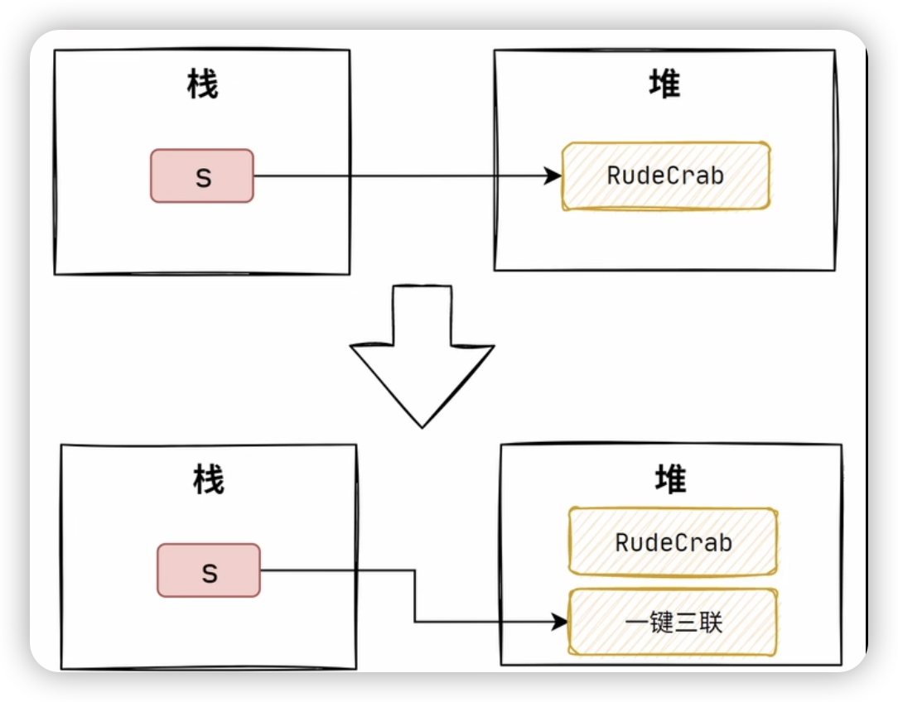
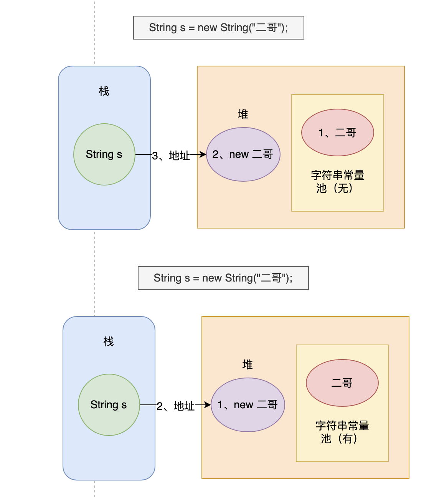
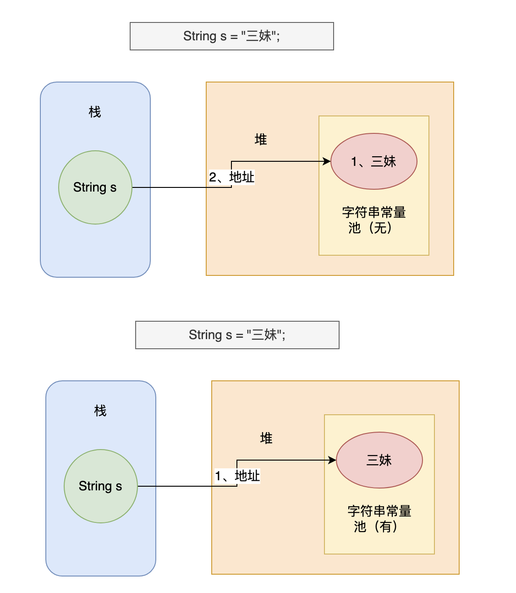
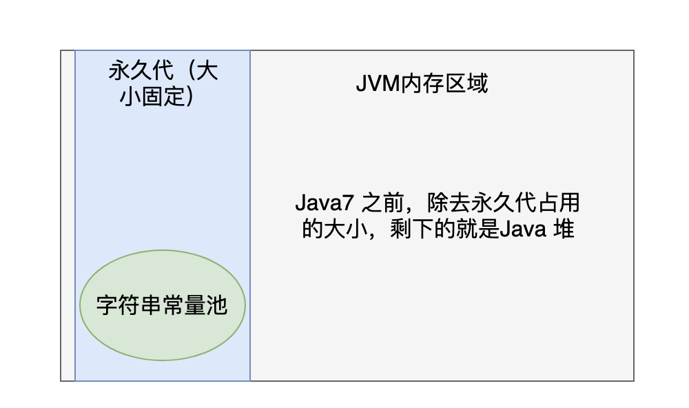
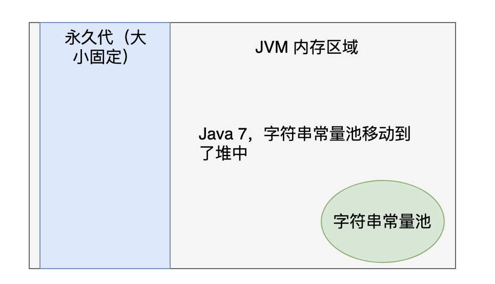
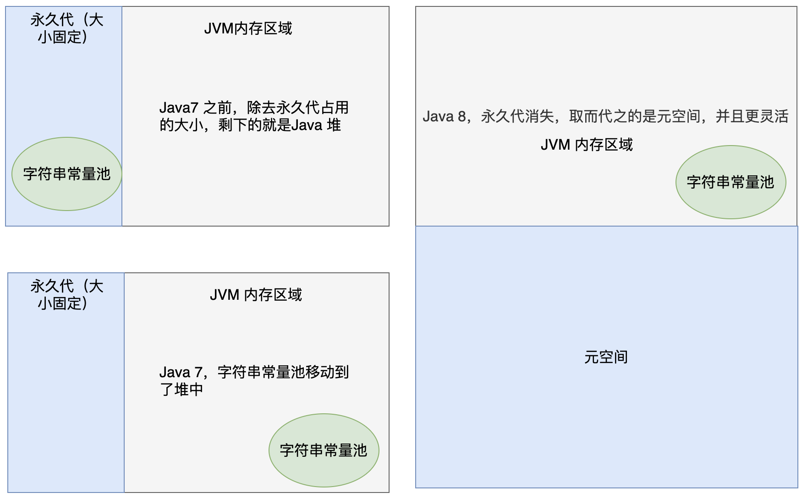

# 1.4.3 String看这篇就够了

## 一、字符串源码解读

### String类的声明

```java
public final class String
    implements java.io.Serializable, Comparable<String>, CharSequence {
}
```

```
1、String类是final的，是不可变的，意味着它不能被子类继承，遇到字符串拼接的时候就可以考虑StringBuffer、StringBuilder
2、String类实现了Serializable接口，意味着它可以序列化
3、String类实现了Comparable接口，意味着最好不要用‘==’来比较两个字符串是否相等，而应该用compareTo()方法去比较。
```


### JDK9的String底层为什么由char数组优化为byte数组



JDK9的改变：

- String 类的源码已经由char[]优化为了byte[]来存储字符串内容
- 增加了private final byte coder的coder字段

改变原因：

- 节省内存
- 减少了GC

**char[]改变成byte[]原因：**

JDK9之前众所周知char是2个子节，byte是1个字节，并且使用UTF8编码。考虑到两个子节才能存储1个中文汉字，1个子节就可以存储1个英文字母，为了兼容2个子节存储的中文或者需要特殊字符，所以索性全用了char数组，char[]数组既能存中文，又能存英文。
为什么JDK9变成了byte[]呢，因为1个英文就用了2个子节，非常占用内存空间，整整多了1倍内存空间使用。

```java
char[] -> byte[]
```

JDK9版本将两个字节的char数组改成了一个字节的byte数组，但这样就不能去兼容中文了，中文也就不能用String字符串表示了，所以这时候出了coder字段。

```java
private final byte coder;
```

这个字段就是为了兼容中文、特殊符号等存储两个字节的字符，可以看下coder字段是什么：

```java
private final byte coder;
//static final byte LATIN1=0;
//static final byte UTF16=1;
```

coder字段就是一个编码的表示，有两个编码，拉丁和UTF16，0代表拉丁字符编码集，1代表UTF16。拉丁编码集是用单个字节来表示这个字符的，但是UTF16采用双字节来表示这个字符的。所以可以根据存储内容不同去判断到底使用哪一种编码这个字符。比如中文的时候可以用UTF16双字节的存储方式去存储，那英文的时候就可以用拉丁编码去存储单子节的字符。

通过画图来直观表示下空间是如何节省的：



比如存储Laoge这5个字母，JDK9之前是用的char数组，一个L就占了1个字节，但是用了2个字节的空间去存储它。相当于左边的字节是没使用的，是空的。然后以此类推，每个字母用2个字节的空间去存储它，相当于浪费了1倍的空间。JDK9优化完之后1个字母就用1个字节去存储就够了。

JDK9之后英文➕中文在一起是怎么表示的？



"哈"是一个中文，必须占2个字节，-56和-84，这两个字节代表“哈”这个汉字。然后“a"也必须用两个字节去存储，因为这个字母和汉字组合在一块儿了，所以必须得听汉字的。中文和英文混合在一块就不能用拉丁字符编码了，因为“哈”太大住不下，必须得住2个字节，所以这里的用UTF16对“哈a”进行编码，所以“a”也就占2个字节。

JDK9求字符串的长度有一个改变：

```java
public int length(){
  return value.length >> coder();
}
```

JDK9是直接value.length然后右移1个coder，之前JDK8是直接返回value.length，没有右移的操作。JDK9为什么要有右移的操作呢？



value.length >> 0，数字的大小是没有任何改变的。因为拉丁是单子节的，一个字节存储一个字符，那么字节的长度也就是字符串的长度，value就是那个byte数组。然后这个UTF16是用1去表示的，value.length往右移1位，相当于value.length除以2，因为UTF16是双字节，两个字节才能代表1个汉字，相当于两个byte数组才能去存1个汉字，那么在求字符串的长度就要除以2。例如上面的“哈a”，两个字节才能存储一个哈的汉字，所以在计算这个字符串长度，就要除以2。

补充：char a='a'，在内存中占2个字节，而getBytes(StandardCharsets.UTF_8).length输出只有1个字节，原因是将字符转换成字节数组时，由于 'a' 属于ASCII字符范围，所以在UTF-8编码中只需要1个字节来表示。

### String类的hashCode方法

每一个字符串都会有一个 hash 值，这个哈希值在很大概率是不会重复的，因此 String 很适合来作为HashMap（后面会细讲）的键值。

String类的hashCode方法

```java
private int hash; // 缓存字符串的哈希码

public int hashCode() {
    int h = hash; // 从缓存中获取哈希码
    // 如果哈希码未被计算过（即为 0）且字符串不为空，则计算哈希码
    if (h == 0 && value.length > 0) {
        char val[] = value; // 获取字符串的字符数组

        // 遍历字符串的每个字符来计算哈希码
        for (int i = 0; i < value.length; i++) {
            h = 31 * h + val[i]; // 使用 31 作为乘法因子
        }
        hash = h; // 缓存计算后的哈希码
    }
    return h; // 返回哈希码
}
```

hashCode 方法首先检查是否已经计算过哈希码，如果已经计算过，则直接返回缓存的哈希码。否则，方法将使用一个循环遍历字符串的所有字符，并使用一个乘法和加法的组合计算哈希码。

这种计算方法被称为“31 倍哈希法”。计算完成后，将得到的哈希值存储在 hash 成员变量中，以便下次调用 hashCode 方法时直接返回该值，而不需要重新计算。这是一种缓存优化，称为“惰性计算”。

31 倍哈希法（31-Hash）是一种简单有效的字符串哈希算法，常用于对字符串进行哈希处理。该算法的基本思想是将字符串中的每个字符乘以一个固定的质数 31 的幂次方，并将它们相加得到哈希值。具体地，假设字符串为 s，长度为 n，则 31 倍哈希值计算公式如下：

```
H(s) = (s[0] * 31^(n-1)) + (s[1] * 31^(n-2)) + ... + (s[n-1] * 31^0)
```

其中，s[i]表示字符串 s 中第 i 个字符的 ASCII 码值，`^`表示幂运算。

31 倍哈希法的优点在于简单易实现，计算速度快，同时也比较均匀地分布在哈希表中。

### String类有哪些方法

hashCode()、subString()、indexOf()、length()、isEmpty()、charAt()、valueOf()、getBytes()、trim()

## 二、字符串为什么不可变

什么是不可变性？

如果一个对象创建后，我们可以修改对象的属性，那我们就会说这个对象是可变的，反之则是不可变的。

```java
Person p=new Person(18);//Person对象是可变的
p.setAge(20);

String s="abc";//String对象是不可变的
```

新手可能疑惑，String怎么就不可变了？

```java
String s="RudeCrab";
s="一键三连";
```

这种声明了String然后重新赋值，不就可变了吗？

注意：对象的不可变性是指对象本身的属性或者说本身的数据不会改变，将变量重新赋值，那是创建了一个新对象，然后将新对象的引用赋值给了变量。之前的对象是没有收到影响的。



- String 类被 final 关键字修饰，所以它不会有子类，这就意味着没有子类可以重写它的方法，改变它的行为。
- String 类的数据存储在 `char[]` 数组中，而这个数组也被 final 关键字修饰并且是私有成员变量，这就表示 String 对象是没法被修改的，只要初始化一次，值就确定了。

```java
public final class String
    implements java.io.Serializable, Comparable<String>, CharSequence {
    /** The value is used for character storage. */
    private final char value[];
}
```

很多人说String不可变是因为被final修饰，但是并不准确，如下：

```
1. char被final修饰代表它不可指向新的数组，又不能代表数组本身的数据不能改变
2. 真正不可变的原因是char还被private修饰了，并且String没有暴露和提供任何修改字符数组的方法，一些字符串操作都是返回的新String对象。绝对不会影响原数据
3. String类型还被final修饰了，代表不可被继承，从而杜绝了子类覆盖父类行为的可能性。
```

为什么呢Java要这样设计呢？

- Java 会将相同内容的字符串存储在字符串常量池中。这样，具有相同内容的字符串变量可以指向同一个 String 对象，节省内存空间字符串不可变了，字符串常量池才会发挥作用，如果字符串可变，字符串常量池谈何复用呢。
- 可以保证String的hash码也不会变，因此计算1次hash码后就可以将其缓存，再用到时就无需计算了，性能更高。
- 因为hash码不会变，所以可以放心的使用和哈希计算相关的对象，比如HashMap、HashSet。如果String的哈希码会改变，就会影响到这些对象的哈希计算，从而导致预期之外的结果。比如之前存了String对象，到后来就找不到原对象了。
- 不可变对象都是线程安全的，因为不用担心当前线程使用的对象会被其它线程修改。

## 三、字符串常量池

### new String("二哥")创建了几个对象

使用 new 关键字创建一个字符串对象时，Java 虚拟机会先在字符串常量池中查找有没有‘二哥’这个字符串对象，如果有，就不会在字符串常量池中创建‘二哥’这个对象了，直接在堆中创建一个‘二哥’的字符串对象，然后将堆中这个‘二哥’的对象地址返回赋值给变量 s。如果没有，先在字符串常量池中创建一个‘二哥’的字符串对象，然后再在堆中创建一个‘二哥’的字符串对象，然后将堆中这个‘二哥’的字符串对象地址返回赋值给变量 s。



在 Java 中，栈上存储的是基本数据类型的变量和对象的引用，而对象本身则存储在堆上。

对于这行代码 `String s = new String("二哥");`它创建了两个对象：一个是字符串对象 "二哥"，它被添加到了字符串常量池中，另一个是通过 `new String()` 构造方法创建的字符串对象 "二哥"，它被分配在堆内存中，同时引用变量 s 存储在栈上，它指向堆内存中的字符串对象 "二哥"。

### 为什么要先在字符串常量池中创建对象，然后再在堆上创建呢

由于字符串的使用频率实在是太高了，所以 Java 虚拟机为了提高性能和减少内存开销，在创建字符串对象的时候进行了一些优化，特意为字符串开辟了一块空间——也就是字符串常量池。

### 字符串常量池的作用

通常情况下，我们会采用双引号的方式来创建字符串对象，而不是通过 new 关键字的方式，就像下面 👇🏻 这样，这样就不会多此一举：

```java
String s = "三妹";
```

当执行 `String s = "三妹"` 时，Java 虚拟机会先在字符串常量池中查找有没有“三妹”这个字符串对象，如果有，则不创建任何对象，直接将字符串常量池中这个“三妹”的对象地址返回，赋给变量 s；如果没有，在字符串常量池中创建“三妹”这个对象，然后将其地址返回，赋给变量 s。



Java 虚拟机创建了一个字符串对象 "三妹"，它被添加到了字符串常量池中，同时引用变量 s 存储在栈上，它指向字符串常量池中的字符串对象 "三妹"，比之前高效了。

有了字符串常量池，就可以通过双引号的方式直接创建字符串对象，不用再通过 new 的方式在堆中创建对象了,new 的方式始终会创建一个对象，不管字符串的内容是否已经存在，而双引号的方式会重复利用字符串常量池中已经存在的对象。

例子：

```java
String s = new String("二哥");
String s1 = new String("二哥");
```

按照我们之前的分析，这两行代码会创建三个对象，字符串常量池中一个，堆上两个。

再来看下面这个例子：

```java
String s = "三妹";
String s1 = "三妹";
```

这两行代码只会创建一个对象，就是字符串常量池中的那个。这样的话，性能肯定就提高了！

### 字符串常量池在内存中的什么位置呢

#### JDK7之前

在 Java 7 之前，字符串常量池位于永久代（Permanent Generation）的内存区域中，主要用来存储一些字符串常量（静态数据的一种）。永久代是 Java 堆（Java Heap）的一部分，用于存储类信息、方法信息、常量池信息等静态数据。

而 Java 堆是 JVM 中存储对象实例和数组的内存区域，也就是说，永久代是 Java 堆的一个子区域

但是，永久代和堆的大小是相互影响的，因为它们都使用了 JVM 堆内存，因此它们的大小都受到 JVM 堆大小的限制。

于是，当我们创建一个字符串常量时，它会被储存在永久代的字符串常量池中。如果我们创建一个普通字符串对象，则它将被储存在堆中。如果字符串对象的内容是一个已经存在于字符串常量池中的字符串常量，那么这个对象会指向已经存在的字符串常量，而不是重新创建一个新的字符串对象。



需要注意的是，永久代的大小是有限的，并且很难准确地确定一个应用程序需要多少永久代空间。如果我们在应用程序中使用了大量的类、方法、常量等静态数据，就有可能导致永久代空间不足。这种情况下，JVM 就会抛出 OutOfMemoryError 错误。

因此，从 Java 7 开始，为了解决永久代空间不足的问题，将字符串常量池从永久代中移动到堆中。这个改变也是为了更好地支持动态语言的运行时特性。



#### JDK8

到了 Java 8，永久代（PermGen）被取消，并由元空间（Metaspace）取代。元空间是一块本机内存区域，和 JVM 内存区域是分开的。不过，元空间的作用依然和之前的永久代一样，用于存储类信息、方法信息、常量池信息等静态数据。

与永久代不同，元空间具有一些优点，例如：

- 它不会导致 OutOfMemoryError 错误，因为元空间的大小可以动态调整。
- 元空间使用本机内存，而不是 JVM 堆内存，这可以避免堆内存的碎片化问题。
- 元空间中的垃圾收集与堆中的垃圾收集是分离的，这可以避免应用程序在运行过程中因为进行类加载和卸载而频繁地触发 Full GC。



#### 永久代、方法区、元空间

见《深入理解Java虚拟机》P46

### 详解String.intern()方法

思考下面代码的输出结果：

```java
String s1 = new String("二哥三妹");
String s2 = s1.intern();
System.out.println(s1 == s2);
```

第一行代码，字符串常量池中会先创建一个“二哥三妹”的对象，然后堆中会再创建一个“二哥三妹”的对象，s1 引用的是堆中的对象。第二行代码，对 s1 执行 `intern()` 方法，该方法会从字符串常量池中查找“二哥三妹”这个字符串是否存在，此时是存在的，所以 s2 引用的是字符串常量池中的对象.也就意味着 s1 和 s2 的引用地址是不同的，一个来自堆，一个来自字符串常量池，所以输出的结果为 false。

再次思考下面代码的输出结果：

```java
String s1 = new String("二哥") + new String("三妹");
String s2 = s1.intern();
System.out.println(s1 == s2);
```

当编译器遇到 `+` 号这个操作符的时候，会将 `new String("二哥") + new String("三妹")` 这行代码编译为以下代码：

```java
new StringBuilder().append("二哥").append("三妹").toString();
```

```
第一行代码：
创建 "二哥" 字符串对象，存储在字符串常量池中。
创建 "三妹" 字符串对象，存储在字符串常量池中。
执行 new String("二哥")，在堆上创建一个字符串对象，内容为 "二哥"。
执行 new String("三妹")，在堆上创建一个字符串对象，内容为 "三妹"。
执行 new String("二哥") + new String("三妹")，会创建一个 StringBuilder 对象，并将 "二哥" 和 "三妹" 追加到其中，然后调用 StringBuilder 对象的 toString() 方法，将其转换为一个新的字符串对象，内容为 "二哥三妹"。这个新的字符串对象存储在堆上。
第二行代码：
对 s1 执行 intern() 方法，该方法会从字符串常量池中查找“二哥三妹”这个对象是否存在，此时不存在的，但堆中已经存在了，所以字符串常量池中保存的是堆中这个“二哥三妹”对象的引用，也就是说，s2 和 s1 的引用地址是相同的，所以输出的结果为 true。
```

### 彻底搞清楚String创建几个对象

有5个关键点：

- 使用双引号声明的字符串对象会保存在字符串常量池中
- 使用 new 关键字创建的字符串对象会先从字符串常量池中找，如果没找到就创建一个，然后再在堆中创建字符串对象；如果找到了，就直接在堆中创建字符串对象
- "+"的两边都是字符串常量，JVM将两个常量连接后，在字符串常量池中寻找相同的值，如果有则引用该对象，否则创建新的String对象并放入常量；
- "+"的任意1边是变量，JVM在编译器同样会优化，会创建一个StringBuilder来进行字符串的拼接
- intern方法，Java 7 之前，执行 `String.intern()` 方法的时候，不管对象在堆中是否已经创建，字符串常量池中仍然会创建一个内容完全相同的新对象； Java 7 之后呢，由于字符串常量池放在了堆中，执行 `String.intern()` 方法的时候，如果对象在堆中已经创建了，字符串常量池中就不需要再创建新的对象了，而是直接保存堆中对象的引用，也就节省了一部分的内存空间。

#### String str="a"

最多创建了1个对象。当执行 `String s = "a"` 时，Java 虚拟机会先在字符串常量池中查找有没有“a”这个字符串对象，如果有，则不创建任何对象，直接将字符串常量池中这个“a”的对象地址返回，赋给变量 s；如果没有，在字符串常量池中创建“a”这个对象，然后将其地址返回，赋给变量 s。

#### String str=new String("a")

最多创建了2个对象。使用 new 关键字创建一个字符串对象时，Java 虚拟机会先在字符串常量池中查找有没有‘a’这个字符串对象，如果有，就不会在字符串常量池中创建‘a’这个对象了，直接在堆中创建一个‘a’的字符串对象，然后将堆中这个‘a’的对象地址返回赋值给变量 s。如果没有，先在字符串常量池中创建一个‘a’的字符串对象，然后再在堆中创建一个‘a’的字符串对象，然后将堆中这个‘a’的字符串对象地址返回赋值给变量 s。

#### String str="a"+"b"

最多创建了1个对象。"+"的两边都是字符串常量，JVM编译期会将其优化为连接后的值"ab"，然后在字符串常量池中寻找相同的值，如果有则引用该对象，否则创建新的String对象并放入常量；

#### String str = "a" + new String("b");

最多创建了5个对象。"+"的任意1边是变量，JVM在编译器同样会优化，会创建一个StringBuilder来进行字符串的拼接，类似：

```java
new StringBuilder().append("a").append("b").toString();
```

```
1. 字符串常量池中的"a"
2. 字符串常量池中的"b"
3. 通过new String("b")在堆中创建的String对象
4. StringBuilder对象
5. 堆对象"ab"，这个对象由StringBuilder转化而来，是创建在堆内存中，而不是直接放入常量池。如果想放入常量池，可手动调用intern().
```

#### String str1=new  String("A"+"B")会创建几个对象？

1. 常量池中的 `"A"`（如果之前不存在）。
2. 常量池中的 `"B"`（如果之前不存在）。
3. 常量池中的 `"AB"`（如果之前不存在）。
4. 通过 `new String("AB")` 创建的新 `String` 对象。

#### String str=new String("a")+new String("b")

规则跟上面String str = "a" + new String("b");一样，"+"的任意1边是变量。

```
1. 字符串常量a
2. 字符串常量b
3. 通过new String("a")在堆中创建的String对象
4. 通过new String("b")在堆中创建的String对象
5. StringBuilder对象
6. 堆对象"ab"
```

#### String intern()

参照上面《详解String.intern()方法》

## 四、StringBuffer和StringBuilder区别

由于字符串是不可变的，所以当遇到字符串拼接尤其是使用`+`号操作符）的时候，就需要考量性能的问题，你不能毫无顾虑地生产太多 String 对象，对珍贵的内存造成不必要的压力。于是 Java 就设计了一个专门用来解决此问题的 StringBuffer 类。

不过，由于 StringBuffer 操作字符串的方法加了 synchronized进行了同步，主要是考虑到多线程环境下的安全问题，所以如果在非多线程环境下，执行效率就会比较低，因为加了没必要的锁。

于是 Java 就给 StringBuffer “生了个兄弟”，名叫 StringBuilder，说，“孩子，你别管线程安全了，你就在单线程环境下使用，这样效率会高得多，如果要在多线程环境下修改字符串，你到时候可以使用 ThreadLocal来避免多线程冲突。”

除了类名不同，方法没有加 synchronized，基本上完全一样。实际开发中，StringBuilder 的使用频率也是远高于 StringBuffer，甚至可以这么说，StringBuilder 完全取代了 StringBuffer。


