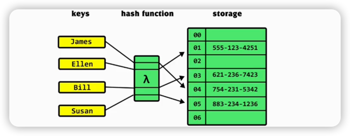
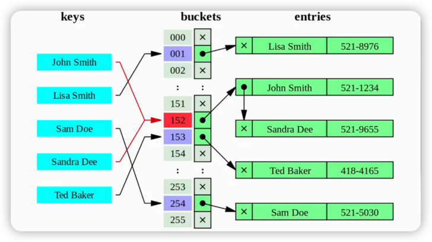
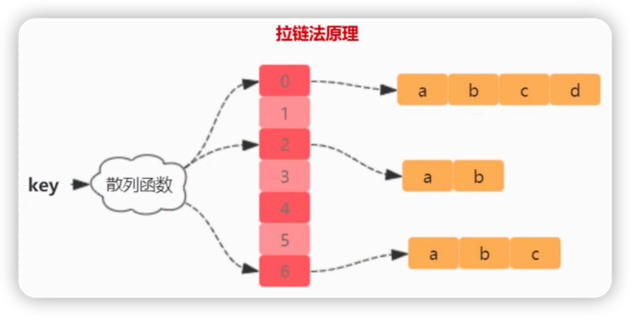
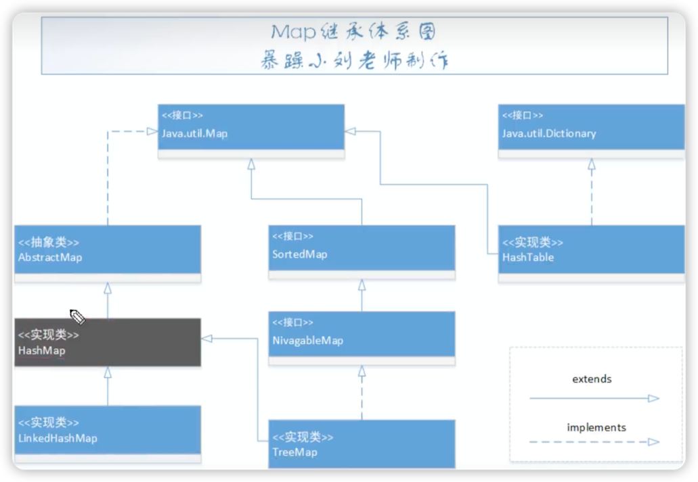
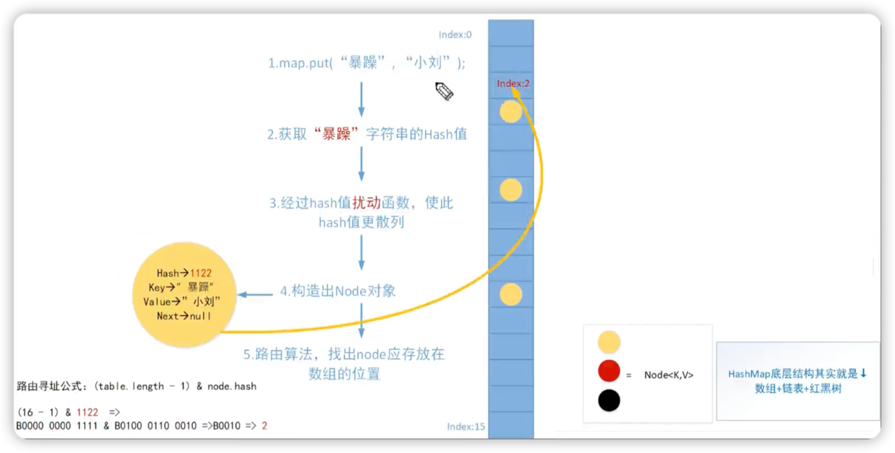
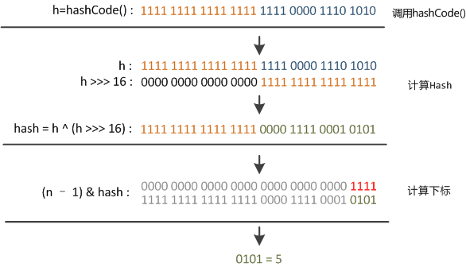
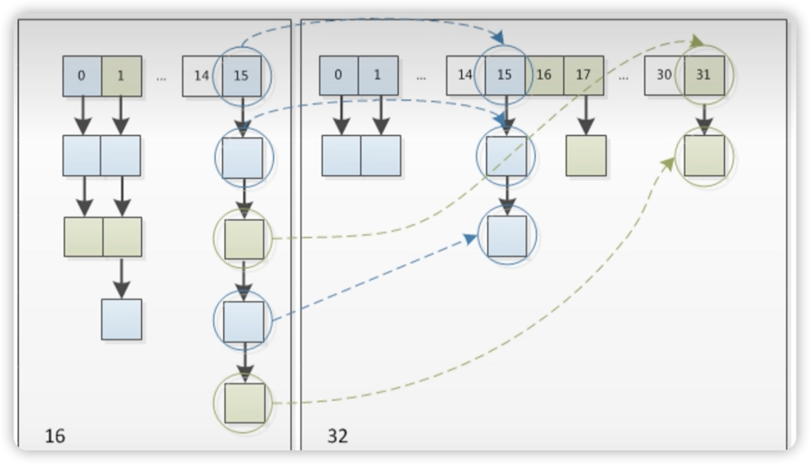
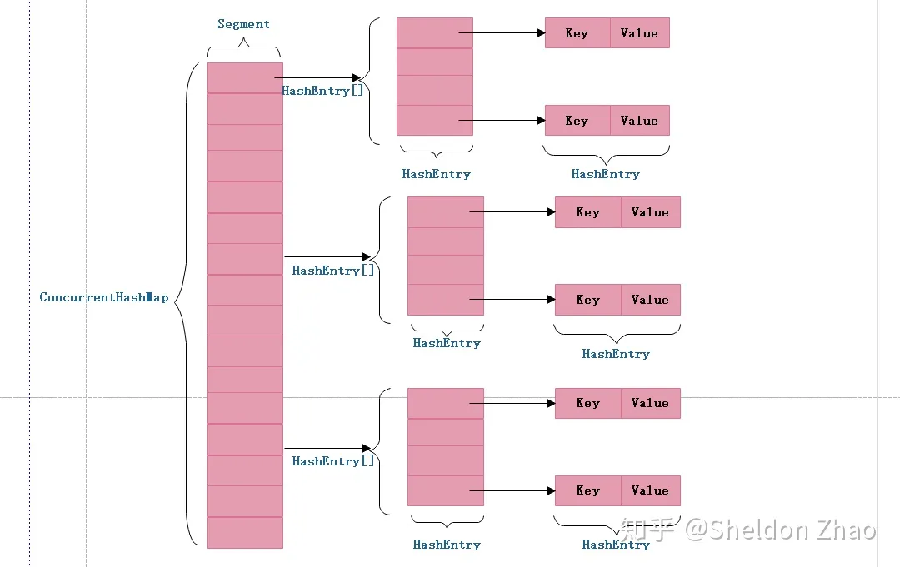

# 1.5.2 HashMap源码分析

## 前言

Map：双列集合。
	HashTable：线程安全，速度快。底层是哈希表数据结构。不允许null作为键，允许null作为值。
	HashMap：线程不安全，速度慢，底层是哈希表数据结构。允许null作为键，null作为值，代替了hashtable。
		LinkedHashMap：可以保证HashMap集合有序，存入顺序和取出的顺序一致。
	TreeMap：可以用来对Map集合中的键进行排序。

## 一、基础入门

### 1、数组的优势/劣势

数组在内存空间是连续的，

优势：通过元素索引（index）快速访问到元素

劣势：内存申请后大小固定，如果新增元素则没空间了，需要重写新建一个数组将原数组写入，再将新增元素写入，性能差


### 2、链表的优势/劣势

链表在内存空间不是连续的，每个内存里有下一个指向内存的引用。

优势：增删快

劣势：只能通过遍历获取到元素，查找慢

### 3、什么是哈希

核心理论：Hash也称散列、哈希，基本原理就是把任意长度的输入，通过hash算法变成固定长度的输出，这个映射的规则就是对应的hash算法，而原始数据映射后的二进制串就是哈希值。

hash的特点：

- 从hash值不可反向推导出原始的数据
- 输入数据的微小变化会得到完全不同的hash值，相同的数据会得到相同的值
- 哈希算法的执行效率高，长文本也能快速计算出哈希值
- hash算法冲突概率要小

由于hash的原理是将输入空间的值映射成hash空间内，而hash值的空间远小于输入的空间，所以一定会存在不同的输入被映射成相同输出的情况。

### 3、散列表（哈希表）

散列表：整合了数组和链表的优势。

散列表也叫哈希表，是根据关键码值（Key value）而直接进行访问的数据结构。也就是说，它通过把关键码值映射到表中一个位置来访问记录，以加快查找速度。这个映射函数叫做散列函数，存放记录的数组叫做散列表。



### 4、散裂冲突（hash冲突）

因为存储单元数目是有限的，当关键字数量增大时，两个不同的关键字k1，k2可能会出现f(k1)=f(k2)，而关键字实际上是无限的，所以这种冲突不可避免。

目前主流解决散裂冲突的方式有两种：

- 开放寻址法
- 链地址法（拉链法）



### 5、拉链法

对于不同的关键字可能会通过散列函数映射到同一地址，为了避免非同义词发生冲突，可以把所有的同义词存储在一个线性链表中，这个先行链表由其散列地址唯一标识。



## 二、HashMap原理

### 1、HashMap的继承体系




### 2、Node数据结构分析

```java
    static class Node<K,V> implements Map.Entry<K,V> {
        //存放key的hash值，它和hashcode不同，hash是key经过扰动函数得到的hash值
        final int hash;
        final K key;
        V value;
        Node<K,V> next;
```


### 3、底层存储结构介绍


外层是Node数组，初始化默认长度为16，**链表长度达到8并且哈希表所有元素达到了64**，这个链表就会树化成红黑树

所以Hash底层结构就是Node数组+Node链表+Node红黑树

### 4、put数据原理分析



### 5、什么是Hash碰撞

参考基础入门的第4节。


### 6、什么是链化

参考基础入门的第5节。


### 7、JDK8为什么引入红黑树

解决链化很长的问题，提高查找效率。


### 8、HashMap扩容原理

扩容的是Node数组。提高查找性能，空间换时间。扩容后桶位变得更多，链表变得更短。

## 三、源码分析

### 1、HashMap核心属性分析

**threshold,loadFactory,size,modCount**

```java
//属性
//初始化默认数组容量大小，大小为16
static final int DEFAULT_INITIAL_CAPACITY = 1 << 4; // aka 16
//数组最大容量
static final int MAXIMUM_CAPACITY = 1 << 30;
//默认负载因子为0.75，经过科学验证的，不建议修改
static final float DEFAULT_LOAD_FACTOR = 0.75f;
//树化阈值，超过8后链表（且hash表中所有node达到64个）会被树化
static final int TREEIFY_THRESHOLD = 8;
//链化阈值，树小于6后会被链化
static final int UNTREEIFY_THRESHOLD = 6;
//hash表中所有元素达到64个node，且某个链上的长度超过8后才会树化
static final int MIN_TREEIFY_CAPACITY = 64;
```


```java
//字段
//hash表，用Node数组构建的
//什么时候初始化？
transient Node<K,V>[] table;
//当前Hash表元素次数
transient int size;
//hash表结构修改次数
transient int modCount;
//扩容阈值，当hash表中的元素(Node数组)超过阈值时，触发扩容！！！
int threshold;
//负载因子0.75，用来计算threshold，thrershold=capacity*loadFactor
final float loadFactor;
```

### 2、构造方法分析

```java
//构造方法，初始化Node数组长度和负载因子。
    //最常用的无参构造方法
    public HashMap() {
        this.loadFactor = DEFAULT_LOAD_FACTOR; // all other fields defaulted
    }
    //入参是数组容量大小
    public HashMap(int initialCapacity) {
        this(initialCapacity, DEFAULT_LOAD_FACTOR);
    }
		//主要看这个构造方法
    public HashMap(int initialCapacity, float loadFactor) {
      //其实就是做了一些校验
        if (initialCapacity < 0)
            throw new IllegalArgumentException("Illegal initial capacity: " +
                                               initialCapacity);
        if (initialCapacity > MAXIMUM_CAPACITY)
            initialCapacity = MAXIMUM_CAPACITY;
        if (loadFactor <= 0 || Float.isNaN(loadFactor))
            throw new IllegalArgumentException("Illegal load factor: " +
                                               loadFactor);
        this.loadFactor = loadFactor;
        this.threshold = tableSizeFor(initialCapacity);
    }
		//作用：返回一个大于等于当前值cap的数字，并且数字一定是2的次方数。
		//比如传入10，返回16。/传入7，返回8.
    static final int tableSizeFor(int cap) {
        int n = cap - 1;
        n |= n >>> 1;
        n |= n >>> 2;
        n |= n >>> 4;
        n |= n >>> 8;
        n |= n >>> 16;
        return (n < 0) ? 1 : (n >= MAXIMUM_CAPACITY) ? MAXIMUM_CAPACITY : n + 1;
    }
```


### 3、HashMap put方法分析（重要）

```java
    public V put(K key, V value) {
      //套娃
        return putVal(hash(key), key, value, false, true);
    }
```

先看hash(key)方法

```java
//扰动函数，使得hash值更散列    
//作用：让key的hash值的高16位也参与位运算
//假设key=null，hash值为0
static final int hash(Object key) {
        int h;
        return (key == null) ? 0 : (h = key.hashCode()) ^ (h >>> 16);
    }
```

众所周知往hash表中插入一个数据的时候，是根据数据的key的hashCode，经过扰动函数之后，得到一个hash值，这个值再与hash表的length作运算，找到对应的数组下标位置。

- 参数 key：需要计算哈希码的键值。
- `key == null ? 0 : (h = key.hashCode()) ^ (h >>> 16)`：这是一个三目运算符，如果键值为 null，则哈希码为 0（依旧是说如果键为 null，则存放在第一个位置）；否则，通过调用`hashCode()`方法获取键的哈希码，并将其与右移 16 位的哈希码进行异或运算。
- `^` 运算符：异或运算符是 Java 中的一种位运算符，它用于将两个数的二进制位进行比较，如果相同则为 0，不同则为 1。
- `h >>> 16`：将哈希码向右移动 16 位，相当于将原来的哈希码分成了两个 16 位的部分。
- 最终返回的是经过异或运算后得到的哈希码值。

理论上，哈希码是一个 int 类型，范围从-2147483648 到 2147483648，哈希码的二进制是32位。



某哈希值为 `11111111 11111111 11110000 1110 1010`，将它右移 16 位（h >>> 16），刚好是 `00000000 00000000 11111111 11111111`，再进行异或操作（h ^ (h >>> 16)），结果是 `11111111 11111111 00001111 00010101`

> 异或（`^`）运算是基于二进制的位运算，采用符号 XOR 或者`^`来表示，运算规则是：如果是同值取 0、异值取 1

由于混合了原来哈希值的高位和低位，所以低位的随机性加大了（掺杂了部分高位的特征，高位的信息也得到了保留）。

结果再与数组长度-1（`00000000 00000000 00000000 00001111`）做取模运算，得到的下标就是 `00000000 00000000 00000000 00000101`，也就是 5。

综上所述，**hash 方法是用来做哈希值优化的**，把哈希值右移 16 位，也就正好是自己长度的一半，之后与原哈希值做异或运算，这样就混合了原哈希值中的高位和低位，增大了随机性。

说白了，**hash 方法就是为了增加随机性，让数据元素更加均衡的分布，减少碰撞**

```java
final V putVal(int hash, K key, V value, boolean onlyIfAbsent,
                   boolean evict) {
  //tab：引用当前hashMap的散列表
  //p：表示当前散列表的元素
  //n：表示散列表数组的长度
  //i：表示路由寻址结果
        Node<K,V>[] tab; Node<K,V> p; int n, i;
  
  //延迟初始化逻辑，第一次调用putVal时会初始化hashMap对象中的最耗费内存的散列表
        if ((tab = table) == null || (n = tab.length) == 0)
            n = (tab = resize()).length;
  //最简单的一种情况：寻址找到的同为刚好是null，这个时候，直接将当前k-v=>node扔进去就可以了
        if ((p = tab[i = (n - 1) & hash]) == null)
            tab[i] = newNode(hash, key, value, null);
        else {
          //e：不为null的话，找到了一个与当前要插入的key-value一致的key的元素
          //k：表示临时的一个key
            Node<K,V> e; K k;
          //表示桶位中的该元素，与你当前插入的元素的key完全一致，表示后续需要进行替换操作
            if (p.hash == hash &&
                ((k = p.key) == key || (key != null && key.equals(k))))
                e = p;
            else if (p instanceof TreeNode)//红黑树
                e = ((TreeNode<K,V>)p).putTreeVal(this, tab, hash, key, value);
            else {
              //链表的情况，而且链表的头元素与我们要插入的key不一致。
                for (int binCount = 0; ; ++binCount) {
                  //条件成立的话，说明迭代到最后一个元素了，也没找到一个与你要插入的key一致的node
                  //说明需要加入到当前链表的末尾
                    if ((e = p.next) == null) {
                        p.next = newNode(hash, key, value, null);
                      //条件成立的话，说明当前链表的长度，达到树化标准了，需要进行树化
                        if (binCount >= TREEIFY_THRESHOLD - 1) // -1 for 1st
                          //树化操作
                            treeifyBin(tab, hash);
                        break;
                    }
                  //条件成立的话，说明找到了相同key的node元素，需要进行替换操作
                    if (e.hash == hash &&
                        ((k = e.key) == key || (key != null && key.equals(k))))
                        break;
                    p = e;
                }
            }
          //e不等于null，条件成立说明，找到了一个与你插入元素key完全一致的数据，需要进行替换
            if (e != null) { // existing mapping for key
                V oldValue = e.value;
                if (!onlyIfAbsent || oldValue == null)
                    e.value = value;
                afterNodeAccess(e);
                return oldValue;
            }
        }
  //表示散列表结构被修改的次数，替换Noe元素的value不计数
        ++modCount;
  //插入新元素，size自增，如果自增后的值大于扩容阈值，则出发扩容
        if (++size > threshold)
            resize();
        afterNodeInsertion(evict);
        return null;
    }
```

### 4、HashMap resize扩容方法分析（核心）

```java
final Node<K,V>[] resize() {
  //oldTab：引用扩容前的哈希表
        Node<K,V>[] oldTab = table;
  //oldCap：表示扩容之前table数组的长度
        int oldCap = (oldTab == null) ? 0 : oldTab.length;
  //oldThr：表示扩容之前的扩容阈值，触发本次扩容的阈值
        int oldThr = threshold;
  //newCap：扩容之后table数组的大小
  //newThr：扩容之后，下次再次触发扩容的条件
        int newCap, newThr = 0;
  //条件如果成立说明hashMap中的散列表已经初始化过了，这是一次正常的扩容
        if (oldCap > 0) {
          //扩容之前的table数组大小已经达到最大阈值后，则不扩容，且设置扩容条件为int最大值
            if (oldCap >= MAXIMUM_CAPACITY) {
                threshold = Integer.MAX_VALUE;
                return oldTab;
            }
          //oldCap左移一位实现数值翻倍，并且赋值给newCap，newCap小于数组最大值限制且扩容之前的阈值>=16
          //这种情况下，则下一次扩容的阈值等于当前阈值翻倍
            else if ((newCap = oldCap << 1) < MAXIMUM_CAPACITY &&
                     oldCap >= DEFAULT_INITIAL_CAPACITY)
                newThr = oldThr << 1; // double threshold
        }
  //oldCap ==0，说明hashMap中的散列表是null
  //1.new HashMap(InitCap,loadFactor);
  //2.new HashMap(initCap);
  //3.new HashMap(map);并且这个map有数据
        else if (oldThr > 0) // initial capacity was placed in threshold
            newCap = oldThr;
        else {               // zero initial threshold signifies using defaults
          //oldCap==0,oldThr==0
          //new HashMap()
            newCap = DEFAULT_INITIAL_CAPACITY;
            newThr = (int)(DEFAULT_LOAD_FACTOR * DEFAULT_INITIAL_CAPACITY);
        }
  //newThr为零时，通过newCap和loadFactor计算出一个newThr
        if (newThr == 0) {
            float ft = (float)newCap * loadFactor;
            newThr = (newCap < MAXIMUM_CAPACITY && ft < (float)MAXIMUM_CAPACITY ?
                      (int)ft : Integer.MAX_VALUE);
        }
        threshold = newThr;
        @SuppressWarnings({"rawtypes","unchecked"})
        Node<K,V>[] newTab = (Node<K,V>[])new Node[newCap];
        table = newTab;
  //说明，hashMp本次扩容之前，table不为null
        if (oldTab != null) {
            for (int j = 0; j < oldCap; ++j) {
              //当前node节点
                Node<K,V> e;
              //说明当前桶位中有数据，但是数据具体是单个数据，还是链表还是红黑树，并不知道
                if ((e = oldTab[j]) != null) {
                  //方便JVM GC时回收
                    oldTab[j] = null;
                  //第一种情况：当前桶位只有一个元素，从未发生过碰撞，这情况直接计算出当前元素应存放在新数组中的位置，然后扔进去就可以了
                    if (e.next == null)
                        newTab[e.hash & (newCap - 1)] = e;
                  //第二种情况：当前节点已经树化
                    else if (e instanceof TreeNode)
                        ((TreeNode<K,V>)e).split(this, newTab, j, oldCap);
                    else { // preserve order
                      //第三种情况：桶位已经形成链表
                      //低位链表：存放在扩容之后的数组下标位置，与当前数组下标位置一致
                        Node<K,V> loHead = null, loTail = null;
                      //高位链表：存放扩容之后的数组下标位置，当前数组下标位置+加扩容之前数组的长度
                        Node<K,V> hiHead = null, hiTail = null;
                        Node<K,V> next;
                        do {
                            next = e.next;
                          //hash-> .... 1 1111
                          //hash-> .... 0 1111
                            if ((e.hash & oldCap) == 0) {
                                if (loTail == null)
                                    loHead = e;
                                else
                                    loTail.next = e;
                                loTail = e;
                            }
                            else {
                                if (hiTail == null)
                                    hiHead = e;
                                else
                                    hiTail.next = e;
                                hiTail = e;
                            }
                        } while ((e = next) != null);
                        if (loTail != null) {
                            loTail.next = null;
                            newTab[j] = loHead;
                        }
                        if (hiTail != null) {
                            hiTail.next = null;
                            newTab[j + oldCap] = hiHead;
                        }
                    }
                }
            }
        }
        return newTab;
    }
```




从上面这个扩容图可以看到，扩容前下标为15的链表，在扩容后分别分散到下标15和31的数组中。扩容前链表的所有元素hash值相同，为啥扩容后就分散了呢？
原因在于扩容后是：e.hash & (newCap - 1)，而扩容前十e.hash & (oldCap - 1)。扩容前链表的二进制计算的末尾肯定都一样，而扩容后翻了1倍往左多看了一位，这一位要么是0，要么是1，因此会分散到两个扩容后的数组下标中。

### 5、HashMap get方法分析


### 6、HashMap remove方法分析


### 7、HashMap replace方法分析


## 四、ConcurrentHashMap的实现原理

ConcurrentHashMap底层是双层数组结构，外层是Segment数组，里面还有一个Entry对象组成的链表。

对于JDK1.7版本的实现，ConcurrentHashMap 为了提高本身的并发能力，在内部采用了一个叫做 Segment 的结构，一个 Segment 其实就是一个类 Hash Table 的结构，Segment 内部维护了一个链表数组，我们用下面这一幅图来看下 ConcurrentHashMap 的内部结构,从下面的结构我们可以了解到，ConcurrentHashMap 定位一个元素的过程需要进行**两次Hash操作**，第一次 Hash 定位到 Segment，第二次 Hash 定位到元素所在的链表的头部，因此，这一种结构的带来的副作用是 Hash 的过程要比普通的 HashMap 要长，但是带来的好处是写操作的时候可以只对元素所在的 Segment 进行操作即可，不会影响到其他的 Segment，这样，在最理想的情况下，ConcurrentHashMap 可以**最高同时支持 Segment 数量大小的写操作**（刚好这些写操作都非常平均地分布在所有的 Segment上），所以，通过这一种结构，ConcurrentHashMap 的并发能力可以大大的提高。我们用下面这一幅图来看下ConcurrentHashMap的内部结构详情图，如下:



为什么要用二次hash，主要原因是为了构造分离锁，使得对于map的修改不会锁住整个容器，提高并发能力。当然，没有一种东西是绝对完美的，二次hash带来的问题是整个hash的过程比hashmap单次hash要长，所以，如果不是并发情形，不要使concurrentHashmap。

JAVA7之前ConcurrentHashMap主要采用锁机制，在对某个Segment进行操作时，将该Segment锁定，不允许对其进行非查询操作，而在JAVA8之后采用**CAS无锁算法**，这种乐观操作在完成前进行判断，如果符合预期结果才给予执行，对并发操作提供良好的优化.


参考视频：
[B站hashmap源码讲解](https://www.bilibili.com/video/BV1b84y1G7o5/?spm_id_from=333.788.videopod.episodes&vd_source=fd3d3496287a9be0e155c6e6202f0283&p=5)
参考文章：https://cloud.tencent.com/developer/article/2459662


