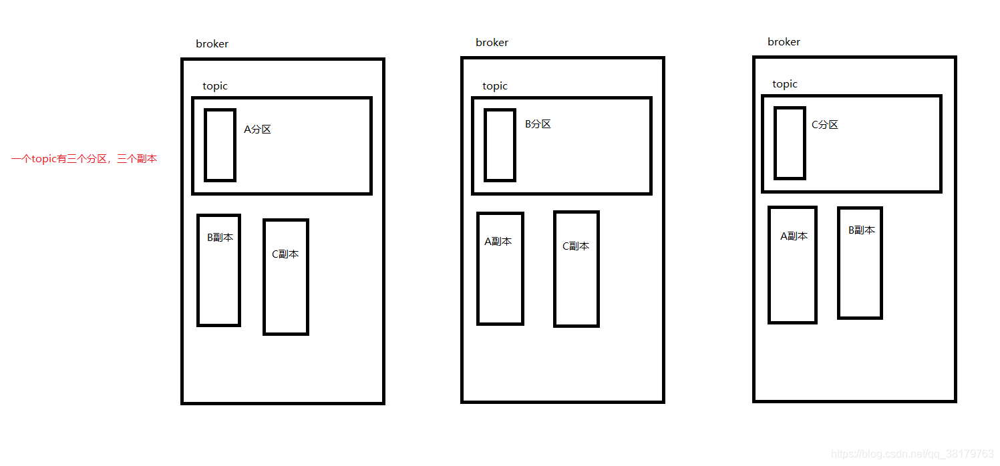
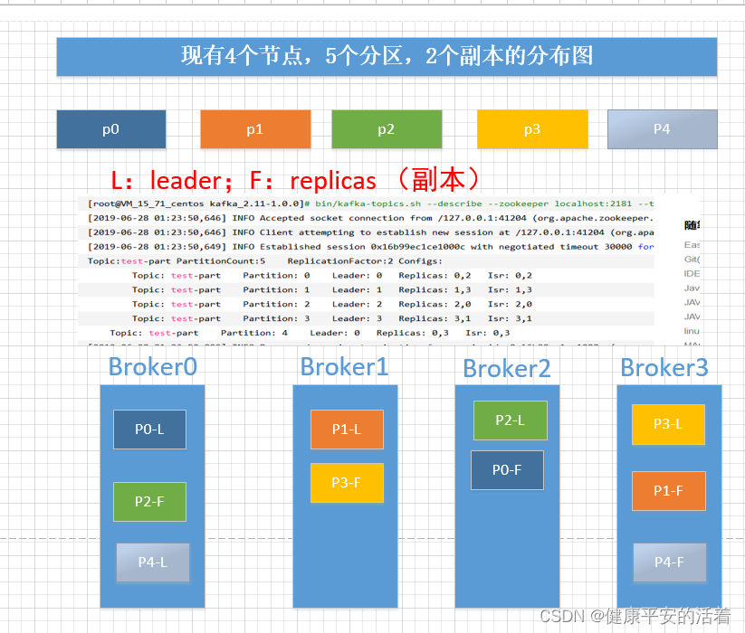
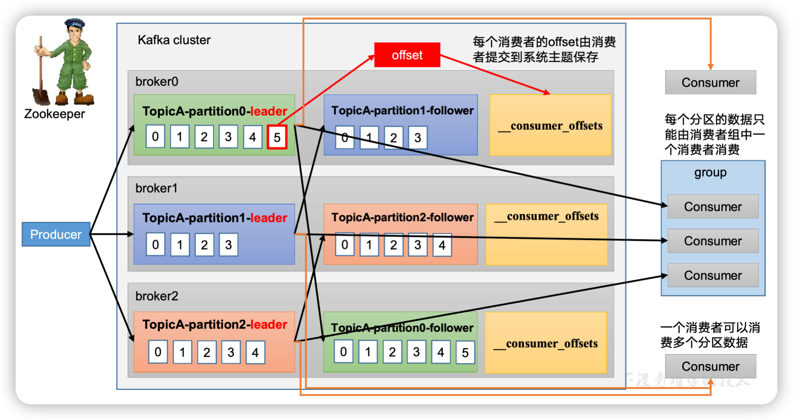
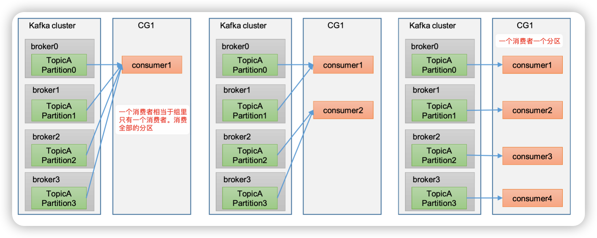
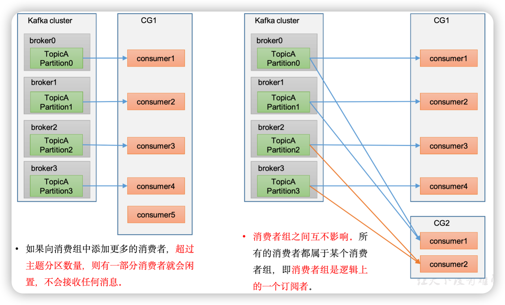
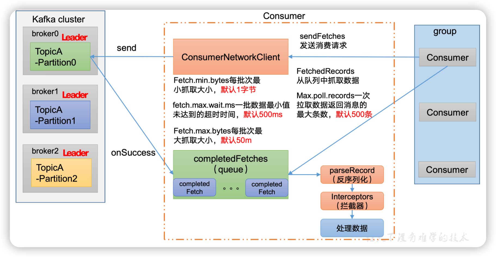
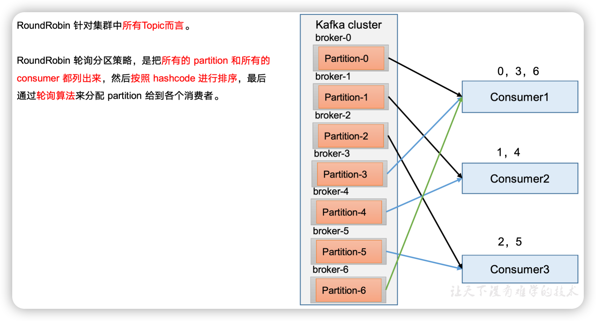
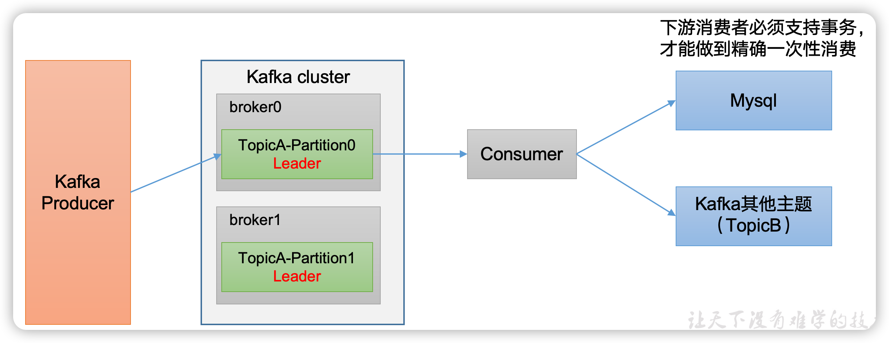

# kafka看这篇就够了

## 1、Kafka基础

### 1.1 消息队列的应用场景

- 缓存/削峰
- 解耦
- 异步通信

### 1.2 分组消费

消费者组內每个消费者负责消费不同分区的数据，一个分区只能由一个组內消费者消费；消费者组之间互不影响。

### 1.3 顺序消费

partition是一个有序队列，要保证顺序的有序性，生产者将消息发送到指定的分区上，消费者才能顺序消费。

## 2、Kafka生产者

### 2.1 生产者消息发送原理

消息发送过程中，涉及到两个线程——main线程和Sender线程。在Main线程中创建了一个双端队列RecordAccumulator。main线程将消息发送给RecordAccumulator，Sender线程不断从RecordAccumulator中拉取消息发送到Kafka Broker。

有两个重要参数：

- batch.size，默认16k，只有数据积累到batch.size后，sender才会发送数据
- linger.ms，如果数据未达到batch.size，sender等待linger.ms设置的时间到了后就会发送数据，单位ms，默认0ms，表示没有延迟

### 2.2 生产者重要参数

| 参数名称                              | 描述                                                         |
| ------------------------------------- | ------------------------------------------------------------ |
| bootstrap.servers                     | 生产者连接集群broker地址清单                                 |
| key.serializer和value.serializer      | 序列化类型                                                   |
| buffer.memory                         | RecordAccumulator缓冲区大小，默认32M                         |
| batch.size                            | 缓冲区一批数据最大值，默认16k                                |
| linger.ms                             | 如果数据迟迟未达到batch.size块，sender等待linger.ms后就会发送数据 |
| acks                                  | 生产者发送过来的数据  0:不需要等数据落盘应答，1:leader收到数据后应答，-1:leader+isr所有节点收齐数据后应答 |
| max.in.flight.requests.per.connection | 允许最多没有返回ack的次数，默认5                             |
| retries                               | 当消息发送出现错误的时候，系统会重发消息                     |
| relay.backoff.ms                      | 两次重试之间的时间间隔，默认100ms                            |
| enable.idempotence                    | 是否开启幂等性，默认true                                     |
| compression.type                      | 生产者发送的所有数据的压缩方式。默认是none，支持类型：none、gzip、snappy、lz4、zstd |

### 2.3 生产者有哪些发送方式

- 普通异步发送
- 带函数回调的异步发送。回调函数会在producer收到ack时调用，为异步调用
- 同步发送

### 2.4 topic分区的好处

- 便于合理使用存储资源。每个partition在一个Broker上存储，可以把海量的数据按照分区切割成一块一块数据存储在多台broker上
- 提高并行度。生产者可以以分区为单位发送数据，消费者可以以分区为单位消费数据。

### 2.5 生产者发送消息的分区策略

- 默认分区器DefaultPartitioner
  - 指明partition的情况下，直接将指明的值作为partition值
  - 没有指明partition值但有key的情况下，将key的hash值与topic的partition数进行取余得到partition值
  - 既没有partition值又没有key值的情况下，会随机选择一个分区并尽可能一直使用该分区，待该分区满了再随机一个分区使用

- 自定义分区器

### 2.6 生产经验—生产者如何提高吞吐量

调4个参数：

- batch.size
- linger.ms
- buffer.memory
- compression.type

### 2.7 生产经验—数据可靠性

通过设置ACK应答级别来保证数据的可靠性

- acks=0，生产者发送过来数据就不管了，可靠性差，效率高
- acks=1，生产者发送过来的数据leader应答，可靠性中等，效率中等
- acks=-1，生产者发送过来的数据leader和isr队列里面所有follower应答，可靠性高，效率低

在生产环境中，acks=0很少使用；acks=1，一般用于传输普通日志，允许丢个别数据；acks=-1，一般用于传输和钱相关的数据，用于对可靠性要求比较高的场景。

leader维护了一个动态的isr集合（leader：0，isr：0.1.2），如果follower长时间未向leader发送通信请求或同步数据，则该follower将被踢出isr，默认30s。例如2超时，（leader:0,isr:0.1）

**数据完全可靠条件**=ACK级别设置为-1 + 分区副本大于等于2 + ISR里应答的最小副本数量大于等于2

### 2.8 生产经验—数据去重

至少一次（数据可靠性）：ACK级别设置为-1 + 分区副本大于等于2 + ISR里应答的最小副本数量大于等于2。保证数据不丢失，但无法保证数据不重复

最多一次：ACK级别设置为0，保证数据不重复，但无法保证数据不丢失。

精确一次：需要用kafka的幂等性

#### 2.8.1 幂等性

幂等性就是指Producer无论向Broker发送多少次重复数据，Broker端都只会持久化一次，保证了不重复。

**精确一次**=幂等性+至少一次（ACK级别设置为-1 + 分区副本大于等于2 + ISR里应答的最小副本数量大于等于2）

如何开启幂等性：开启参数`enable.idempotence`为`true`

#### 2.8.2 生产者事务

说明：开启事务，必须开启幂等性

Producer在使用事务功能前，必须先自定义一个唯一的transactional.id。有了transactional.id，即使客户端挂掉了，它重启也能继续处理未完成的事务。

使用事务保证消息仅一次发送：

```java
//设置事务id（必须），事务id任意起名
properties.put(ProducerConfig.TRANSACTIONAL_ID_CONFIG,"transaction_id_0");
//初始化事务
kafkaProducer.initTransactions();
//开启事务
kafkaProducer.beginTransaction();
//发送消息
kafkaProducer.send(new ProducerRecord<>("first","x"));
//提交事务
kafkaProducer.commitTransaction();
//终止事务
kafkaProducer.abortTransaction();
```

### 2.9 生产经验—数据有序

单分区內，有序

多分区，分区与分区间无序

### 2.10 生产经验—数据乱序

 数据乱序的情况：发送数据1，2，3，4，5。发送到3的时候没有应答成功，要重发，结果4先过来了，就导致乱序。

kafka保证数据单分区有序条件如下：

- 未开启幂等性时，max.in.flight.requests.per.connection允许最多没有返回ack的次数需要设置为1
- 开启幂等性时，max.in.flight.requests.per.connection需要设置小于等于5。
  原因说明：启用幂等后，kafka服务端会缓存producer发来的最近5个request的元数据，无论如何，都可以保证最近5个request的数据都是有序的。（所以要小于5）

## 3、Broker重要参数

| 参数名称                                | 描述                                                         |
| --------------------------------------- | ------------------------------------------------------------ |
| replica.lag.time.max.ms                 | ISR中，如果Follower长时间未向Leader发送通信请求或同步数据，则该Follower将被踢出ISR。该时间阈值，默认30s。 |
| auto.leader.rebalance.enable            | 默认是true。 自动Leader Partition 平衡。                     |
| leader.imbalance.per.broker.percentage  | 默认是10%。每个broker允许的不平衡的leader的比率。如果每个broker超过了这个值，控制器会触发leader的平衡。 |
| leader.imbalance.check.interval.seconds | 默认值300秒。检查leader负载是否平衡的间隔时间。              |
| log.segment.bytes                       | Kafka中log日志是分成一块块存储的，此配置是指log日志划分 成块的大小，默认值1G。 |
| log.index.interval.bytes                | 默认4kb，kafka里面每当写入了4kb大小的日志（.log），然后就往index文件里面记录一个索引。 |
| log.retention.hours                     | Kafka中数据保存的时间，默认7天。                             |
| log.retention.minutes                   | Kafka中数据保存的时间，分钟级别，默认关闭。                  |
| log.retention.ms                        | Kafka中数据保存的时间，毫秒级别，默认关闭。                  |
| log.retention.check.interval.ms         | 检查数据是否保存超时的间隔，默认是5分钟。                    |
| log.retention.bytes                     | 默认等于-1，表示无穷大。超过设置的所有日志总大小，删除最早的segment。 |
| log.cleanup.policy                      | 默认是delete，表示所有数据启用删除策略；如果设置值为compact，表示所有数据启用压缩策略。 |
| num.io.threads                          | 默认是8。负责写磁盘的线程数。整个参数值要占总核数的50%。     |
| num.replica.fetchers                    | 副本拉取线程数，这个参数占总核数的50%的1/3                   |
| num.network.threads                     | 默认是3。数据传输线程数，这个参数占总核数的50%的2/3 。       |
| log.flush.interval.messages             | 强制页缓存刷写到磁盘的条数，默认是long的最大值，9223372036854775807。一般不建议修改，交给系统自己管理。 |
| log.flush.interval.ms                   | 每隔多久，刷数据到磁盘，默认是null。一般不建议修改，交给系统自己管理。 |

### 3.1 kafka副本的理解

kafka主题分为多个分区，每个分区可以创建几个副本，副本的意思是leader副本+follower副本

（1）Kafka副本作用：提高数据可靠性。

（2）Kafka默认副本1个（只有一个leader副本），生产环境一般配置为2个（一个leader副本，一个follower副本），保证数据可靠性；太多副本会增加磁盘存储空间，增加网络上数据传输，降低效率。

（3）Kafka中副本分为：Leader和Follower。Kafka生产者只会把数据发往Leader，然后Follower找Leader进行同步数据。

（4）Kafka分区中的所有副本统称为AR（Assigned Repllicas）。

 AR = ISR + OSR

**ISR**，表示和Leader保持同步的Follower集合。如果Follower长时间未向Leader发送通信请求或同步数据，则该Follower将被踢出ISR。该时间阈值由***\*replica.lag.time.max.ms\****参数设定，默认30s。Leader发生故障之后，就会从ISR中选举新的Leader。

**OSR**，表示Follower与Leader副本同步时，延迟过多的副本。

### 3.2 分区和副本的理解

​		kafka有多个主题，每个主题有多个分区，每个分区可以分布到不同的机器上，每个分区又可以有多个副本。这多个副本中，只有一个是leader，而其他的都是follower副本。仅有leader副本可以对外提供服务。

​		多个follower副本通常存放在和leader副本不同的broker中。通过这样的机制实现了高可用，当某台机器挂掉后，其他follower副本也能迅速”转正“，开始对外提供服务。

### 3.3 follower副本为什么不对外提供服务

​		这个问题本质上是对性能和一致性的取舍。试想一下，如果follower副本也对外提供服务那会怎么样呢？首先，性能是肯定会有所提升的。但同时，会出现一系列问题。类似数据库事务中的幻读，脏读。

​		比如你现在写入一条数据到kafka主题a，消费者b从主题a消费数据，却发现消费不到，因为消费者b去读取的那个分区副本中，最新消息还没写入。而这个时候，另一个消费者c却可以消费到最新那条数据，因为它消费了leader副本。

看吧，为了提高那么些性能而导致出现数据不一致问题，那显然是不值得的。

### 3.4 几分区几副本的理解

**案例1**:



上图是3节点3分区3副本。这里的副本指的是leader+follower的个数。真实的follwer=副本数-1

**案例2**:

假设创建4个节点，5个分区，2个副本，那么分区，副本的关系，如下图所示：

```java
[2019-06-28 01:23:50,649] INFO Established session 0x16b99ec1ce1000c with negotiated timeout 30000 for client /127.0.0.1:41204 (org.apache.zookeeper.server.ZooKeeperServer)
Topic:test-part PartitionCount:5    ReplicationFactor:2 Configs:
        Topic: test-part    Partition: 0    Leader: 0   Replicas: 0,2   Isr: 0,2
        Topic: test-part    Partition: 1    Leader: 1   Replicas: 1,3   Isr: 1,3
        Topic: test-part    Partition: 2    Leader: 2   Replicas: 2,0   Isr: 2,0
        Topic: test-part    Partition: 3    Leader: 3   Replicas: 3,1   Isr: 3,1
        Topic: test-part    Partition: 4    Leader: 0   Replicas: 0,3   Isr: 0,3
[2019-06-28 01:23:50,899] INFO Processed session termination for sessionid: 0x16b99ec1ce1000c (org.apache.zookeeper.server.PrepRequestProcessor)
[2019-06-28 01:23:50,904] INFO Closed socket connection for client /127.0.0.1:41204 which had sessionid 0x16b99ec1ce1000c (org.apache.zookeeper.server.NIOServerCnxn)
```

通过以上信息我们可以分析得出：

Partition表示5个不同的分区，Leader表示每个分区的主副本所在的broker，Replicas表示每个分区的副本在哪些broker上。

解读第一行：Partition表示0分区的leader副本在为0的broker里面，0分区的副本在为0和2的的broker里面。得出结论0分区的leader副本在Broker0里，follower副本在broker2里。可以以此类推出其它副本



### 3.5 生产经验—Leader Partition负载平衡

正常情况下，Kafka本身会自动把Leader Partition均匀分散在各个机器上，来保证每台机器的读写吞吐量都是均匀的，但是如果某些broker宕机，会导致Leader Partition过于集中在其他少部分几台Broker上，这会导致少数几台broker的读写请求压力过高，其它宕机broker重启之后都是follower partition，读写请求很低，造成集群负载不均衡。

| 参数名称                                | 描述                                                         |
| --------------------------------------- | ------------------------------------------------------------ |
| auto.leader.rebalance.enable            | 默认是true。 自动Leader Partition 平衡。生产环境中，leader重选举的代价比较大，可能会带来性能影响，建议设置为false关闭。 |
| leader.imbalance.per.broker.percentage  | 默认是10%。每个broker允许的不平衡的leader的比率。如果每个broker超过了这个值，控制器会触发leader的平衡。 |
| leader.imbalance.check.interval.seconds | 默认值300秒。检查leader负载是否平衡的间隔时间。              |

### 3.6 Topic数据的存储机制

Topic是逻辑上的概念，而partition是物理上的概念，每个partition对应于一个log文件，该log文件中存储的就是Producer生产的数据。Producer生产的数据会被不断追加到该log文件末端，为防止log文件过大导致数据定位效率低下，Kafka采取了分片和索引机制，将每个partition分为多个segment.

### 3.7 kafka日志文件清理策略

Kafka中默认的日志保存时间为7天，可以通过调整如下参数修改保存时间。

- log.retention.hours，最低优先级小时，默认7天。

- log.retention.minutes，分钟。

- log.retention.ms，最高优先级毫秒。

- log.retention.check.interval.ms，负责设置检查周期，默认5分钟。

那么日志一旦超过了设置的时间，怎么处理？Kafka中提供的日志清理策略有delete和compact两种

**delete日志删除：将过期数据删除**

- log.cleanup.policy=delete 所有数据启用删除策略
  - 基于时间：默认打开。
  - 基于大小：默认关闭。超过设置的所有日志总大小，删除最早的segment

- compact日志压缩：对于相同的key，不同的value值，只保留最后一个版本
  - log.cleanup.policy=compact
  - 这种策略只适合特殊场景，比如消息key是用户ID，value是用户资料，通过这种压缩策略，整个消息集里就保存了所有用户最新的资料。

## 4、Kafka消费者

### 4.1 kafka消费方式

- Pull（拉）模式：consumer采用从broker中主动拉取数据，**Kafka采取这种方式**
- Push（推）模式：Kafka没有采取这种方式，因为broker决定消息发送的速率，很难适应所有消费者的消费速率。还有个问题是如果kafka没有数据，消费者可能会陷入循环中，一直返回空数据。

### 4.2 消费者总体工作流程

需要注意的是：

- 每个消费者的offset由消费者提交到kafka一个内置的topic中，该topic为_consumer_offsets
- 分区消费，每个分区的数据只能由消费者组中一个消费者消费
- 一个消费者可以消费多个分区的数据，`@KafkaListener里配置partition参数即可`



### 4.3 消费者组原理





### 4.4 消费者组详细消费流程



### 4.5 消费者重要参数

| 参数                      | 说明                                                         |
| ------------------------- | ------------------------------------------------------------ |
| fetch.min.bytes           | consumer在一次拉取请求中能从kafka中拉取的最小数据量，默认值为1B。如果返回给consumer的数据量小于这个参数所配置的值，那么它就需要等待，直到数据量满足这个参数的配置大小。可以适当调大提高吞吐量，但会造成一定时延。 |
| fetch.max.bytes           | consumer在一次拉取请求中能从kafka中拉取的最大数据量，默认52428800B（50M）。如果这个参数设置的值比任意一条消息小，也能正常消费 |
| fetch.max.wait.ms         | 如果迟迟未达到fetch.min.bytes，而满足了fetch.max.wait.ms等待时间（默认值500ms），消费者也会收到消息 |
| max.partition.fetch.bytes | 从每个分区里返回给Consumer的最大数据量，默认1MB。`fetch.max.bytes`则是对整个拉取请求的总大小进行了限制，包括了所有分区的数据，因此，实际上一次拉取请求中所有分区的数据总量不能超过`fetch.max.bytes`，同时每个分区的数据量也不能超过`max.partition.fetch.bytes` |
| max.poll.records          | consumer在一次拉取请求中拉取的最大消息数，默认500条，如果消息比较小，可以适当调大增加消费速度 |
| connections.max.idle.ms   | 指定在多久之后关闭限制的连接，默认9分钟                      |
| receive.buffer.bytes      | 设置socket接受消息缓冲区的大小，默认128kb。如果consumer处于不同机房（消费速度不一样），则可以适当调大该值 |
| send.buffer.bytes         | 设置socket发送消息缓冲区的大小，默认128kb                    |
| request.timeout.ms        | consumer等待请求响应的最长时间，默认3000ms                   |


### 4.6 消费者API

- 一个消费者消费主题所有分区的数据
- 一个消费者消费指定分区的数据
- 消费者组消费主题的数据，分区消费

### 4.7 生产经验—分区的分配以及再平衡

一个consumer group中有多个consumer组成，一个topic有多个partition组成，现在的问题时，到底由哪个consumer来消费哪个partition的数据

Kafka有四种主流的分区分配策略：Range、RoundRobin、Sticky、CooperativeSticky。
可以通过配置参数`partition.assignment.strategy`，修改分区的分配策略。默认策略时`Range+CooperativeSticky`。kafka可以同时使用多个分区分配策略。

#### 4.7.1 Range分区分配策略

Range是对每个topic而言的。

首先对同一个topic里面的分区按照序列号进行排序，并对消费者按照字母顺序进行排序。

假如现在有7个分区，3个消费者，排序后的分区将会是0 1 2 3 4 5 6；消费者排序完之后将会是C0 C1 C2

通过`partitions数/consumer数`来决定每个消费者应能改消费几个分区，如果除不尽，那么前面几个消费者将会多消费一个分区。

例如，7/3=2余1，除不尽，那么消费者C0便会多消费1个分区（C0消费3个，C1和C2各自消费2个）；8/3=2余2，除不尽，那么C0和C1分别多消费1个。

**注意**：如果只是针对1个topic而言，C0消费者多消费1个分区影响不是很大。但是如果有N多个Topic，那么针对每个topic，消费者C0都将多消费1个分区，topic越多，C0消费的分区会比其它消费者明显多消费N个分区。

**容易产生数据倾斜！**

#### 4.7.2 RoundRobin分区分配策略



#### 4.7.3 Sticky以及再平衡

**粘性分区定义：**可以理解为分配的结果带有“粘性的”。即在执行一次新的分配之前，考虑上一次分配的结果，尽量少的调整分配的变动，可以节省大量的开销。

粘性分区是Kafka从0.11.x版本开始引入这种分配策略，首先会尽量均衡的放置分区到消费者上面，在出现同一消费者组内消费者出现问题的时候，会尽量保持原有分配的分区不变化。

### 4.8 offset位移

consumer默认将offset保存在Kafka一个内置的topic中，该topic为_consumer_offsets。

__consumer_offsets主题里面采用key和value的方式存储数据。key是group.id+topic+分区号，value就是当前offset的值。每隔一段时间，kafka内部会对这个topic进行compact，也就是每个group.id+topic+分区号就保留最新数据。

#### 4.8.1 自动提交offset

为了能专注自己的业务逻辑，kafka提供了自动提交offset的功能
自动提交offset的相关参数：

- enable.auto.commit：是否开启自动提交offset功能，默认true
- auto.commit.interval.ms：自动提交offset的时间间隔，默认5s

#### 4.8.2 手动提交offset

虽然自动提交offset十分便利，但是由于其是基于时间提交的，开发人员难以把握offset提交的时机。因此Kafka还提供了手动提交offset的API。

手动提交offset的方法有两种：分别是commitSync（同步提交）和commitAsync（异步提交）。两者的相同点是，都会将本次提交的一批数据最高的偏移量提交；不同点是同步提交阻塞当前线程，一直到提交成功，并且会自动失败重试；而异步提交则没有失败重试机制，故可能提交失败。

虽然同步提交offset可靠些，但是会阻塞当前线程，吞吐量会收到很大影响，更多情况下会选择异步提交。

#### 4.8.3 指定offset消费

auto.offset.reset=earliest|latest|none  默认是latest

当kafka中没有初始偏移量（消费者组第一次消费）或服务器上不再存当前偏移量时：

- earliest：自动将偏移量重置为最早的偏移量
- latest（默认值）：自动将偏移量重置为最新偏移量
- none：如果未找到消费者组的先前偏移量，则向消费者抛出异常

#### 4.8.4 指定时间消费


#### 4.8.5 漏消费和重复消费

**重复消费**：已经消费了数据，但是offset未提交

重复消费场景：自动提交offset引起

- consumer每5s提交offset
- 如果提交offset后2s，consumer挂了
- 再次重启consumer，则从上一次提交的offset处继续消费，导致重复消费


**漏消费**：先提交offset后消费，又啃根造成数据的漏消费

漏消费场景：设置offset为手动提交，当offset被提交时，数据还在内存中未落盘，此时刚好消费者线程被kill掉，那么offset已经提交，但是数据未处理，导致这部分内存中的数据丢失。

思考：如何能做到既不漏消费也不重复消费？——通过消费者事务解决，详看下一节。

### 4.9、生产经验—消费者事务

如果想完成consumer端的精准一次性消费，那么需要kafka消费端将消费过程和提交offset过程做原子绑定，此时我们需要将kafka的offset保存到支持事务的自定义介质（比如MySQL）.



### 4.10 生产经验—数据积压

- 如果是kafka消费能力不足，则可以考虑增加topic的分区数，并且同时提升消费组的消费者数量，消费者数=分区数
- 如果是下游的数据处理不及时：提高没批次拉取的数量。批次拉取数量过少，使处理的数据小于生产的数据，也会造成数据积压。


