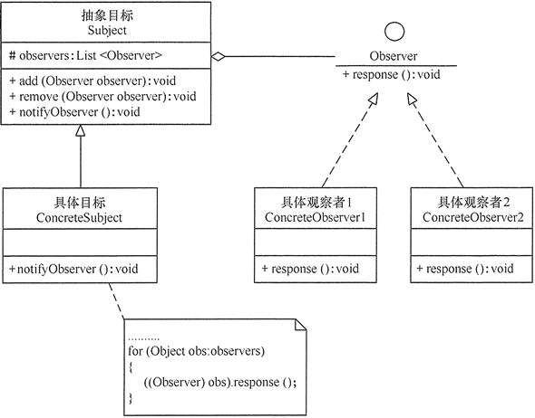

# 3.3 观察者模式

## 一、介绍

观察者模式定义对象间的一种一对多的依赖关系，当一个对象的状态发生改变时，所有依赖于它的对象都得到通知并被自动更新，其主要解决一个对象状态改变给其他关联对象通知的问题，保证易用和低耦合。

观察者模式又叫发布-订阅模式，UML图如下：



理解：将观察者对象添加到观察者集合里面，通知方法循环调用观察者集合里面的对象方法。

观察者多用于类似消息队列的场景。

- 具体观察者实现同一个接口
- 抽象目标里引用观察者集合，具备新增和移除观察者方法以及通知观察着的通知方法
- 具体目标继承抽象目标并实现通知方法

举一个例子，就好比微信朋友圈，以当前个人作为订阅者，好友作为主题。一个人发一条动态朋友圈出去，他的好友都能看到这个朋友圈，并且可以在自主选择点赞或者评论

**抽象观察者**

```java
//抽象观察者
interface Observer {
    void response(); //反应
}
```

**具体观察者**

```java
	//具体观察者1
class ConcreteObserver1 implements Observer {
    public void response() {
        System.out.println("具体观察者1作出反应！");
    }
}

//具体观察者1
class ConcreteObserver2 implements Observer {
    public void response() {
        System.out.println("具体观察者2作出反应！");
    }
}
```

**抽象目标**

```java
//抽象目标
abstract class Subject {
    protected List<Observer> observers = new ArrayList<Observer>();

    //增加观察者方法
    public void add(Observer observer) {
        observers.add(observer);
    }

    //删除观察者方法
    public void remove(Observer observer) {
        observers.remove(observer);
    }

    public abstract void notifyObserver(); //通知观察者方法
}
```

**具体目标**

```java
//具体目标
class ConcreteSubject extends Subject {
    public void notifyObserver() {
        System.out.println("具体目标发生改变...");
        System.out.println("--------------");

        for (Object obs : observers) {
            ((Observer) obs).response();
        }

    }
}
```

**main方法**

```java
public class ObserverPattern {
    public static void main(String[] args) {
        Subject subject = new ConcreteSubject();
        Observer obs1 = new ConcreteObserver1();
        Observer obs2 = new ConcreteObserver2();
        subject.add(obs1);
        subject.add(obs2);
        subject.notifyObserver();
    }
}
```

## 二、SpringBoot观察者模式

一个典型的应用场景是：当用户注册以后，需要给用户发送邮件，发送优惠券等操作，如下图所示。


UserService 在完成自身的用户注册逻辑之后，仅仅只需要发布一个 UserRegisterEvent 事件，而无需关注其它拓展逻辑。其它 Service 可以自己订阅 UserRegisterEvent 事件，实现自定义的拓展逻辑。Spring的事件机制主要由3个部分组成。

- ApplicationEvent事件（Event）
- ApplicationEventPublisherAware发布事件（Subject）
- ApplicationListener监听器（Observer）

**UserRegisterEvent用户注册事件**

```java
public class UserRegisterEvent extends ApplicationEvent {
    public UserRegisterEvent(Object source) {
        super(source);
    }
    /**
     * 用户名
     */
    private String username;

    public UserRegisterEvent(Object source, String username) {
        super(source);
        this.username = username;
    }
    public String getUsername() {
        return username;
    }
}
```

**UserService发布用户注册事件**

```java
@Service
public class UserService implements ApplicationEventPublisherAware {
    private Logger logger = LoggerFactory.getLogger(getClass());
    private ApplicationEventPublisher applicationEventPublisher;
    @Override
    public void setApplicationEventPublisher(ApplicationEventPublisher applicationEventPublisher) {
        this.applicationEventPublisher = applicationEventPublisher;
    }
    public void register(String username) {
        // ... 执行注册逻辑
        logger.info("[register][执行用户({}) 的注册逻辑]", username);
        // <2> ... 发布
        applicationEventPublisher.publishEvent(new UserRegisterEvent(this, username));
    }
}
```

**EmailService订阅用户注册事件事件，发送邮件**

```java
@Service
public class EmailService implements ApplicationListener<UserRegisterEvent> {
    private Logger logger = LoggerFactory.getLogger(getClass());

    @Override
    public void onApplicationEvent(UserRegisterEvent event) {
        logger.info("[onApplicationEvent][给用户({}) 发送邮件]", event.getUsername());
    }
}
```

**CouponService订阅用户注册事件，发送优惠券**

```java
@Service
public class CouponService {
    private Logger logger = LoggerFactory.getLogger(getClass());

    @EventListener// <1>
    public void addCoupon(UserRegisterEvent event) {
        logger.info("[addCoupon][给用户({}) 发放优惠劵]", event.getUsername());
    }
}
```

**Controller**

```java
    @Autowired
    private UserService userService;    
		@GetMapping(value = "/test")
    public AjaxResult test() throws InterruptedException {
        userService.register("ranqing");
        return success("hello, world!");
    }
```

输出

```

2024-11-11 14:05:37.323  INFO 52791 --- [nio-5050-exec-1] com.ruoyi.jenkins.observe.UserService    : [register][执行用户(ranqing) 的注册逻辑]
2024-11-11 14:05:37.324  INFO 52791 --- [nio-5050-exec-1] com.ruoyi.jenkins.observe.EmailService   : [onApplicationEvent][给用户(ranqing) 发送邮件]
2024-11-11 14:05:37.324  INFO 52791 --- [nio-5050-exec-1] com.ruoyi.jenkins.observe.CouponService  : [addCoupon][给用户(ranqing) 发放优惠劵]
```

## 三、Spring源码里的观察者模式

AbstractApplicationContext

```java
//ContextStartedEvent 主要用于通知所有注册的 ApplicationListener，告知他们应用上下文已经启动。
public class ContextStartedEvent extends ApplicationContextEvent {
    public ContextStartedEvent(ApplicationContext source) {
        super(source);
    }
}
```

```java
public class ContextStoppedEvent extends ApplicationContextEvent {
    public ContextStoppedEvent(ApplicationContext source) {
        super(source);
    }
}
```

```java
public class ContextRefreshedEvent extends ApplicationContextEvent {
    public ContextRefreshedEvent(ApplicationContext source) {
        super(source);
    }
}
```


