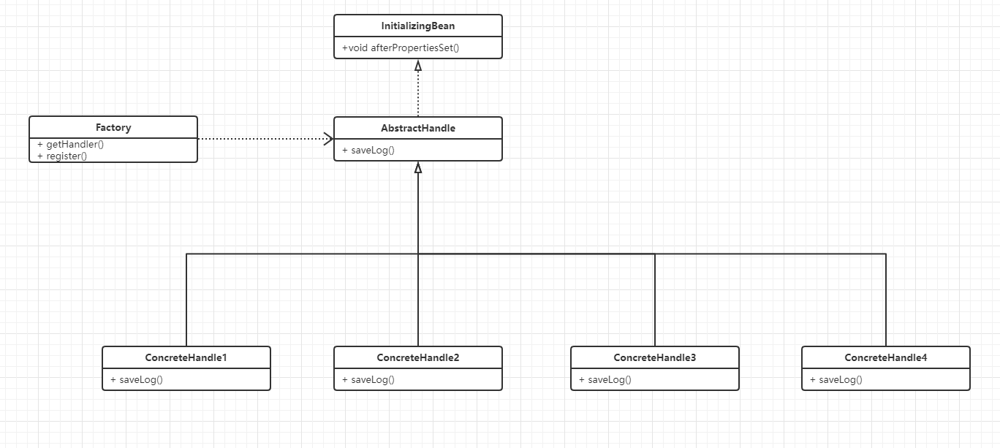
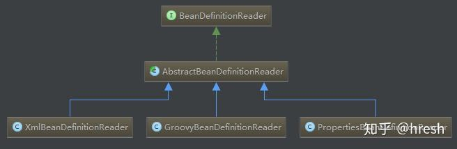

# 3.4 策略模式

## 一、介绍

阿里开发规约-编程规约-控制语句-第六条 ：超过 3 层的 if-else 的逻辑判断代码可以使用卫语句、策略模式、状态模式等来实现。相信大家都见过这种代码：

```java
if (conditionA) {
    逻辑1
} else if (conditionB) {
    逻辑2
} else if (conditionC) {
    逻辑3
} else {
    逻辑4
}
```

这种代fs码虽然写起来简单，但是很明显违反了面向对象的 2 个基本原则：

- 单一职责原则（一个类应该只有一个发生变化的原因）：因为之后修改任何一个逻辑，当前类都会被修改
- 开闭原则（对扩展开放，对修改关闭）：如果此时需要添加（删除）某个逻辑，那么不可避免的要修改原来的代码

因为违反了以上两个原则，尤其是当 if-else 块中的代码量比较大时，后续代码的扩展和维护就会逐渐变得非常困难且容易出错，使用卫语句也同样避免不了以上两个问题。因此根据我的经验，得出一个我个人认为比较好的实践：

- if-else 不超过 2 层，块中代码 1~5 行，直接写到块中，否则封装为方法
- if-else 超过 2 层，但块中的代码不超过 3 行，尽量使用卫语句
- if-else 超过 2 层，且块中代码超过 3 行，尽量使用策略模式

**结构**

策略模式的主要角色如下。

1. 抽象策略（Strategy）类：定义了一个公共接口，各种不同的算法以不同的方式实现这个接口，环境角色使用这个接口调用不同的算法，一般使用接口或抽象类实现。
2. 具体策略（Concrete Strategy）类：实现了抽象策略定义的接口，提供具体的算法实现。
3. 环境（Context）类：持有一个策略类的引用，最终给客户端调用。


**抽象策略类**

```java
//抽象策略类
interface Strategy {
    public void strategyMethod();    //策略方法
}
```

**具体策略类A**

```java
//具体策略类A
class ConcreteStrategyA implements Strategy {
    public void strategyMethod() {
        System.out.println("具体策略A的策略方法被访问！");
    }
}
```

**具体策略类B**

```java
//具体策略类B
class ConcreteStrategyB implements Strategy {
    public void strategyMethod() {
        System.out.println("具体策略B的策略方法被访问！");
    }
}
```

**环境类**

```java
//环境类
class Context {
    private Strategy strategy;
    public Strategy getStrategy() {
        return strategy;
    }
    public void setStrategy(Strategy strategy) {
        this.strategy = strategy;
    }
    public void strategyMethod() {
        strategy.strategyMethod();
    }
}
```

**main()**

```java
public class StrategyPattern {
    public static void main(String[] args) {
        Context c = new Context();
        Strategy s = new ConcreteStrategyA();
        c.setStrategy(s);
        c.strategyMethod();
        System.out.println("-----------------");
        s = new ConcreteStrategyB();
        c.setStrategy(s);
        c.strategyMethod();
    }
}
```

输出

```
具体策略A的策略方法被访问！
-----------------
具体策略B的策略方法被访问！
```

## 二、SpringBoot策略模式

### 1、背景

写一个日志功能，当用户对成果进行编辑、删除、机构关联、作者关联操作时，记录用户的操作。

很容易想到用aop的思想来记录用户的操作，这四种操作可以用if else来做，但是对不同操作的逻辑处理不一样且非常多，如果用if来写不利于维护且耦合度高，所以采用spring自带的策略模式。

### 2、结构图



AbstractHandle实现了InitialzingBean接口，所以Spring启动的时候，ContrteHandle1...4里面会调用afterPropertiesSet()方法将handle注册到Factory里面

### 3、代码实现

#### 3.1、枚举类

```java
public enum OperationLogType
{
    EDIT("1"), DEL("2"), AUTHOR("3"),DEPT("4");
    private final String code;
    OperationLogType(String code)
    {
        this.code = code;
    }
    public String getCode()
    {
        return code;
    }
}
```

#### 3.2、业务实现层调策略模式

```java
@Service
public class OperationLogServiceImpl implements OperationLogService {
    @Override
    public int saveLog(HkOperLog hkOperLog) {
        OperationHandler handler = OperationFactory.getHandler(hkOperLog.getOperationType());
        int i = handler.saveLog(hkOperLog);
        return i;
    }
}
```

#### 3.3、环境类工厂

```java
public class OperationFactory {
    public static Map<String, OperationHandler> map = new HashMap();
    public static OperationHandler getHandler(String operationType){
        return map.get(operationType);
    }
    public static void register(String tableType, OperationHandler operationHandler){
        if(StringUtils.isNull(tableType)||StringUtils.isNull(operationHandler)){
            return;
        }
        map.put(tableType, operationHandler);
    }
}
```

#### 3.4、抽象策略类

```java
public abstract class OperationHandler implements InitializingBean {
   /*保存操作日志信息*/
   public abstract int saveLog(HkOperLog hkOperLog);
}
```

#### 3.5、具体策略类

```java
@Service
public class OperationEditServiceImpl extends OperationHandler {
    private static final Logger log = LoggerFactory.getLogger(OperationEditServiceImpl.class);
    @Resource
    private HkOperLogMapper hkOperLogMapper;
    @Override
    public int saveLog(HkOperLog hkOperLog) {
        log.info("记录编辑操作日志");
        //TODO业务操作
        return 1;
    }
    //系统启动时调用
    @Override
    public void afterPropertiesSet() throws Exception {
        OperationFactory.register(OperationLogType.EDIT.getCode(),this);
    }
}
```

```java
@Service
public class OperationDelServiceImpl extends OperationHandler {
    private static final Logger log = LoggerFactory.getLogger(OperationDelServiceImpl.class);
    @Resource
    private HkOperLogMapper hkOperLogMapper;
    @Override
    public int saveLog(HkOperLog hkOperLog) {
        log.info("记录删除操作日志");
		//TODO 业务操作
        return i;
    }
    @Override
    public void afterPropertiesSet() throws Exception {
        OperationFactory.register(OperationLogType.DEL.getCode(),this);
    }
}
```

## 三、Spring源码里的策略模式

**BeanDefinitionReader** 的作用是读取 Spring 配置文件中的内容，将其转换为 IoC 容器内部的数据



- AbstractBeanDefinitionReader：实现了 EnvironmentCapable，提供了获取/设置环境的方法。定义了一些通用方法，使用策略模式，将一些具体方法放到子类实现。
- XmlBeanDefinitionReader：读取 XML 文件定义的 BeanDefinition
- PropertiesBeanDefinitionReader：可以从属性文件，Resource，Property 对象等读取 BeanDefinition
- GroovyBeanDefinitionReader：可以读取 Groovy 语言定义的 Bean
