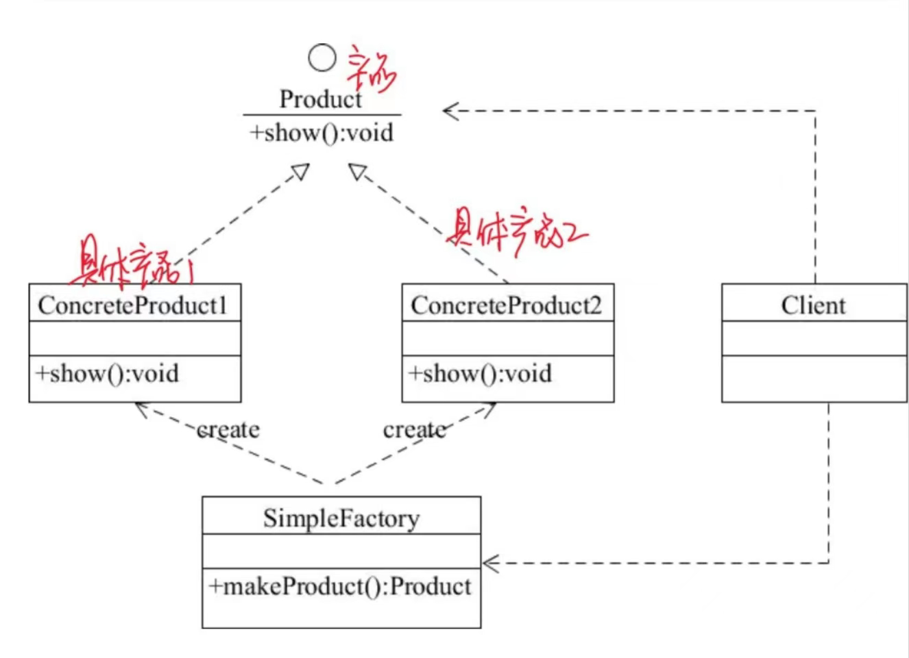
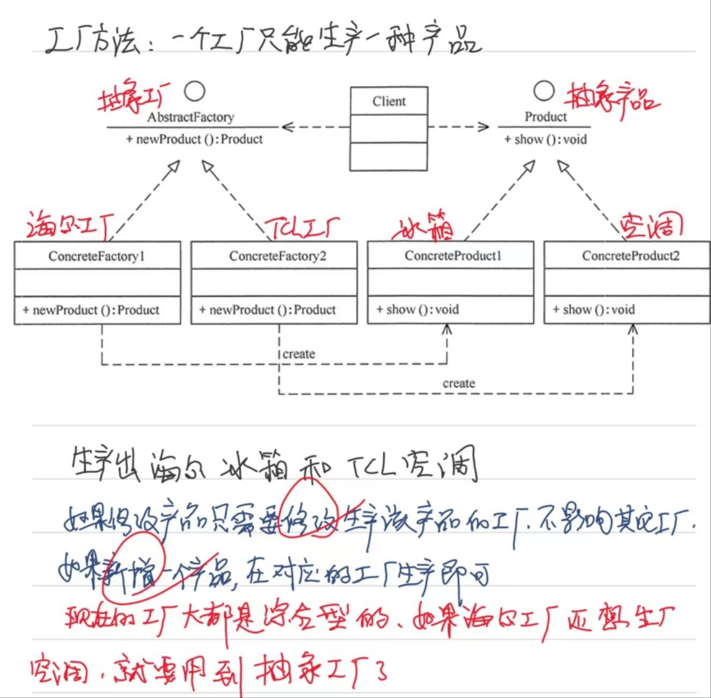
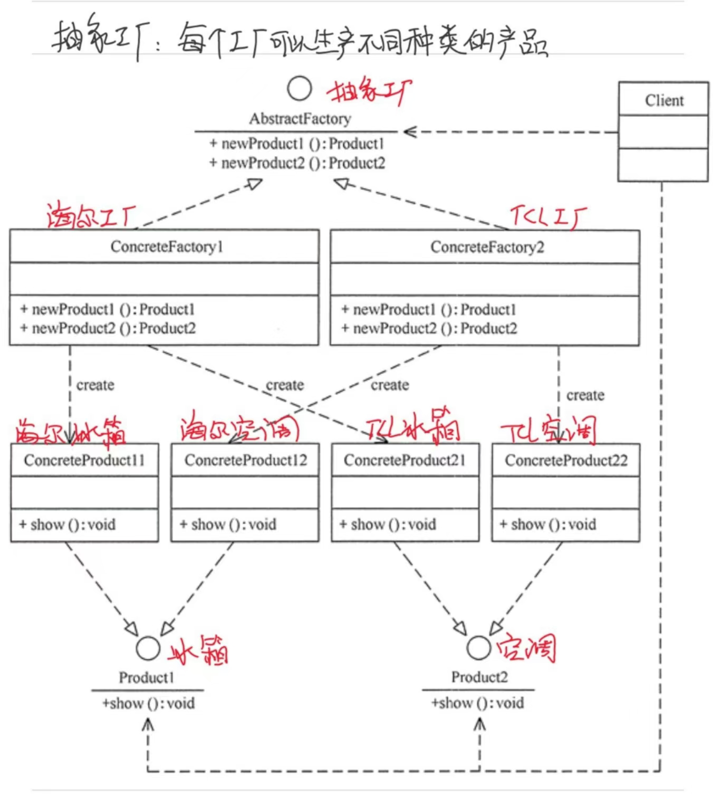

# 3.5 工厂模式

## 一、简单工厂模式

含义：我们把被创建的对象称为“产品”，把创建产品的对象称为“工厂”。如果要创建的产品不多，只要一个工厂类就可以完成，这种模式叫“简单工厂模式”。

简单工厂：一个工厂生产多个产品

违反开闭原则：每新增一个产品就要去修改工厂代码



```java
public class Client {
    public static void main(String[] args) {
    }

    //抽象产品
    public interface Product {
        void show();
    }

    //具体产品：ProductA
    static class ConcreteProduct1 implements Product {
        public void show() {
            System.out.println("具体产品1显示...");
        }
    }

    //具体产品：ProductB
    static class ConcreteProduct2 implements Product {
        public void show() {
            System.out.println("具体产品2显示...");
        }
    }

    final class Const {
        static final int PRODUCT_A = 0;
        static final int PRODUCT_B = 1;
        static final int PRODUCT_C = 2;
    }

    static class SimpleFactory {
        public static Product makeProduct(int kind) {
            switch (kind) {
                case Const.PRODUCT_A:
                    return new ConcreteProduct1();
                case Const.PRODUCT_B:
                    return new ConcreteProduct2();
            }
            return null;
        }
    }
}
```


## 二、工厂方法模式

简单说就是一个工厂生产种产品！简单工厂模式每增加一个产品就要增加一个具体产品类和修改对应的具体工厂类，这增加了系统的复杂度，违反了开闭原则，而工厂方法模式不会修改原来的工厂类，只需要多写一个相应的工厂类。

工厂方法在简单工厂的基础上，对工厂类进行了抽象，灵活性增强，对于新产品的创建，只需多写一个相应的工厂类



```java
public class AbstractFactoryTest {
    public static void main(String[] args) {
        try {
            AbstractFactory af=new ConcreteFactory1().newProduct();
            af.show();
        } catch (Exception e) {
            System.out.println(e.getMessage());
        }
    }
}

//抽象产品：提供了产品的接口
interface Product {
    public void show();
}

//具体产品1：实现抽象产品中的抽象方法
class ConcreteProduct1 implements Product {
    public void show() {
        System.out.println("具体产品1显示...");
    }
}

//具体产品2：实现抽象产品中的抽象方法
class ConcreteProduct2 implements Product {
    public void show() {
        System.out.println("具体产品2显示...");
    }
}

//抽象工厂：提供了厂品的生成方法
interface AbstractFactory {
    public Product newProduct();
}

//具体工厂1：实现了厂品的生成方法
class ConcreteFactory1 implements AbstractFactory {
    public Product newProduct() {
        System.out.println("具体工厂1生成-->具体产品1...");
        return new ConcreteProduct1();
    }
}

//具体工厂2：实现了厂品的生成方法
class ConcreteFactory2 implements AbstractFactory {
    public Product newProduct() {
        System.out.println("具体工厂2生成-->具体产品2...");
        return new ConcreteProduct2();
    }
}
```


## 三、抽象工厂模式



可以看出抽象工厂模式的结构同工厂方法模式的结构相似，不同的是其产品的种类不止一个，所以创建产品的方法也不止一个。下面给出抽象工厂和具体工厂的代码。跟工厂方法主要的区别是把产品接口拆分了。

```java
interface AbstractFactory {
    public Product1 newProduct1();
    public Product2 newProduct2();
}
class ConcreteFactory1 implements AbstractFactory {
    public Product1 newProduct1() {
        System.out.println("具体工厂 1 生成-->具体产品 11...");
        return new ConcreteProduct11();
    }
    public Product2 newProduct2() {
        System.out.println("具体工厂 1 生成-->具体产品 21...");
        return new ConcreteProduct21();
    }
}
```


## 四、Spring源码中的工厂模式

Spring 中的 `BeanFactory` 就是简单工厂模式的一种实现。

Spring所有的容器都是从BeanFactory继承而来，BeanFactory 是 Spring 中最基础的容器，它通过读取配置文件或注解来实例化和管理 Bean，它是管理和维护 Spring Bean 的工厂，BeanFactory 负责创建、配置和管理 Bean 实例，同时提供了对 Bean 生命周期的管理和控制。

BeanFactory 接口定义了一组方法，用于获取和管理 Bean 实例。其中，getBean() 方法是最常用的方法之一，它用于从容器中获取指定名称的 Bean 实例。与其他 Spring 容器相比，BeanFactory 更加轻量级，因为它只在需要时才会实例化 Bean，而其他容器（如 ApplicationContext）在启动时就会预先实例化所有 Bean。这种延迟加载的策略使得 BeanFactory 更加灵活和高效，特别适用于资源受限的环境。

BeanFactory 也可以被视为一个工厂模式的实现，它将对象的创建和管理分离，使得应用程序更加灵活和可扩展。开发人员只需要关注业务逻辑的实现，而不需要手动管理对象的创建和依赖关系。这种解耦的设计使得应用程序更加灵活、可测试和可维护。总之，BeanFactory 是 Spring 框架中最基础的容器，它提供了一种轻量级的方式来管理和维护 Bean，使得应用程序更加灵活和高效。

BeanFactory的创建有三种方式，XML 配置方式、Java 配置方式和注解配置方式

**XML 配置方式**：

```java
public static void main(String[] args) {
    // 加载配置文件
    ClassPathResource resource = new ClassPathResource("applicationContext.xml");
    
    // 创建 BeanFactory
    BeanFactory beanFactory = new XmlBeanFactory(resource);
    
    // 获取 Bean 实例
    MyBean myBean = (MyBean) beanFactory.getBean("myBean");
    
    // 使用 Bean 实例
    myBean.doSomething();
}
```

**Java配置方式**：

```typescript
@Configuration
public class AppConfig {
    @Bean
    public MyBean myBean() {
        return new MyBean();
    }
}
```

```java
public static void main(String[] args) {
    // 创建 ApplicationContext，并指定配置类
    ApplicationContext context = new AnnotationConfigApplicationContext(AppConfig.class);
    
    // 获取 Bean 实例
    MyBean myBean = context.getBean(MyBean.class);
    
    // 使用 Bean 实例
    myBean.doSomething();
}
```


