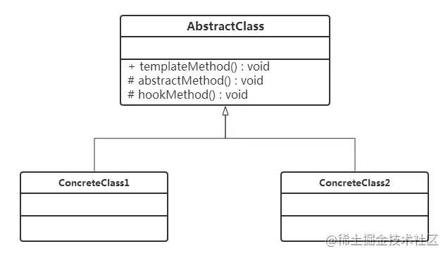

# 3.6 模板方法模式

## 一、介绍

抽象模板角色声明并实现，负责对基本方法的调度，一般以final修饰，不允许具体模板角色重写。模板方法一般也是一个具体方法。

钩子方法（Hook Method）是模板方法模式中的一种特殊方法，用于在抽象类中提供一个默认的实现，但允许具体子类选择性地进行重写或扩展。钩子方法允许子类在不改变算法骨架的情况下，对算法的某些步骤进行定制。



抽象模板角色声明并实现，负责对基本方法的调度，一般以**final修饰**，不允许具体模板角色重写。模板方法一般也是一个具体方法。

```java
public abstract class AbstractClass {

    protected boolean isNeedUnlock = true;  // 默认需要开锁

    /**
     * 基本方法，子类需要实现
     */
    protected abstract void unlock();

    /**
     * 基本方法，子类需要实现
     */
    protected abstract void ride();

    /**
     * 钩子方法，子类可实现
     *
     * @param isNeedUnlock
     */
    protected void isNeedUnlock(boolean isNeedUnlock) {
        this.isNeedUnlock = isNeedUnlock;
    }

    /**
     * 模板方法，负责调度基本方法，子类不可实现
     */
    public final void use() {
        if (isNeedUnlock) {
            unlock();
        } else {
            System.out.println("========锁坏了，不用解锁========");
        }
        ride();
    }
}
```

抽象模板角色定义了unlock和ride两个使用单车的基本方法，还有一个钩子方法，用来控制模板方法逻辑顺序，核心是use模板方法，用final修饰，该方法完成对基本方法调度。注意，模板方法中对基本方法的调度是**有顺序有规则的**。还有一点，基本方法都是protected修饰的，因为基本方法都是在以public修饰的模板方法中调用，并且可以由子类实现，并不需要暴露给其他类调用。

现在来看两个具体模板角色的实现：

**扫描开锁的单车**

```java
// 扫码开锁的单车
public class ScanBicycle extends AbstractClass {
    @Override
    protected void unlock() {
        System.out.println("========" + "扫码开锁" + "========");
    }

    @Override
    protected void ride() {
        System.out.println(getClass().getSimpleName() + "骑起来很拉风");
    }

    protected void isNeedUnlock(boolean isNeedUnlock) {
        this.isNeedUnlock = isNeedUnlock;
    }
}
```

**密码开锁的单车**

```java
// 密码开锁的单车
public class CodeBicycle extends AbstractClass {
    @Override
    protected void unlock() {
        System.out.println("========" + "密码开锁" + "========");
    }

    @Override
    protected void ride() {
        System.out.println(getClass().getSimpleName() + "骑起来很拉风");
    }

    protected void isNeedUnlock(boolean isNeedUnlock) {
        this.isNeedUnlock = isNeedUnlock;
    }
}
```

可以看到，相比之前的实现，现在两个具体类都不需要实现use方法，只负责实现基本方法的逻辑，职责上变得更加清晰了。

当我以百米冲刺的速度跑到共享单车面前时，发现这辆车的锁是坏掉的，也就是不用开锁，免费的，骑回家收藏也没问题。在代码中只要调用钩子方法isNeedUnlock就好，实现如下：

```java
public class Client {
    public static void main(String[] args) {
        ScanBicycle scanBicycle = new ScanBicycle();
        scanBicycle.isNeedUnlock(false);
        scanBicycle.use();

        CodeBicycle codeBicycle = new CodeBicycle();
		codeBicycle.isNeedUnlock(true);
        codeBicycle.use();
    }
}
```

运行结果如下：

```
========锁坏了，不用解锁========
ScanBicycle骑起来很拉风
========密码开锁========
CodeBicycle骑起来很拉风
```

## 二、Spring中的模板方法

Spring中用到模板方法的比如有：RestTemplate, JdbcTemplate、JmsTemplate, JpaTemplate等。

### 1、JdbcTemplate

JDBC的操作流程，有加载驱动程序、获取连接、创建会话、执行SQL、处理结果、释放资源。倘若每次数据库操作都需要如此繁琐的步骤，那么程序员会疯，Spring对如此不友好的API设计早已看不下去，故针对原生JDBC进行了封装，即JdbcTemplate，JdbcTemplate的使用极其简单，一次数据库操作，基本只需一次API调用即可。

其封装思路正是采用了模板方法设计模式的套路，因为JDBC的操作明显就是一个按流程调用API的过程，其中获取资源、释放资源对所有的数据库操作都是一样的，只是SQL的执行不同而已。

```java
public class JdbcTemplate extends JdbcAccessor implements JdbcOperations {
}
```

JdbcTemplate中的核心方法，即模板方法，JdbcTemplate对外提供的API最终会调用该方法，它定义了获取资源、执行SQL、释放资源这一基本流程：

```java
    @Override
	@Nullable
	public <T> T execute(StatementCallback<T> action) throws DataAccessException {
		Assert.notNull(action, "Callback object must not be null");
 
		Connection con = DataSourceUtils.getConnection(obtainDataSource());
		Statement stmt = null;
		try {
			stmt = con.createStatement();
			applyStatementSettings(stmt);
			T result = action.doInStatement(stmt);
			handleWarnings(stmt);
			return result;
		}
		catch (SQLException ex) {
			// Release Connection early, to avoid potential connection pool deadlock
			// in the case when the exception translator hasn't been initialized yet.
			String sql = getSql(action);
			JdbcUtils.closeStatement(stmt);
			stmt = null;
			DataSourceUtils.releaseConnection(con, getDataSource());
			con = null;
			throw translateException("StatementCallback", sql, ex);
		}
		finally {
			JdbcUtils.closeStatement(stmt);
			DataSourceUtils.releaseConnection(con, getDataSource());
		}
	}
```

### 2、RestTemplate

RedisTemplate的执行流程同样是：获取请求、设置请求、发送请求、得到响应、处理结果、释放资源，这又是模板方法的套路。

```java
public class RestTemplate extends InterceptingHttpAccessor implements RestOperations {
}
```

RestTemplate对外提供的API最终会调用该方法，它定义了获取请求、设置请求、发送请求、得到响应、处理结果、释放资源这一基本流程：

```java
    @Nullable
	protected <T> T doExecute(URI url, @Nullable HttpMethod method, @Nullable RequestCallback requestCallback,
			@Nullable ResponseExtractor<T> responseExtractor) throws RestClientException {
 
		Assert.notNull(url, "'url' must not be null");
		Assert.notNull(method, "'method' must not be null");
		ClientHttpResponse response = null;
		try {
			ClientHttpRequest request = createRequest(url, method);
			if (requestCallback != null) {
				requestCallback.doWithRequest(request);
			}
			response = request.execute();
			handleResponse(url, method, response);
			if (responseExtractor != null) {
				return responseExtractor.extractData(response);
			}
			else {
				return null;
			}
		}
		catch (IOException ex) {
			String resource = url.toString();
			String query = url.getRawQuery();
			resource = (query != null ? resource.substring(0, resource.indexOf('?')) : resource);
			throw new ResourceAccessException("I/O error on " + method.name() +
					" request for \"" + resource + "\": " + ex.getMessage(), ex);
		}
		finally {
			if (response != null) {
				response.close();
			}
		}
	}
```


