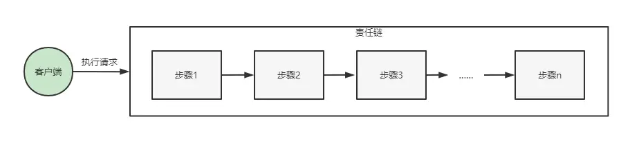
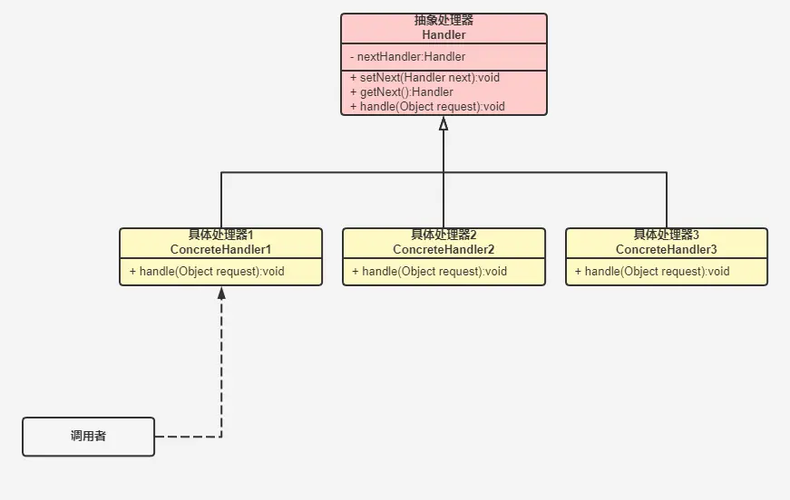
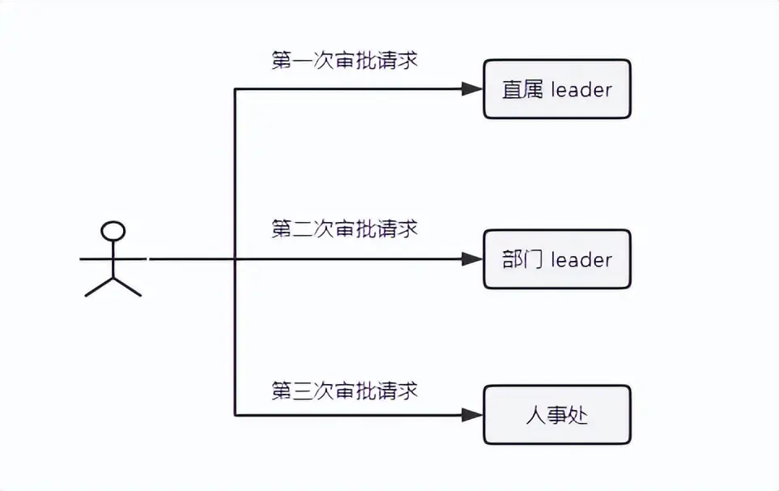

# 3.7 责任链模式

## 一、介绍

责任链模式顾名思义是将不同职责的步骤串联起来执行，并且一个步骤执行完成之后才能够执行下一个步骤。从名字可以看出通常责任链模式使用链表来完成。因此当执行任务的请求发起时，从责任链上第一步开始往下传递，直到最后一个步骤完成。在责任链模式当中，客户端只用执行一次流程开始的请求便不再需要参与到流程执行当中，责任链上的流程便能够自己一直往下执行，客户端同样也并不关心执行流程细节，从而实现与流程之间的解耦。



责任链模式主要角色如下：



**代码**：

```java
// 抽象处理器
public abstract class Handler {
    private Handler next;

    public Handler getNext() {
        return next;
    }

    public void setNext(Handler next) {
        this.next = next;
    }
    public abstract void handle(Object request);
}

// 具体处理器 1
public class ConcreteHandler1 extends Handler {
    @Override
    public void handle(Object request) {
        System.out.println("concrete handler 1 execute request. request: " + request);
        if (getNext() != null) {
            getNext().handle(request);
        }
    }
}

// 具体处理器 2
public class ConcreteHandler2 extends Handler {
    @Override
    public void handle(Object request) {
        System.out.println("concrete handler 2 execute request. request: " + request);
        if (getNext() != null){
            getNext().handle(request);
        }
    }
}

// 具体处理器 3
public class ConcreteHandler3 extends Handler {
    @Override
    public void handle(Object request) {
        System.out.println("concrete handler 3 execute request. request: " + request);
        if (getNext() != null) {
            getNext().handle(request);
        }
    }
}


public static void main(String[] args) {
    Handler concreteHandler1 = new ConcreteHandler1();
    Handler concreteHandler2 = new ConcreteHandler2();
    Handler concreteHandler3 = new ConcreteHandler3();

    concreteHandler1.setNext(concreteHandler2);
    concreteHandler2.setNext(concreteHandler3);

    concreteHandler1.handle("my request.");
}
```

## 二、具体实例

以**日常请假**为例。请假申请会先到你的**直属 leader** 处审批，审批通过后再到**部门 leader** 处审批，部门 leader 通过后，最后到人事处报备记录请假天数。如果在传统企业里面，我们需要手写一份请假表，然后跑到直属 leader 办公室，让直属 leader 签字，然后再到部门 leader 办公室签字，最后还要跑到人事处上交请假单，这样相当于发出了**三次请求**，才能走完整个请假流程。



但是在现代各种 OA 系统管理下，整个请假流程就变的简单了，我们只需要发起一次请假请求，接下来你的请假请求便会自动的在审批人中间进行流转，这个时候我们的责任链模式便派上用场。代码如下：

```java
// 请假抽象处理器
public abstract class DayOffHandler {
    private DayOffHandler next;

    public DayOffHandler getNext() {
        return next;
    }

    public void setNext(DayOffHandler next) {
        this.next = next;
    }
    public abstract void handle(String request);

}
// 直属 leader 处理
public class GroupLeaderHandler extends DayOffHandler {
    @Override
    public void handle(String request) {
        System.out.println("直属 leader 审查: " + request);
        System.out.println("同意请求");
        if (getNext() != null) {
            getNext().handle(request);
        }
    }
}
// 部门 leader 处理
public class DepartmentLeaderHandler extends DayOffHandler{
    @Override
    public void handle(String request) {
        System.out.println("部门 leader 审查: " + request);
        System.out.println("同意请求");
        if (getNext() != null) {
            getNext().handle(request);
        }
    }
}
// 人事处处理
public class HRHandler extends DayOffHandler {
    @Override
    public void handle(String request) {
        System.out.println("人事处审查: " + request);
        System.out.println("同意请求，记录请假");
        if (getNext() != null) {
            getNext().handle(request);
        }
    }
}
```

上面的代码定义了**请假抽象处理类**和三个具体的处理人，我们需要将这三个处理人的流程初始化**串联**起来，并且一步步的执行下去，像下面这张图所示流程一样，于是客户端的代码如下：

```java
public static void main(String[] args) {

    DayOffHandler groupLeaderHandler = new GroupLeaderHandler();
    DayOffHandler departmentLeaderHandler = new DepartmentLeaderHandler();
    DayOffHandler hrHandler = new HRHandler();
    groupLeaderHandler.setNext(departmentLeaderHandler);
    departmentLeaderHandler.setNext(hrHandler);

    System.out.println("收到面试通知，需要请假");
    String request = "家中有事，请假半天，望批准";
    System.out.println("发起请求：");
    groupLeaderHandler.handle(request);
}
```

从**客户端代码**中可以看到，我们首先实例化了三个具体处理人，然后通过 **setNext** 方法将他们串联起来，而我们只需向直属 leader 发起一次请假请求即可，整个审批流程便能够自动的执行下去，不需要再挨个跑办公室申请了。执行后的结果如下：

```nestedtext
收到面试通知，需要请假
发起请求：
直属 leader 审查: 家中有事，请假半天，望批准
同意请求
部门 leader 审查: 家中有事，请假半天，望批准
同意请求
人事处审查: 家中有事，请假半天，望批准
同意请求，记录请假
```

## 三、Servlet中的责任链模式

说到责任链模式，那么最著名的当然是 **Servlet** 中的**过滤器 Filter** 了，在这**拦截器和过滤器**的体系中都使用责任链模式来依次处理每个请求，首先看看过滤器 Filter 的使用方式。Filter 接口如下：

```java
public interface Filter {
    default void init(FilterConfig filterConfig) throws ServletException {
    }

    void doFilter(ServletRequest var1, ServletResponse var2, FilterChain var3) throws IOException, ServletException;

    default void destroy() {
    }
}
```

**FilterChain** 便是过滤器 Filter 的一条责任链，其代码如下：

```java
public interface FilterChain {
    void doFilter(ServletRequest var1, ServletResponse var2) throws IOException, ServletException;
}


public final class ApplicationFilterChain implements FilterChain {
    
    public void doFilter(ServletRequest request, ServletResponse response) throws IOException, ServletException {
        if (Globals.IS_SECURITY_ENABLED) {
            final ServletRequest req = request;
            final ServletResponse res = response;

            try {
                AccessController.doPrivileged(new PrivilegedExceptionAction<Void>() {
                    public Void run() throws ServletException, IOException {
                        ApplicationFilterChain.this.internalDoFilter(req, res);
                        return null;
                    }
                });
            } catch (PrivilegedActionException var7) {
                Exception e = var7.getException();
                if (e instanceof ServletException) {
                    throw (ServletException)e;
                }

                if (e instanceof IOException) {
                    throw (IOException)e;
                }

                if (e instanceof RuntimeException) {
                    throw (RuntimeException)e;
                }

                throw new ServletException(e.getMessage(), e);
            }
        } else {
            this.internalDoFilter(request, response);
        }

    }

    private void internalDoFilter(ServletRequest request, ServletResponse response) throws IOException, ServletException {
        if (this.pos < this.n) {
            ApplicationFilterConfig filterConfig = this.filters[this.pos++];

            try {
                Filter filter = filterConfig.getFilter();
                if (request.isAsyncSupported() && "false".equalsIgnoreCase(filterConfig.getFilterDef().getAsyncSupported())) {
                    request.setAttribute("org.apache.catalina.ASYNC_SUPPORTED", Boolean.FALSE);
                }

                if (Globals.IS_SECURITY_ENABLED) {
                    Principal principal = ((HttpServletRequest)request).getUserPrincipal();
                    Object[] args = new Object[]{request, response, this};
                    SecurityUtil.doAsPrivilege("doFilter", filter, classType, args, principal);
                } else {
                    filter.doFilter(request, response, this);
                }

            } catch (ServletException | RuntimeException | IOException var15) {
                throw var15;
            } catch (Throwable var16) {
                Throwable e = ExceptionUtils.unwrapInvocationTargetException(var16);
                ExceptionUtils.handleThrowable(e);
                throw new ServletException(sm.getString("filterChain.filter"), e);
            }
        } else {
            try {
                if (ApplicationDispatcher.WRAP_SAME_OBJECT) {
                    lastServicedRequest.set(request);
                    lastServicedResponse.set(response);
                }

                if (request.isAsyncSupported() && !this.servletSupportsAsync) {
                    request.setAttribute("org.apache.catalina.ASYNC_SUPPORTED", Boolean.FALSE);
                }

                if (request instanceof HttpServletRequest && response instanceof HttpServletResponse && Globals.IS_SECURITY_ENABLED) {
                    Principal principal = ((HttpServletRequest)request).getUserPrincipal();
                    Object[] args = new Object[]{request, response};
                    SecurityUtil.doAsPrivilege("service", this.servlet, classTypeUsedInService, args, principal);
                } else {
                    this.servlet.service(request, response);
                }
            } catch (ServletException | RuntimeException | IOException var17) {
                throw var17;
            } catch (Throwable var18) {
                Throwable e = ExceptionUtils.unwrapInvocationTargetException(var18);
                ExceptionUtils.handleThrowable(e);
                throw new ServletException(sm.getString("filterChain.servlet"), e);
            } finally {
                if (ApplicationDispatcher.WRAP_SAME_OBJECT) {
                    lastServicedRequest.set((Object)null);
                    lastServicedResponse.set((Object)null);
                }

            }

        }
    }
}
```

在 **internalDoFilter()** 方法中，可以看到整个 **FilterChain** 上使用**数组 filters** 存放每一个过滤器及其配置并使用 **pos 记录**当前遍历到哪一个过滤器，然后再执行获取到的 **Filter** 的 **doFilter** 方法。与前面所讲链表方式存放不同，这里的链路使用数组来进行存放。

## 四、Spring中的策略模式

在 **SpringMVC** 中的 **Interceptor** 同样也用到了**责任链模式**。首先来看看 **Interceptor** 的抽象处理类;

```java
public interface HandlerInterceptor {
    default boolean preHandle(HttpServletRequest request, HttpServletResponse response, Object handler) throws Exception {
        return true;
    }

    default void postHandle(HttpServletRequest request, HttpServletResponse response, Object handler, @Nullable ModelAndView modelAndView) throws Exception {
    }

    default void afterCompletion(HttpServletRequest request, HttpServletResponse response, Object handler, @Nullable Exception ex) throws Exception {
    }
}
```

在抽象处理类中，定义了三个方法，分别是处理前置处理器、后置处理器和整个流程完成之后的处理。通过 **HandlerExecutionChain** 将拦截器串联起来，在 **HandlerExecutionChain** 中，我们需要关注 **applyPreHandle**、**applyPostHandle** 和 **triggerAfterCompletion** 三个方法，这三个方法分别执行了拦截器中所定义的 **preHandle** 、**postHandle** 和 **afterCompletion** 方法。并且从代码中也能够看处，和前面的过滤器一样，所有的拦截器都存放在 **interceptors** 数组中，并在三个方法中遍历 **interceptors** 数组依次执行相应的方法

```java
public class HandlerExecutionChain {
    @Nullable
    private HandlerInterceptor[] interceptors;

    boolean applyPreHandle(HttpServletRequest request, HttpServletResponse response) throws Exception {
        HandlerInterceptor[] interceptors = this.getInterceptors();
        if (!ObjectUtils.isEmpty(interceptors)) {
            for(int i = 0; i < interceptors.length; this.interceptorIndex = i++) {
                HandlerInterceptor interceptor = interceptors[i];
                if (!interceptor.preHandle(request, response, this.handler)) {
                    this.triggerAfterCompletion(request, response, (Exception)null);
                    return false;
                }
            }
        }

        return true;
    }

    void applyPostHandle(HttpServletRequest request, HttpServletResponse response, @Nullable ModelAndView mv) throws Exception {
        HandlerInterceptor[] interceptors = this.getInterceptors();
        if (!ObjectUtils.isEmpty(interceptors)) {
            for(int i = interceptors.length - 1; i >= 0; --i) {
                HandlerInterceptor interceptor = interceptors[i];
                interceptor.postHandle(request, response, this.handler, mv);
            }
        }

    }

    void triggerAfterCompletion(HttpServletRequest request, HttpServletResponse response, @Nullable Exception ex) throws Exception {
        HandlerInterceptor[] interceptors = this.getInterceptors();
        if (!ObjectUtils.isEmpty(interceptors)) {
            for(int i = this.interceptorIndex; i >= 0; --i) {
                HandlerInterceptor interceptor = interceptors[i];

                try {
                    interceptor.afterCompletion(request, response, this.handler, ex);
                } catch (Throwable var8) {
                    logger.error("HandlerInterceptor.afterCompletion threw exception", var8);
                }
            }
        }

    }
}
```


