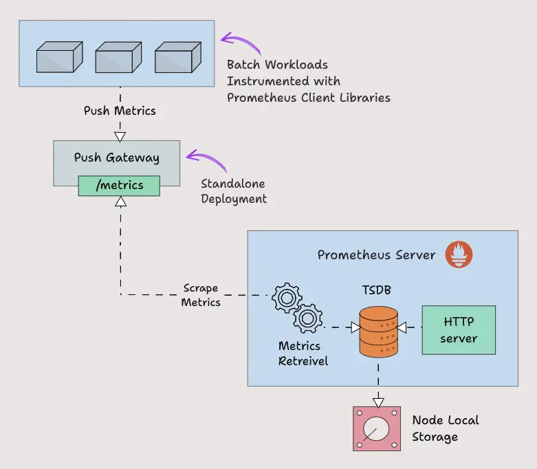

# 9.1.2 Prometheus架构剖析


## 架构概述


Prometheus主要由以下部分组成：

- Prometheus Server
- Service Discovery
- Time-Series Database (TSDB)
- Targets
- Exporters
- Push Gateway
- Alert Manager
- Client Libraries
- PromQL

## Job/Exporter

Job/Exporter属于Prometheus target，是Prometheus监控的对象。

Job分为长时间执行和段时间执行两种。对于长时间执行的Job，可以使用Prometheus Client集成进行监控；对于短时间执行的Job，可以将监控数据推送到Pushgateway中缓存。

Exporter的机制是将第三方系统的监控数据按照Prometheus的格式暴露出来。Exporter 就像在目标上运行的代理。它将指标从特定系统转换为普罗米修斯可以理解的格式。它可以是系统指标，如 CPU、内存等，也可以是 Java JMX 指标、MySQL 指标等


默认情况下，这些转换后的指标由 Exporter 在目标的 /metrics 路径（HTTP 端点）上公开。例如，如果要监控服务器的 CPU 和内存，则需要在该服务器上安装 Node Exporter，并且 Node Exporter 以 prometheus 指标格式在 /metrics 上公开 CPU 和内存指标。一旦 Prometheus 提取指标，它将结合指标名称、标签、值和时间戳生成结构化数据。

**Exporter局限性**：Exporter种类繁多，每个Exporter又是独立的，每个组件各司其职。但是Exporter越多，维护压力越大，可以考虑替换为Influx Data公司开源的Telegraf统一进行管理。Telegraf支持各种类型Exporter的集成，可以实现Exporter的多合一，使用Telegraf集成Prometheus比单独使用Prometheus会拥有更低的内存使用率和CPU使用率。

在 Prometheus 配置文件中，所有 Exporter 的详细信息将在 scrape_configs 下给出。

```shell
scrape_configs:
  - job_name: 'node-exporter'
    static_configs:
      - targets: ['node-exporter1:9100', 'node-exporter2:9100']

  - job_name: 'blackbox-exporter'
    static_configs:
      - targets: ['blackbox-exporter1:9115', 'blackbox-exporter2:9115']
    metrics_path: /probe

  - job_name: 'snmp-exporter'
    static_configs:
      - targets: ['snmp-exporter1:9116', 'snmp-exporter2:9116']
    metrics_path: /snmp
```


## Pushgateway

**Prometheus是拉模式为主的监控系统，它的推模式就是通过Pushgateway组件实现的。Pushgateway是支持临时性Job主动推送指标的中间网管，它本质上是一种用于监控Prometheus服务器无法抓取的资源的解决方案。**

Prometheus 默认使用 pull 方式来抓取指标。然而，有些场景需要将指标推送到 prometheus。让我们举一个在 Kubernetes cronjob 上运行的批处理作业的示例，该作业每天根据某些事件运行 5 分钟。在这种情况下，Prometheus 将无法使用拉机制正确抓取服务级别指标。因此，我们需要将指标推送到 prometheus，而不是等待 prometheus 拉取指标。为了推送指标，prometheus 提供了一个名为 Pushgateway 的解决方案。它是一种中间网关。

Pushgateway 需要作为独立组件运行。批处理作业可以使用 HTTP API 将指标推送到 Pushgateway。然后 Pushgateway 在 /metrics 端点上公开这些指标。然后 Prometheus 从 Pushgateway 中抓取这些指标。



Pushgateway 将指标数据临时存储在内存中。它更像是一个临时缓存。Pushgateway 配置也将在 Prometheus 配置中的 scrape_configs 部分下进行配置。

```shell
scrape_configs:
  - job_name: "pushgateway"
    honor_labels: true
    static_configs:
    - targets: [pushgateway.monitoring.svc:9091]
```

Pushgateway的使用场景主要有如下几种：

- 临时/短作业
- 批处理作业
- 应用程序与Prometheus服务器之间有网络隔离，如安全性（防火墙）、连续性（不在一个网段，服务器或应用仅允许特定端口或路径访问）。

Pushgateway的局限性：

- 存在单点故障问题。如果Pushgateway从许多不同的来源手机指标时宕机，用户将失去对所有这些来源的监控，可能会触发许多不必要的告警。
- Pushgateway不会自动删除推送给它的任何指标数据。因此，必须使用Pushgateway的API从推送网关中删除过期的指标
- Pushgateway还有防火墙和NAT问题。推荐做法是将Prometheus移到防火墙后面，让Prometheus更加接近采集的目标

注意：Pushgateway会丧失Prometheus通过UP监控指标检查实例监控状况的功能，此时Prometheus对应的拉状态的UP指标只是针对单Pushgateway服务的。

## 服务发现（Service Discovery）

Prometheus通过服务发现机制对云以及容器环境下的监控场景提供了完善的支持

- 支持文件的服务发现（Prometheus会周期性地从文件中读取最新的target信息）
- 支持多种常见的服务发现组件，如Kubernetes、DNS、Zookeeper、Azure、EC2和GCE等。例如Prometheus可以使用Kubernetes的API获取容器信息的变化（如容器的创建和删除）来动态更新监控对象。

通过服务发现的方式，管理员可以在不重启Prometheus服务的情况下动态发现需要监控的target实例信息。

**服务发现的Relabeling机制**：Relabeling机制会从Prometheus包含的target实例中获取默认的元标签信息，从而对不同开发环境（测试、预发布、线上）、不同业务团队、不同组织等按照某些规则（比如标签）从服务发现注册中心返回的target实例中有选择性地采集某些Exporter实例的监控数据。

## Prometheus服务器（Prometheus Server）

Prometheus服务器主要包含抓取、存储和查询这3个功能。

- 抓取：Prometheus Server通过服务发现组件，周期性地从上面介绍的Job、Exporter、Pushgateway这3个组件中通过Http轮询的形式拉取监控指标数据。
- 存储：抓取到的监控数据通过一定的规则清理和数据整理（）抓取前使用服务发现提供的relabel_configs方法，抓取后使用作业内的metrics_relabel_configs方法），会把得到的结果存储到新的时间序列中进行持久化。存储系统每秒可以处理数百万个样品的摄入，使得使用一台Prometheus服务器监控数千台机器成为可能。
  - Prometheus的存储分为本地存储和远程存储
  - 本地存储：会直接保留到本地磁盘，性能上建议使用SSD且不要保存超过一个月的数据。记住，任何版本的Prometheus都不支持NFS，有损坏或丢失历史数据的可能。
  - 远程存储：适用于存储大量的监控数据。Prometheus支持的远程存储包括OpenTSDB、InfluxDB、Elasticsearch、Graphite、CrateDB、Kafka、PostgreSQL、TimescaleDB、TiKV等。远程存储需要配合中间层的适配器进行转换，主要设计Prometheus中的remote_write和remote_read接口。在实际生产中，远程存储会出现各种各样的问题，需要不断进行优化、压测、架构改造甚至重写上传数据逻辑的模块等工作。

- 查询：Prometheus持久化数据以后，客户端就可以通过PromQL语句对数据进行查询了。


## Dashboard

Web UI、Grafana、API client可以统一理解为Prometheus的Dashboard。实际工作中使用Grafana作为前端展示界面，用户也可以直接使用Client向Prometheus Server发送请求以获取数据。

## Alertmanager

Alertmanager是独立于Prometheus的一个告警组件，需要单独安装部署。Prometheus可以将多个Alertmanager配置为一个集群，通过服务发现动态发现告警集群中节点的上下线从而避免单点问题，Alertmanager也支持集群内多个实例之间的通信。

它的主要工作是根据 Prometheus 警报配置中设置的指标阈值发送警报。警报由 Prometheus 触发（注意，是由 Prometheus 进程触发原始告警）并发送到 Alertmanager。Alertmanager 对告警去重、抑制、静默、分组，最后使用各类通知媒介（电子邮件、slack 等）发出告警事件。其具体功能：

- Alert Deduplicating：消除重复警报
- Grouping：将相关警报分组在一起
- Silencing：静默维护
- Routing：路由，根据严重性将警报路由到适当的接收者
- Inhibition：抑制，当存在中高严重性警报时停止低严重性警报的过程


参考文章：https://segmentfault.com/a/1190000045089599


