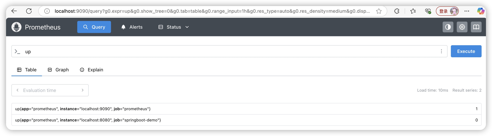

# 9.1.3 Prometheus安装和启动

- https://prometheus.io/download/下载最新软件版本

- 解压和启动

  ```shell
  # 解压
  tar xvfz promxxxx.tar.gz
  # 启动
  ./prometheus --config.file=prometheus.yml
  ```

- 访问：启动后Prometheus端口号9090，可以访问localhost:9090/metrics，该地址返回与Prometheus Server状态相关的监控信息。

  ```shell
  localhost:9090/graph是Prometheus的默认查询界面
  在Graph界面可以输入PromQL表达式，比如输入 up，就可以查看监控的每个Job的健康状态，1健康，0不健康
  ```

- 抓取配置scrape_configs，一个scrape_config 片段指定一组目标和参数， 目标就是实例，指定采集的端点。如果ccrape_configs如下配置：（其中8080服务是没有启动的）

  ```shell
  # A scrape configuration containing exactly one endpoint to scrape:
  # Here it's Prometheus itself.
  scrape_configs:
    # The job name is added as a label `job=<job_name>` to any timeseries scraped from this config.
    - job_name: "prometheus"
  
      # metrics_path defaults to '/metrics'
      # scheme defaults to 'http'.
  
      static_configs:
        - targets: ["localhost:9090"]
         # The label name is added as a label `label_name=<label_value>` to any timeseries scraped from this config.
          labels:
            app: "prometheus"
    - job_name: "springboot-demo"
  
      # metrics_path defaults to '/metrics'
      # scheme defaults to 'http'.
      metrics_path: '/actuator/prometheus'
  
      static_configs:
        - targets: ["localhost:8080"]
         # The label name is added as a label `label_name=<label_value>` to any timeseries scraped from this config.
          labels:
            app: "prometheus"
  ```

  结果如下，8080端口服务是不正常的：

  

status菜单里的信息大多是可配置的，例如--web.enable-lifecycle，在部署springboot微服务过程中是最常见的，它支持prometheus通过Web端点动态更新配置。

```
./prometheus --config.file=prometheus.yml --web.enable-lifecycle
```

如果开启了这个命令参数，每当prometheus.yml文件发生改变时，就不需要对Prometheus进行关闭再重启的操作了，而是通过下面这个命令让配置进行重新加载（API接口）

```shell
curl -X POST http://localhost:9090/-/reload
# 也可以通过http方式关闭prometheus
curl -X POST http://localhost:9090/-/quit
```

**需要注意的是，告警及其阈值是在Prometheus中配置的，而不是在Alertmanager中配置的**，prometheus.yml部分配置及含义在书P48


