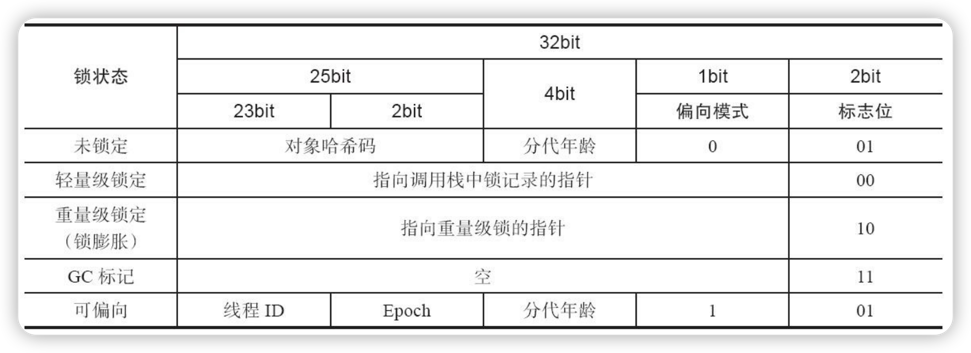
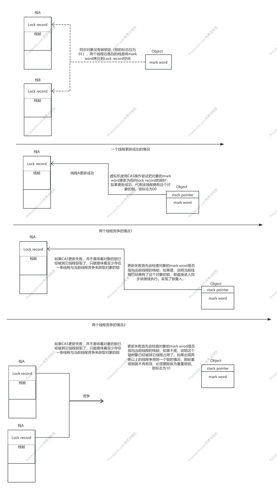

# 2.9.3 锁优化

有哪些锁优化技术？

- 自适应自旋
- 锁消除
- 锁膨胀
- 轻量级锁

## 一、自旋锁与自适应锁

互斥同步对性能最大的影响是阻塞的实现，挂起和恢复线程操作都需要转入内核态中完成。

**自旋锁**：如果有多个处理器核心，能让两个或以上的线程同时并行执行，我们就可以让后面请求锁的那个线程“稍等一会儿”，但不放弃处理器的执行时间，看看持有锁的线程释放很快就会释放锁。为了让线程等待，我们只须让线程执行一个忙循环（自旋）。

自旋不能代替阻塞，先不说对处理器的要求，自旋等待本身虽然避免了线程切换的开销，但它要占用处理器的时间。如果锁占用的时间很短，自旋等待的效果就会非常好，反之，带来性能浪费。因此自旋等待时间必须有一定的限度，自旋次数的默认值是10次，用户也可以使用JVM参数自行更改。

无论用户指定自旋次数还是用默认自旋次数，自旋时间都是固定的。在JDK6中对自旋锁进行优化，引入了自适应的自旋。

自适应自旋的时间不再固定，而是由前一次在同一个锁上自旋时间以及锁拥有者的状态来决定

## 二、锁消除

锁消除指的是虚拟机即时编译器在运行时，对一些代码要求同步，但是对被检测到不可能存在共享数据竞争的锁进行消除。

锁消除判定依据来源于逃逸分析的数据支持，如果判断到一段代码中，在堆上的所有数据都不会逃逸出去被其它线程访问到，那就可以把它当作栈上数据对待，认为他们是线程私有的，同步加锁自然就无须进行。

引申出一个问题就是，变量是否逃逸，对于虚拟机来说是需要使用复杂的过程间分析才能确定的，但是程序员自己应该清楚，怎么会明知道不存在数据争用的情况下还要求同步呢——答案是，有许多同步措施并不是程序员自己加入的，Java里面同步的代码出现得很频繁，比如下面这个看起来没有同步的代码。

```java
public String concatString(String s1,String s2,String s3){
    return s1+s2+s3;
}
```

由于String是一个不可变的类，对字符串的连接操作总是通过生成新的String对象来进行的。上面代码经过Javac编译后，会变成下面代码的例子。

```java
public String concatString(String s1,String s2,String s3){
    StringBuilder sb=new StringBuilder();
    sb.append(s1);
    sb.append(s2);
    sb.append(s3);
    return sb.toString();
}
```

每个StringBuilder.append()方法中都有一个同步款，锁就是sb对象。虚拟机观察变量sb，经过逃逸分析后发现它的动态作用域被限制在concatString()方法内部，也就是说sb的所有引用都永远不会逃逸到concatString()方法之外，其它线程无法访问到它，所以这里虽然有锁，但是可以被安全地消除掉。

## 三、锁粗化

通常情况下，为了保证多线程间的有效并发，会要求每个线程持有锁的时间尽可能短，但是大某些情况下，一个程序对同一个锁不间断、高频地请求、同步与释放，会消耗掉一定的系统资源，因为锁的讲求、同步与释放本身会带来性能损耗，这样高频的锁请求就反而不利于系统性能的优化了，虽然单次同步操作的时间可能很短。**锁粗化就是告诉我们任何事情都有个度，有些情况下我们反而希望把很多次锁的请求合并成一个请求，以降低短时间内大量锁请求、同步、释放带来的性能损耗**。

**情况1**

```java
public void doSomethingMethod(){
    synchronized(lock){
        //do some thing
    }
    //这是还有一些代码，做其它不需要同步的工作，但能很快执行完毕
    synchronized(lock){
        //do other thing
    }
}
```

上面的代码是有两块需要同步操作的，但在这两块需要同步操作的代码之间，需要做一些其它的工作，而这些工作只会花费很少的时间，那么我们就可以把这些工作代码放入锁内，将两个同步代码块合并成一个，以降低多次锁请求、同步、释放带来的系统性能消耗，合并后的代码如下:

```java
public void doSomethingMethod(){
    //进行锁粗化：整合成一次锁请求、同步、释放
    synchronized(lock){
        //do some thing
        //做其它不需要同步但能很快执行完的工作
        //do other thing
    }
}
```

**情况2：加锁操作在循环体中**

```java
for(int i=0;i<size;i++){
    synchronized(lock){
    }
}
```

锁粗化后代码如下

```java
synchronized(lock){
    for(int i=0;i<size;i++){
    }
}
```

## 四、轻量级锁

“轻量级”是相对于使用操作系统互斥量来实现的传统锁而言，因此传统的锁机制就被称为“重量级锁”，不过，需要强调一点，轻量级锁并不是用来代替重量级锁的，它的**目的**是在没有多线程竞争的前提下，减少传统的重量级锁使用操作系统互斥量产生的性能损耗。

要理解轻量级锁，首先要理解对象头。

### 1、对象头

对象头分为两部分

- Mark Word。用于存储对象自身的运行时的数据，如哈希码、GC分代年龄等。
- 用于存储指向方法区对象类型数据的指针。

对象头结构如下



### 2、轻量级锁加锁过程



### 3、轻量级锁解锁过程

轻量级锁解锁过程同样是通过CAS操作来进行的（因为上面轻量级锁加锁的第一步将对象的mark word拷贝到了线程的栈帧里面，所以解锁就是将栈帧里面的Displaced Mark Word替换回对象的Mark Word），如果对象的mark word仍然指向线程的锁记录，那就用CAS操作把对象当前的Mark Word和线程中复制的Displaced Mark Word替换回来，假如能成功替换，那整个同步过程就顺利完成了；如果替换失败，就说明有其它线程尝试获取该锁，就要在释放锁的同时，唤醒被挂起的线程。

### 4、轻量级锁性能

轻量级锁能提升程序同步性能的依据是“对于绝大部份的锁，在整个同步周期内都是不存在竞争的”这条法则。如果没有竞争，轻量级锁便通过CAS操作成功避免了使用互斥量的开销；但如果确实存在锁竞争，除了互斥量的本身开销外，还额外发生了CAS操作的开销。因此在有竞争的情况下，轻量级锁反而会比传统的重量级锁更慢。


