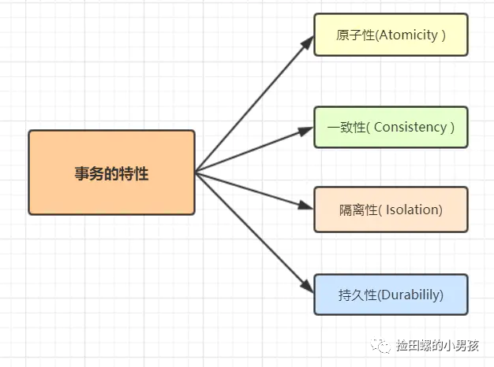
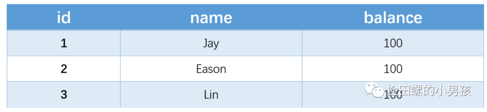
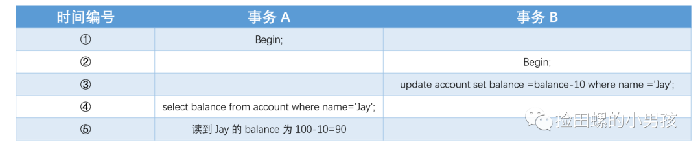
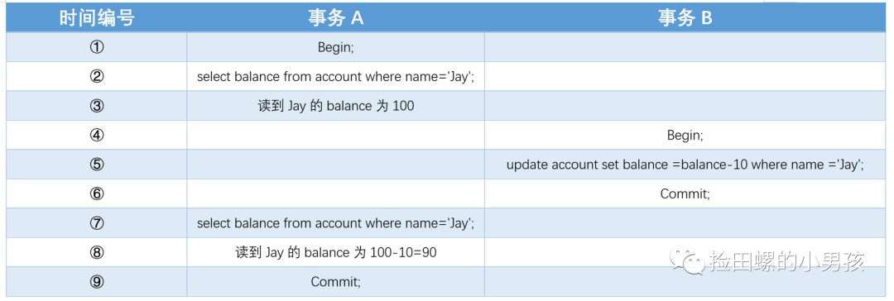
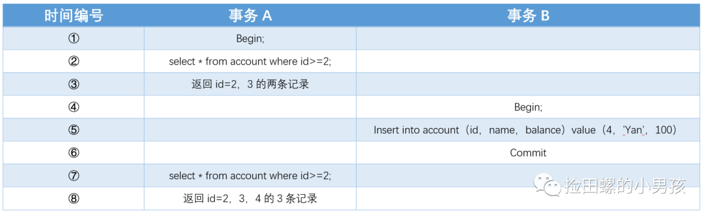

# 5.1.1 事务及其特性

**什么是事务**：事务，由一个有限的数据库操作序列构成，这些操作要么全部执行,要么全部不执行，是一个不可分割的工作单位。

假如A转账给B 100 元，先从A的账户里扣除 100 元，再在 B 的账户上加上 100 元。如果扣完A的100元后，还没来得及给B加上，银行系统异常了，最后导致A的余额减少了，B的余额却没有增加。所以就需要事务，将A的钱回滚回去，就是这么简单。

## 一、事务的四大特性



- **原子性：** 事务作为一个整体被执行，包含在其中的对数据库的操作要么全部都执行，要么都不执行。原子性由undo log日志来保证。

  理解：生单和减库存要保证原子性。

- **一致性：** 使用事务的最终目的，由业务代码正确逻辑保证。

  理解：指在事务开始之前和事务结束以后，数据不会被破坏，假如A账户给B账户转10块钱，不管成功与否，A和B的总金额是不变的。

- **隔离性：** 多个事务并发访问时，事务之间是相互隔离的，一个事务不应该被其他事务干扰，多个并发事务之间要相互隔离。。

  隔离性由加锁和MVCC实现的。

- **持久性：** 表示事务完成提交后，该事务对数据库所作的操作更改，将持久地保存在数据库之中。持久性由redo log实现的，比如事务的两阶段提交。

## 二、事务并发存在的问题

事务并发执行存在什么问题呢，换句话说就是，一个事务是怎么干扰到其他事务的呢？看例子吧~假设现在有表：

```sql
CREATE TABLE `account` (
 `id` int(11) NOT NULL,
 `name` varchar(255) DEFAULT NULL,
 `balance` int(11) DEFAULT NULL,
  PRIMARY KEY (`id`),
  UNIQUE KEY `un_name_idx` (`name`) USING BTREE
) ENGINE=InnoDB DEFAULT CHARSET=utf8;
```

表中有数据：



事务并发会存在三大问题

- 脏读
- 不可重复读
- 幻读

### 1、脏读（dirty read）

假设现在有两个事务A、B：

- 假设现在A的余额是100，事务A正在准备查询Jay的余额
- 这时候，事务B先扣减Jay的余额，扣了10
- 最后A读到的是扣减后的余额



由上图可以发现，事务A、B交替执行，事务A被事务B干扰到了，因为事务A读取到事务B未提交的数据，这就是**脏读**。

**脏读**是指在数据库事务处理中，一个事务读取了另一个事务未提交的数据。

### 2、不可重复读（unrepeatable read）

假设现在有两个事务A和B：

- 事务A先查询Jay的余额，查到结果是100
- 这时候事务B 对Jay的账户余额进行扣减，扣去10后，提交事务
- 事务A再去查询Jay的账户余额发现变成了90



事务A又被事务B干扰到了！在事务A范围内，两个相同的查询，读取同一条记录，却返回了不同的数据，这就是**不可重复读**。

### 3、幻读

注意幻读和不可重复读的区别：幻读是两次范围查询中其他时候更改提交了数据，不可重复读是两次读的同一条记录中其他事务更改提交了数据。

假设现在有两个事务A、B：

- 事务A先查询id大于2的账户记录，得到记录id=2和id=3的两条记录
- 这时候，事务B开启，插入一条id=4的记录，并且提交了
- 事务A再去执行相同的查询，却得到了id=2,3,4的3条记录了。



事务A查询一个范围的结果集，另一个并发事务B往这个范围中插入/删除了数据，并静悄悄地提交，然后事务A再次查询相同的范围，两次读取得到的结果集不一样了，这就是**幻读**。


