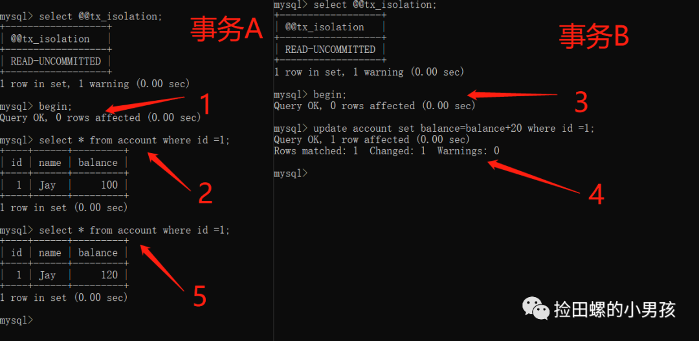
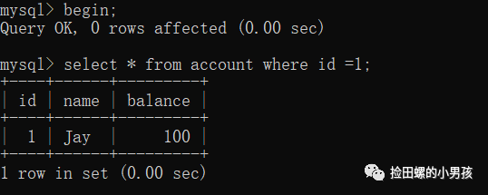
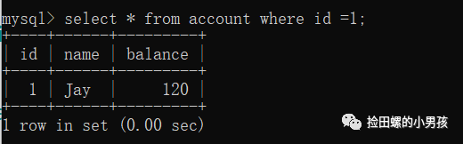
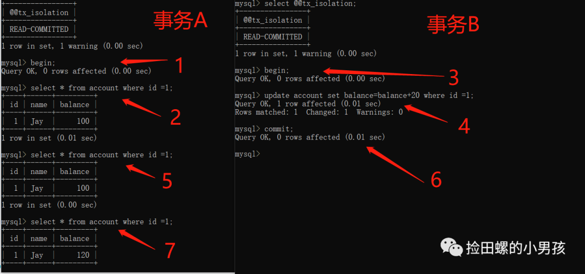
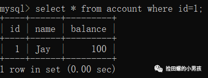
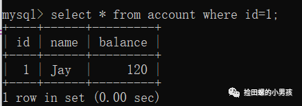
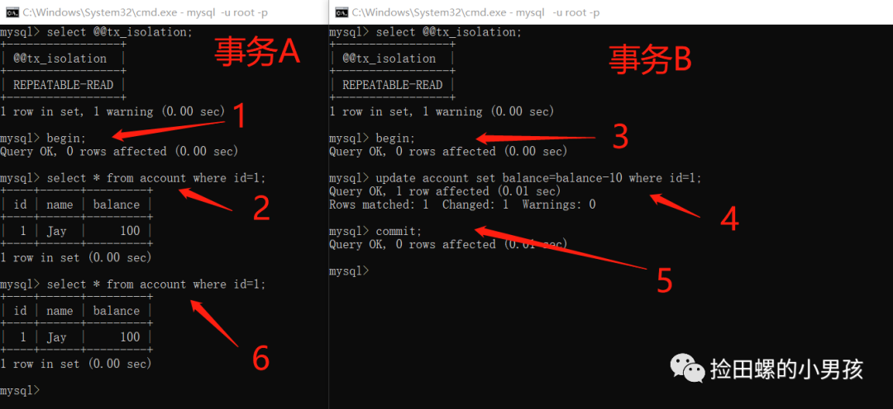
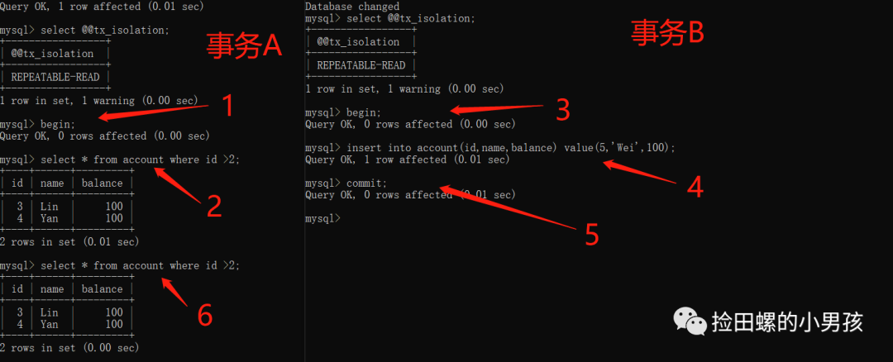
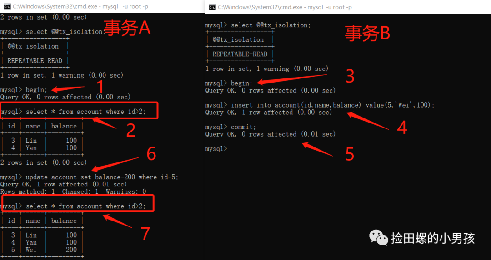
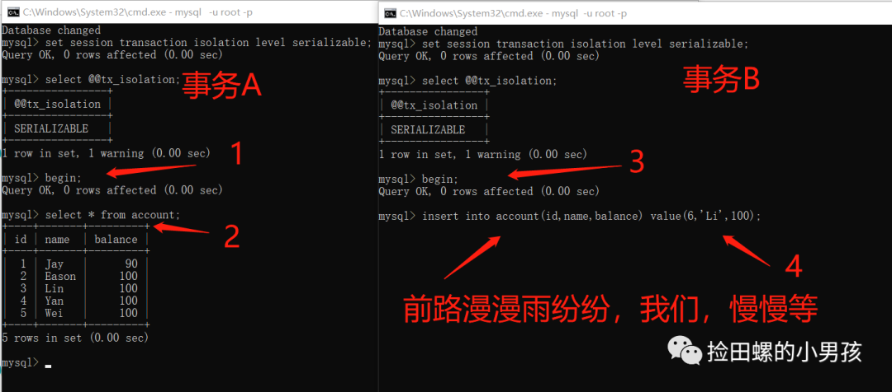

# 5.1.2 事务的四大隔离级别
导语：在看这文章的时候，脑海先想到平时代码里是如何用事务的，用的什么注解～

既然并发事务存在**脏读、不可重复、幻读**等问题，InnoDB实现了哪几种事务的隔离级别应对呢？

- 读未提交（Read Uncommitted）
- 读已提交（Read Committed）
- 可重复读（Repeatable Read）（mysql默认隔离级别）
- 串行化（Serializable）

## 一、读未提交（Read Uncommitted）

我们去数据库给它设置**读未提交**隔离级别，实践一下吧~



先把事务隔离级别设置为read uncommitted，开启事务A，查询id=1的数据

```sql
set session transaction isolation level read uncommitted;
begin;
select * from account where id =1;
```

结果如下：



这时候，另开一个窗口打开mysql，也把当前事务隔离级别设置为read uncommitted，开启事务B，执行更新操作

```sql
set session transaction isolation level read uncommitted;
begin;
update account set balance=balance+20 where id =1;
```

接着回事务A的窗口，再查account表id=1的数据，结果如下：



可以发现，在**读未提交（Read Uncommitted）** 隔离级别下，一个事务会读到其他事务未提交的数据的，即存在**脏读**问题。事务B都还没commit到数据库呢，事务A就读到了，感觉都乱套了。。。实际上，读未提交是隔离级别最低的一种。

## 二、读已提交（Read Committed）

读已提交级别又被称为**RC级别**

为了避免脏读，数据库有了比**读未提交**更高的隔离级别，即**读已提交**。



把当前事务隔离级别设置为读已提交（READ COMMITTED），开启事务A，查询account中id=1的数据

```sql
set session transaction isolation level read committed;
begin;
select * from account where id =1;
```

另开一个窗口打开mysql，也把事务隔离级别设置为read committed，开启事务B，执行以下操作

```sql
set session transaction isolation level read committed;
begin;
update account set balance=balance+20 where id =1;
```

接着回事务A的窗口，再查account数据，发现数据没变：



我们再去到事务B的窗口执行commit操作：

```sql
commit;
```

最后回到事务A窗口查询，发现数据变了：



由此可以得出结论，隔离级别设置为**已提交读（READ COMMITTED）** 时，已经不会出现脏读问题了，当前事务只能读取到其他事务提交的数据。但是，你站在事务A的角度想想，存在其他问题吗？

**读已提交的隔离级别会有什么问题呢？**

在同一个事务A里，相同的查询sql，读取同一条记录（id=1），读到的结果是不一样的，即**不可重复读**。所以，隔离级别设置为read committed的时候，还会存在**不可重复读**的并发问题。

## 三、可重复读（Repeatable Read）

可重复读级别又称为**RR级别**

如果你的老板要求，在同个事务中，查询结果必须是一致的，即老板要求你解决不可重复的并发问题，怎么办呢？老板，臣妾办不到？来实践一下**可重复读（Repeatable Read）** 这个隔离级别吧~



哈哈，步骤1、2、6的查询结果都是一样的，即**repeatable read解决了不可重复读问题**，是不是心里美滋滋的呢，终于解决老板的难题了~

### 1、RR级别是否解决了幻读问题

再来看看网上的一个热点问题，有关于RR级别下，是否解决了幻读问题？我们来实践一下：



由图可得，步骤2和步骤6查询结果集没有变化，看起来RR级别是已经解决幻读问题了~ 但是呢，**RR级别还是存在这种现象**：



其实，上图如果事务A中，没有 `update accountsetbalance=200 whereid=5;`这步操作， `select*from account where id>2`查询到的结果集确实是不变，这种情况没有**幻读**问题。但是，有了update这个骚操作，同一个事务，相同的sql，查出的结果集不同，这个是符合了**幻读**的定义~

这个问题，亲爱的朋友，你觉得它算幻读问题吗？

## 四、串行化（Serializable）

前面三种数据库隔离级别，都有一定的并发问题，现在放大招吧，实践SERIALIZABLE隔离级别。

把事务隔离级别设置为Serializable，开启事务A，查询account表数据

```sql
set session transaction isolation level serializable;
select @@tx_isolation;
begin;
select * from account;
```

另开一个窗口打开mysql，也把事务隔离级别设置为Serializable，开启事务B，执行插入一条数据：

```sql
set session transaction isolation level serializable;
select @@tx_isolation;
begin;
insert into account(id,name,balance) value(6,'Li',100);
```



由图可得，当数据库隔离级别设置为serializable的时候，事务B对表的写操作，在等事务A的读操作。其实，这是隔离级别中最严格的，读写都不允许并发。它保证了最好的安全性，性能却是个问题~

参考文章：https://cloud.tencent.com/developer/article/1614863


