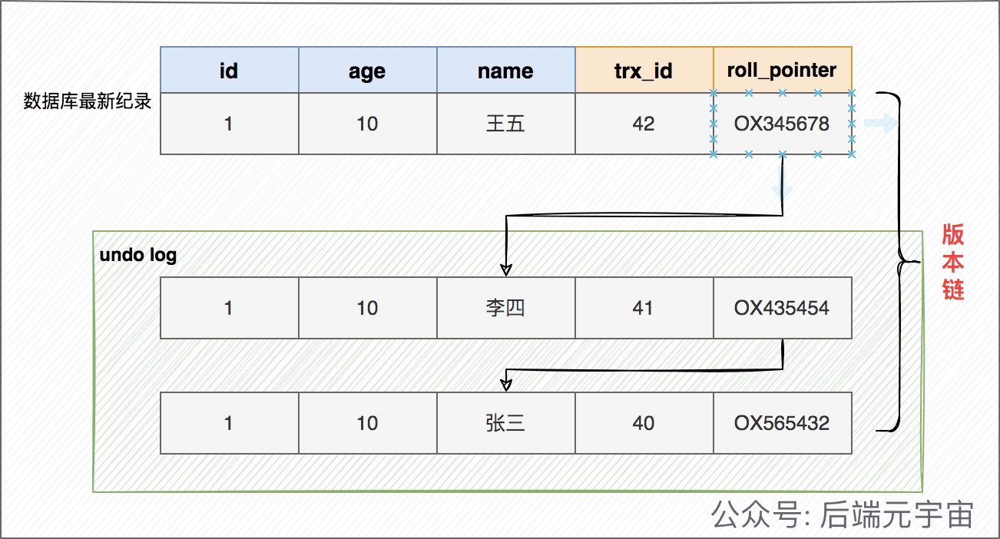
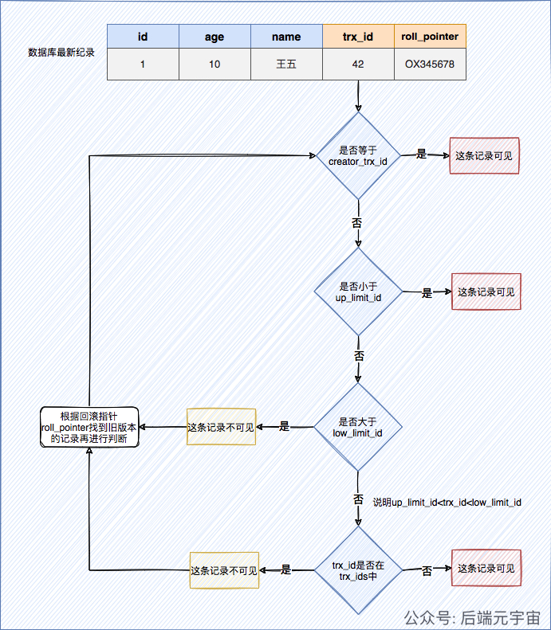
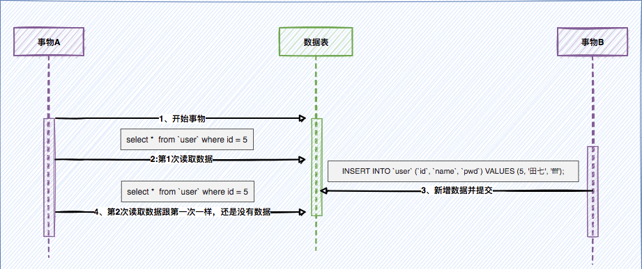
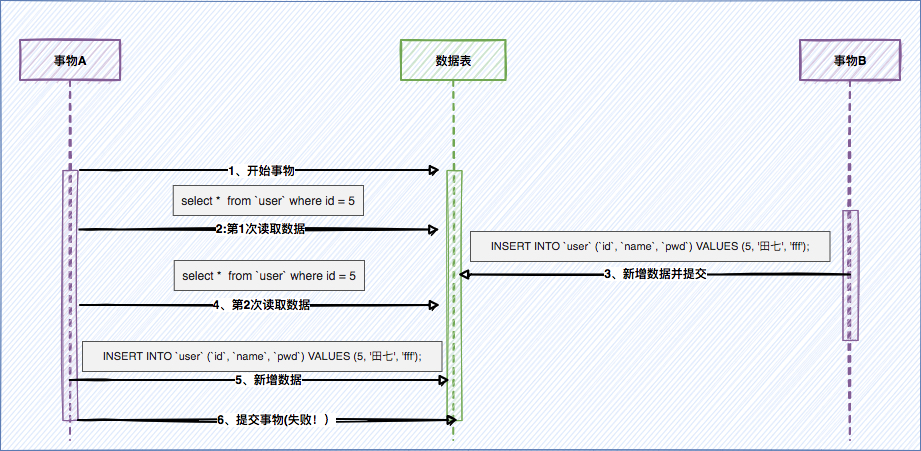

# 5.1.3 MVCC多版本并发控制

## 一、什么是MVCC

MVCC解决的不是幻读，而是不可重复读。

**多版本控制**: 指的是一种提高并发的技术。最早的数据库系统，只有读读之间可以并发，读写，写读，写写都要阻塞。引入多版本之后，**只有写写之间相互阻塞**，其他三种操作都可以并行，这样大幅度提高了InnoDB的并发度。

在内部实现中，InnoDB通过undo log保存每条数据的多个版本，并且能够找回数据历史版本提供给用户读，每个事务读到的数据版本可能是不一样的。在同一个事务中，用户只能看到该事务创建快照之前已经提交的修改和该事务本身做的修改。

MVCC只在`已提交读`（Read Committed）和`可重复读`（Repeatable Read）两个隔离级别下工作，其他两个隔离级别和MVCC是不兼容的。因为未提交读，总数读取最新的数据行，而不是读取符合当前事务版本的数据行。而串行化（Serializable）则会对读的所有数据多加锁。

MVCC的实现原理主要是依赖**每一行记录中两个隐藏字段，undo log，ReadView**

## 二、MVCC相关的概念

这里我们先来理解下有关MVCC相关的一些概念，这些概念都理解后，我们会通过实际例子来演示MVCC的具体工作流程是怎么样的。

### 1、事务版本号

事务每次开启时，都会从数据库获得一个自增长的事务ID，可以从事务ID判断事务的执行先后顺序。这就是事务版本号。

也就是每当begin的时候,首选要做的就是从数据库获得一个自增长的事务ID,它也就是当前事务的事务ID。

### 2、隐藏字段

对于InnoDB存储引擎，每一行记录都有两个隐藏列**trx_id**、**roll_pointer**,如果数据表中存在主键或者非NULL的UNIQUE键时不会创建row_id,否则InnoDB会自动生成单调递增的隐藏主键row_id。

| 列名         | 是否必须 | 描述                                                         |
| :----------- | :------- | :----------------------------------------------------------- |
| row_id       | 否       | 单调递增的行ID，不是必需的，占用6个字节。 这个跟MVCC关系不大 |
| trx_id       | 是       | 记录操作该行数据事务的事务ID                                 |
| roll_pointer | 是       | 回滚指针，指向当前记录行的undo log信息                       |

这里的记录操作，指的是insert|update|delete。对于delete操作而已，InnoDB认为是一个update操作，不过会更新一个另外的删除位，将行表示为deleted,并非真正删除。

### 3、undo log

**undo log可以理解成回滚日志,它存储的是老版本数据**。在表记录修改之前，会先把原始数据拷贝到undo log里，如果事务回滚，即可以通过undo log来还原数据。或者如果当前记录行不可见，可以顺着undo log链找到满足其可见性条件的记录行版本。

在insert/update/delete(本质也是做更新，只是更新一个特殊的删除位字段)操作时，都会产生undo log。

在InnoDB里，undo log分为如下两类：

1）**insert undo log** : 事务对insert新记录时产生的undo log, 只在事务回滚时需要, 并且在事务提交后就可以立即丢弃。

2）**update undo log** : 事务对记录进行delete和update操作时产生的undo log，不仅在事务回滚时需要，快照读也需要，只有当数据库所使用的快照中不涉及该日志记录，对应的回滚日志才会被删除。

undo log有什么用途呢？

> 1、事务回滚时，保证原子性和一致性。
> 2、如果当前记录行不可见，可以顺着undo log链找到满足其可见性条件的记录行版本(用于MVCC快照读)。

### 4、版本链

多个事务并行操作某一行数据时，不同事务对该行数据的修改会产生多个版本，然后通过回滚指针（roll_pointer），连成一个链表，这个链表就称为**版本链**。如下：



### 5、快照读和当前读

**快照读**： 读取的是记录数据的可见版本（有旧的版本）。不加锁,普通的select语句都是快照读,如：

```sql
select * from user where id = 1;
```

**当前读**：读取的是记录数据的最新版本，显式加锁的都是当前读

```sql
select * from user where id = 1 for update;
select * from user where id = 1 lock in share mode;
```

### 6、ReadView

> ReadView是事务在进行快照读的时候生成的记录快照, 可以帮助我们解决可见性问题的

如果一个事务要查询行记录，需要读取哪个版本的行记录呢？ ReadView 就是来解决这个问题的。 ReadView 保存了**当前事务开启时所有活跃的事务列表**。换个角度，可以理解为: **ReadView 保存了不应该让这个事务看到的其他事务 ID 列表。**

ReadView是如何保证可见性判断的呢？我们先看看 ReadView 的几个重要属性

- **trx_ids**: 当前系统中那些活跃(未提交)的读写事务ID, 它数据结构为一个List。(`重点注意`:这里的trx_ids中的活跃事务，**不包括当前事务自己**和已提交的事务，这点非常重要)
- **low_limit_id**: 目前出现过的最大的事务ID+1，即下一个将被分配的事务ID。
- **up_limit_id**: 活跃事务列表trx_ids中最小的事务ID，如果trx_ids为空，则up_limit_id 为 low_limit_id。
- **creator_trx_id**: 表示生成该 ReadView 的事务的 事务id

画张图来理解下



这里需要思考的一个问题就是 `何时创建ReadView？`

上面说过,ReadView是来解决一个事务需要读取哪个版本的行记录的问题的。那么说明什么？只有在select的时候才会创建ReadView。但在不同的隔离级别是有区别的:

> 在RC隔离级别下，是每个select都会创建最新的ReadView；而在RR隔离级别下，则是当事务中的第一个select请求才创建ReadView(下面会详细举例说明)。

那insert/update/delete操作呢？

这样操作不会创建ReadView。但是这些操作在事务开启(begin)且其未提交的时候，那么它的事务ID,会存在在其它存在查询事务的ReadView记录中，也就是trx_ids中。

## 三、MVCC实现原理分析

### 1、如何查询一条记录

1. 获取事务自己事务ID，即trx_id。(这个也不是select的时候获取的，而是这个事务开启的时候获取的 也就是begin的时候)
2. 获取ReadView(这个才是select的时候才会生成的)
3. 数据库表中如果查询到数据，那就到ReadView中的事务版本号进行比较。
4. 如果不符合ReadView的可见性规则， 即就需要Undo log中历史快照，直到返回符合规则的数据;

InnoDB 实现MVCC，是通过`ReadView+ Undo Log` 实现的，Undo Log 保存了历史快照，ReadView可见性规则帮助判断当前版本的数据是否可见。

### 2、MVCC是如何实现读已提交和可重复读呢

其实其它流程都是一样的，读已提交和可重复读唯一的区别在于：在RC隔离级别下，是每个select都会创建最新的ReadView；而在RR隔离级别下，则是当事务中的第一个select请求才创建ReadView。

看完下面这个例子你应该就明白了。


## 四、MVCC能否解决幻读问题

MVCC能解决不可重复读问题,但是不能解决幻读问题，不论是快照读和当前读都不能解决。RR级别解决幻读靠的是锁机制,而不是MVCC机制。

既然网上那么多人说，MVCC解决能解决快照读下的幻读问题， 那这里通过举示例来说明,MVCC解决不了快照读的幻读问题。

假设有张用户表,这张表的 id 是主键。表中一开始有4条数据。


这里是在RR级别下研究(可重复读)。



1、事务A,查询是否存在 id=5 的记录，没有则插入，这是我们期望的正常业务逻辑。

2、这个时候 事务B 新增的一条 id=5 的记录，并提交事务。

3、事务A,再去查询 id=5 的时候,发现还是没有记录。

上面的文章是这样来举例说明,事务A第一次和第二次读到的是一样的，所以认为解决了幻读。我不认为这个是解决了幻读，而是解决了不可能重复读。它保证了第一次和第二次所读到的结果是一样的。

解决幻读了吗？显然没有，因为这个时候如果事务A执行一条插入操作

```sql
INSERT INTO `user` (`id`, `name`, `pwd`) VALUES (5, '田七', 'fff');
```



最终 事务A 提交事务，发现报错了。这就很奇怪，查的时候明明没有这条记录，但插入的时候 却告诉我 主键冲突，这就好像幻觉一样。这才是幻读问题。

所以说MVCC是不能解决的，要想解决还是需要锁。

这里事务A能正常的插入的前提就是其它事务不能插入id=5并提交成功。要解决这个问题也很简单，就是事务A先获得id=5这个排它锁。

我们可以在事务A第一次查询的时候加一个排他锁

```sql
select *  from `user` where id = 5 for update
```

那么事务B的插入动作永远属于堵塞状态，直到事务A插入成功，并提交。那么最终是事务B报主键冲突而回滚。但事务A不会因为查询的时候没有这条记录，插入失败。也就解决了幻读问题。

所以说 RR级别下解决幻读问题靠的是锁机制，而不是MVCC机制。

参考好文：https://www.cnblogs.com/qdhxhz/p/15750866.html


