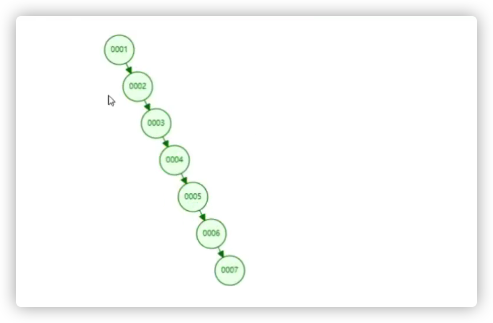
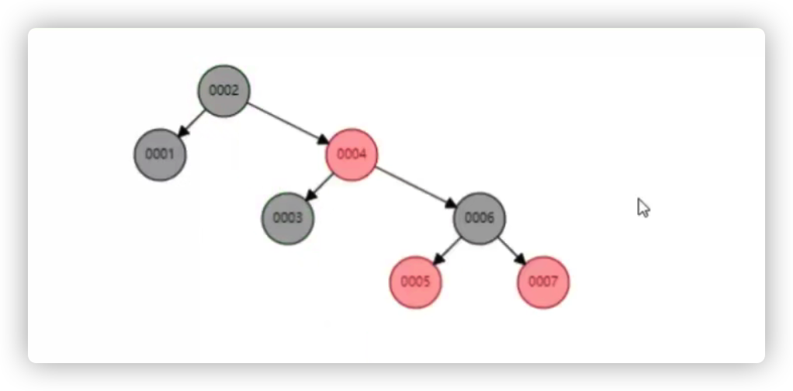
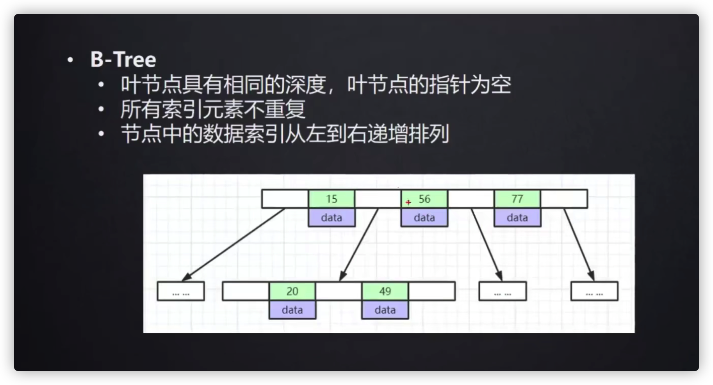
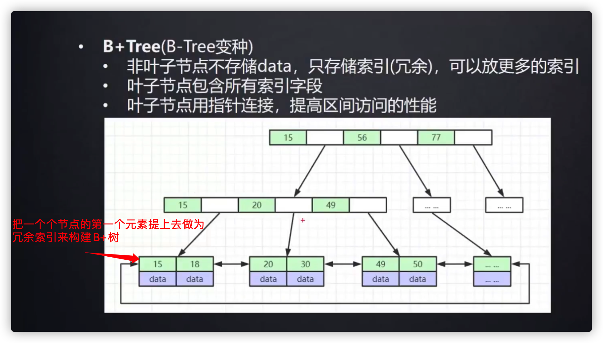
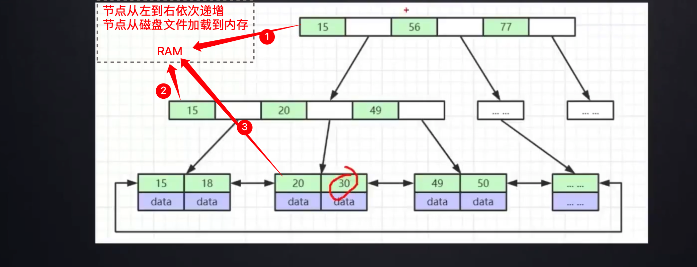

# 5.2.1 索引数据结构

**索引**是帮助MySQL高效获取数据的排好序的数据结构

索引数据结构

- 二叉树
- 红黑树
- Hash表
- B-Tree
- B+Tree

上面的数据结构有什么缺点？为什么MySQL底层采用B+树呢？

## 一、二叉树

如果索引是二叉树数据结构，它有个严重问题，比如Col1自增的数据列存储到二叉树的数据结构中，自增的数据列存储到二叉树中会变成一个链表，那跟全表查找一样了

## 二、红黑树

红黑树又叫平衡二叉树，HashMap底层就是用的红黑树

跟二叉树对比，平衡二叉树查找元素6，只用查找3次！效率更高。

但是红黑树高度不可控。mysql底层没有用红黑树数据结构，如果数据上百万，那么树的高度会特别高，查找的次数会更多，磁盘io也会很大。所有尽量要树的高度越小，那么查找次数越少。

## 三、B-Tree

高度跟二叉树相同的情况下存储的数更多。

## 四、B+Tree

mysql底层在B树的基础上优化为B+树

B+树解决了平衡二叉树当数据越多，高度不可控的问题。

B树和B+树的区别

- B树的每个结点都存储了key和data，B+树的data存储在叶子节点上。节点不存储data，这样一个节点就可以存储更多的key。可以使得树更矮，所以IO操作次数更少。

- 树的所有叶结点构成一个有序链表，可以按照关键码排序的次序遍历全部记录。由于数据顺序排列并且相连，所以便于区间查找和搜索。而B树则需要进行每一层的递归遍历。相邻的元素可能在内存中不相邻，所以缓存命中性没有B+树好。

## 五、B+Tree的查找

将一个节点加载到内存就是一次io操作。版本高的mysql事先就会把非叶子结点加载到内存里面，效率更高，最终只需要一次磁盘查找就能找到元素。所以千万级别的表走索引也很快.

**上面说“B+树高度越小，效率更高”，那如果h=1是不是更好？**——不是的，高度为1的B+树相当于链表，而且全是叶子节点和data。1000w的表查找某个字段就把所有的节点加载到内存，不合适。一般来说会把冗余索引加载到内存，带有data的叶子节点不好加载到内存。

**当单表的数据量达到 1000W 或 100G 以后**，要求分库分表了。
