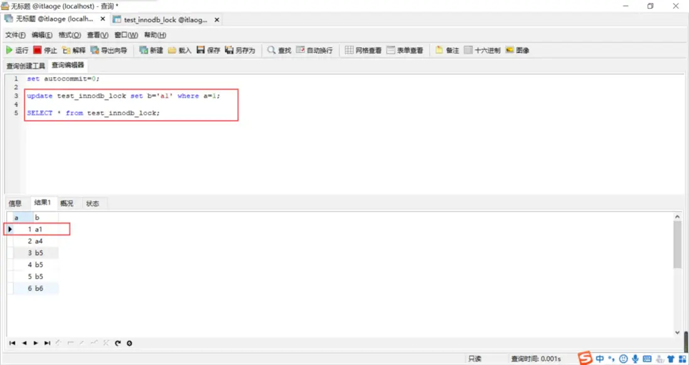
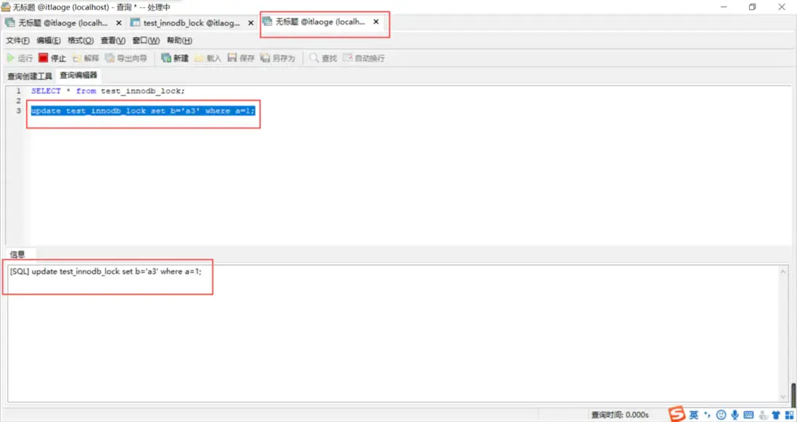
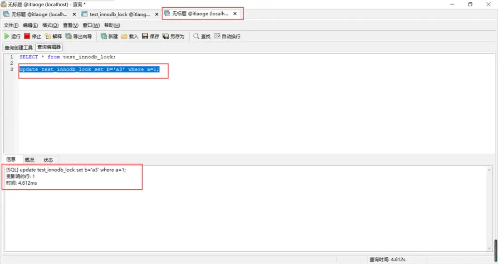
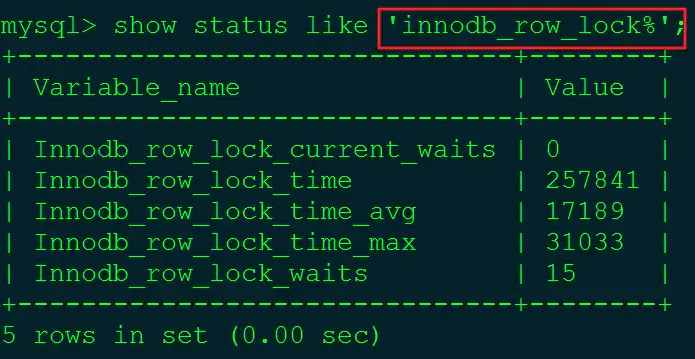
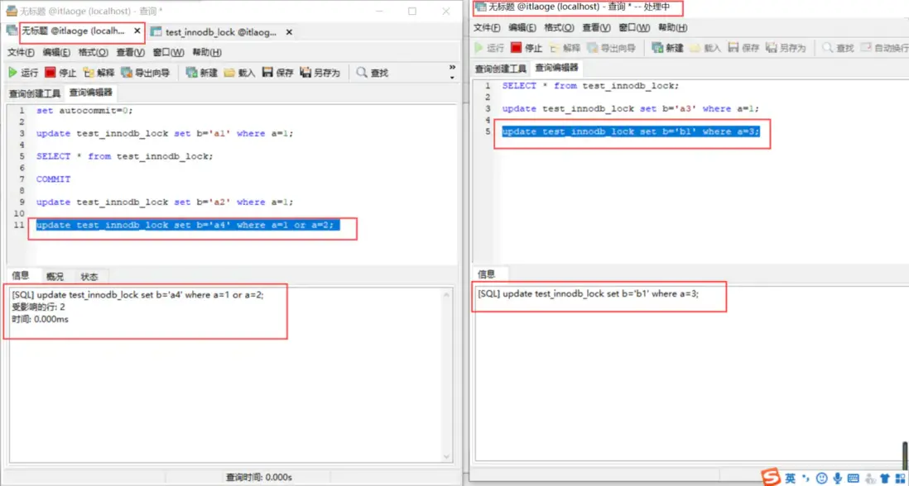
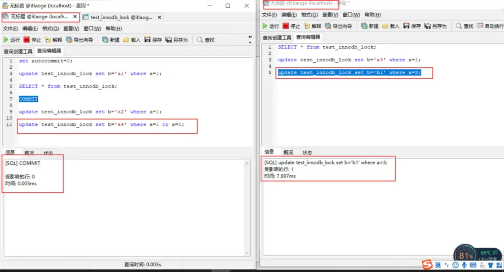
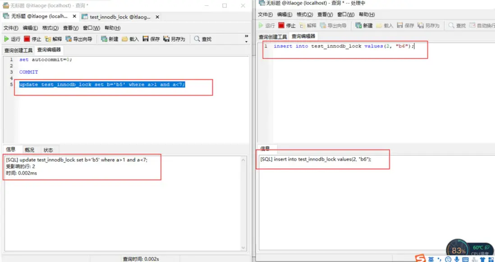

# 5.2.1 行锁、表锁、间隙锁

## 一、介绍

首先锁的存在，目的是为了在并发场景下，保持数据的安全、一致。
并发场景有：

- 读-读 ：此并发场景不需要进行并发控制，也就是不需要加锁。

- 读-写 ：此并发场景需要并发控制，不然就会出现脏读，幻读，不可重复读的问题。

- 写-写 ：此并发场景需要并发控制，不然就会出现更新丢失的问题。

  进行并发控制，常规手段就是加锁，不管是咋java业务代码中，还是mysql数据库本身，都有实现自己的锁，其中mysql的锁有以下几种：

**行锁**：锁住表中的一行；比如 update user set name=‘张三’ where id=1；会锁住id=1的那一行数据，其他事务再想更新，就只能等前一个事务释放锁。
**表锁**：锁住整个表，比如update user set name=‘张三’；由于没有加where条件，此更新sql会对整个表进行更新，也就是会锁住整个表。
**间隙锁**：比如事务A执行update user set name=‘张三’ where id >1 and id<4; 假如表中只有id=1、2 两条数据，A事务还没提交，那么此时事务B再次插入一条id=3的数据，理论上是允许的，但是实际上是B只能等A提交，因为事务A执行的是id>1and id<4，范围涵盖了id=3的，也即是把id=3的这个间隙也给锁了，叫做间隙锁。

## 二、MVCC和各种锁的关系

既然可以使用行锁、表锁、间隙锁来保证数据操作的安全性，那么还要MVCC的出现是为何呢？ 实际是因为在性能方面还有优化的空间。

引入多版本之后，**只有写写之间相互阻塞**，其他三种操作都可以MVCC并行，这样大幅度提高了InnoDB的并发度。

因此，mysql是同时使用了MVCC+行锁、表锁、间隙锁来保证了数据安全，又尽可能大的实现了性能最优化。

## 三、准备工作

**创建表**

```sql
drop table if exists test_innodb_lock;
CREATE TABLE test_innodb_lock (
    a INT (11),
    b VARCHAR (20)
) ENGINE INNODB DEFAULT charset = utf8;
insert into test_innodb_lock values (1,'a');
insert into test_innodb_lock values (2,'b');
insert into test_innodb_lock values (3,'c');
insert into test_innodb_lock values (4,'d');
insert into test_innodb_lock values (5,'e');
```

**创建索引**

```sql
create index idx_lock_a on test_innodb_lock(a);
create index idx_lock_b on test_innodb_lock(b);
```

- 先将自动提交事务改成手动提交：`set autocommit=0;`
- 我们启动两个会话窗口 A 和 B，模拟一个抢到锁，一个没抢到被阻塞住了。

## 四、行锁

**行锁**：锁住表中的一行；比如 update user set name=‘张三’ where id=1；会锁住id=1的那一行数据，其他事务再想更新，就只能等前一个事务释放锁。

### 1、行锁（写&读）

- A 窗口执行

```sql
update test_innodb_lock set b='a1' where a=1;
SELECT * from test_innodb_lock;
```



我们可以看到 A 窗口可以看到更新后的结果

- B 窗口执行

```sql
SELECT * from test_innodb_lock;
```

我们可以看到 B 窗口不能看到更新后的结果，看到的还是老数据，这是因为 a = 1 的这行记录被 A 窗口执行的 SQL 语句抢到了锁，并且没有执行 commit 提交操作。所以窗口 B 看到的还是老数据。这就是 MySQL 隔离级别中的"**读已提交**"。

- 窗口 A 执行 commit 操作

```sql
COMMIT;
```

- 窗口 B 查询

```sql
SELECT * from test_innodb_lock;
```


这个时候我们发现窗口 B 已经读取到最新数据了

### 2、行锁（写&写）

- 窗口 A 执行更新 a = 1 的记录

```sql
update test_innodb_lock set b='a2' where a=1;
```

这时候并没有 commit 提交，锁是窗口 A 持有。

- 窗口 B 也执行更新 a = 1 的记录

```sql
update test_innodb_lock set b='a3' where a=1;
```



**可以看到，窗口 B 一直处于阻塞状态，因为窗口 A 还没有执行 commit，还持有锁。窗口 B 抢不到 a = 1 这行记录的锁，所以一直阻塞等待。**

- 窗口 A 执行 commit 操作

```sql
COMMIT;
```

- 窗口 B 的变化



可以看到这个时候窗口 B 已经执行成功了

### 3、行锁分析

- 执行 SQL 分析命令

```sql
show status like 'innodb_row_lock%';
```



- Variable_name 说明
  - Innodb_row_lock_current_waits：当前正在等待锁定的数量。
  - Innodb_row_lock_time：从系统启动到现在锁定的时长。
  - Innodb_row_lock_time_avg：每次等待锁所花平均时间。
  - Innodb_row_lock_time_max：从系统启动到现在锁等待最长的一次所花的时间。
  - Innodb_row_lock_waits：系统启动后到现在总共等待锁的次数。


## 五、表锁

**当索引失效的时候，行锁会升级成表锁**，索引失效的其中一个方法是对索引自动 or 手动的换型。a 字段本身是 integer，我们加上引号，就变成了 String，这个时候索引就会失效了。

- 窗口 A 更新 a = 1 的记录

```sql
update test_innodb_lock set b='a4' where a=1 or a=2;
```

- 窗口 B 更新 a = 3 的记录

```sql
update test_innodb_lock set b='b1' where a=3;
```



这个时候发现，虽然窗口 A 和 B 更新的行不一样，但是窗口 B 还是被阻塞住了，**就是因为窗口 A 的索引失效，导致行锁升级成了表锁，把整个表锁住了，索引窗口 B 被阻塞了**。

- 窗口 A 执行 commit 操作

```sql
COMMIT;
```

- 窗口 B 的变化



可以看到这个时候窗口 B 已经执行成功了

## 六、间隙锁

### 1、什么是间隙锁

当我们采用范围条件查询数据时，InnoDB 会对这个范围内的数据进行加锁。比如有 id 为：1、3、5、7 的 4 条数据，我们查找 1-7 范围的数据。那么 1-7 都会被加上锁。2、4、6 也在 1-7 的范围中，但是不存在这些数据记录，这些 2、4、6 就被称为间隙。

### 2、间隙锁的危害

范围查找时，会把整个范围的数据全部锁定住，即便这个范围内不存在的一些数据，也会被无辜的锁定住，比如我要在 1、3、5、7 中插入 2，这个时候 1-7 都被锁定住了，根本无法插入 2。在某些场景下会对性能产生很大的影响

### 3、间隙锁演示

我们先把字段 a 的值修改成 1、3、5、7、9

- 窗口 A 更新 a = 1~7 范围的数据

```sql
update test_innodb_lock set b='b5' where a>1 and a<7;
```

- 窗口 B 在 a = 2 的位置插入数据

```sql
insert into test_innodb_lock values(2, "b6");
```



这个时候发现窗口 B 更新 a = 2 的操作一直在等待，因为 1~7 范围的数据被间隙锁，锁住了。只有等窗口 A 执行 commit，窗口 B 的 a = 2 才能更新成功。


参考：https://blog.csdn.net/csdn_20150804/article/details/119766846
