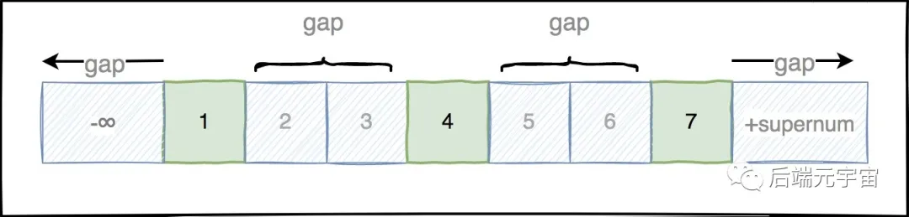
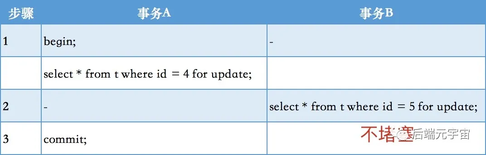
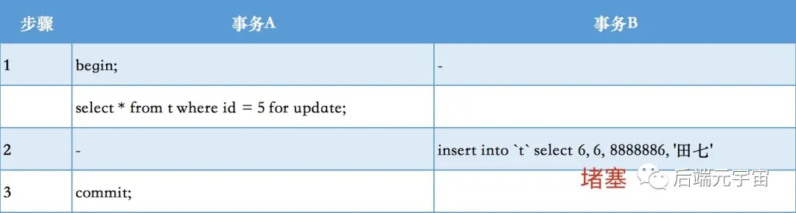
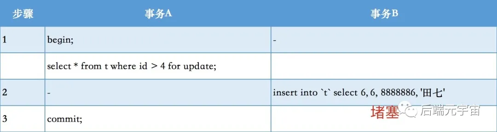

# 5.2.2 间隙锁、临键锁

## 一、介绍

**什么是间隙锁**

**间隙锁**会封锁该条记录相邻两个键之间的空白区域，防止其它事务在这个区域内插入、修改、删除数据，这是为了防止出现 **幻读** 现象；当我们采用范围条件查询数据时，InnoDB 会对这个范围内的数据进行加锁。比如有 id 为：1、3、5、7 的 4 条数据，我们查找 1-7 范围的数据。那么 1-7 都会被加上锁。2、4、6 也在 1-7 的范围中，但是不存在这些数据记录，这些 2、4、6 就被称为间隙。

**间隙锁的危害**

范围查找时，会把整个范围的数据全部锁定住，即便这个范围内不存在的一些数据，也会被无辜的锁定住，比如我要在 1、3、5、7 中插入 2，这个时候 1-7 都被锁定住了，根本无法插入 2。在某些场景下会对性能产生很大的影响

**间隙锁简单演示**

我们先把字段 a 的值修改成 1、3、5、7、9

- 窗口 A 更新 a = 1~7 范围的数据

```sql
update test_innodb_lock set b='b5' where a>1 and a<7;
```

- 窗口 B 在 a = 2 的位置插入数据

```sql
insert into test_innodb_lock values(2, "b6");
```


这个时候发现窗口 B 更新 a = 2 的操作一直在等待，因为 1~7 范围的数据被间隙锁，锁住了。只有等窗口 A 执行 commit，窗口 B 的 a = 2 才能更新成功。

**间隙的范围？**

根据检索条件向下寻找最靠近检索条件的记录值A作为左区间，向上寻找最靠近检索条件的记录值B作为右区间，即锁定的间隙为（A，B] **左开右闭**。

## 二、间隙锁演示

创建数据库表：

```sql
CREATE TABLE `t` (
  `id` int  COMMENT '主键',
  `age` int COMMENT '年龄',
  `mobile` int  COMMENT '手机号',
  `name` varchar(8)COMMENT '名称',
  PRIMARY KEY (`id`),
  KEY `index_age` (`age`)
) ENGINE=InnoDB AUTO_INCREMENT=8;
```

id为主键(唯一索引)、age是普通索引、mobile没有加索引

同时插入数据如下


在进行测试之前，我们先来看看t表中存在的隐藏间隙：



(-∞, 1]
(1, 4]
(4, 7]
(7, +supernum]（其中supernum是数据库维护的最大的值。为了保证间隙锁都是左开右闭原则。）

**关闭自动提交**

```sql
SET autocommit = OFF;
```

### 1、唯一索引示例

#### 1.1 等值查询且数据存在示例



事务A 等值查询id=4，因为id是主键，同时是等值查询存在该记录,所以只会在id=4这条记录上加记录锁，不会加间隙锁。

事务B 等值查询id=5，没有锁冲突，所以查询正常，不会堵塞。(如果事务B 等值查询id=4,因为事务A加了记录锁，所以会堵塞)

#### 1.2 等值查询且数据不存在示例



事务A 等值查询id=5，因为查询记录不存在，所以无法加记录锁，但这里会存在一个(5,7]的间隙锁。

事务B 插入一条id=6的数据，因为上面存在了(5,7]的间隙锁，所以会堵塞。

#### 1.3 范围查询示例



事务A 范围查询id>4，那么这里就会存在一个(4,+supernum]的临键(next-key)锁。

事务B 插入一条id=6的数据，因为上面存在了(4,+supernum]的临键(next-key)锁，所以会堵塞。

如果 事务B 是更新 id=7 的记录，同样会堵塞。

### 2、普通索引示例

#### 2.1 等值查询值示例


事务A 等值查询age=4，因为age是普通索引，所以会产生临键(next-key)锁，范围(1,4]和(4,7](左开右闭原则)。

事务B 插入一个id=6、age=6的数据，因为age值在上面临键锁范围内，所以也会堵塞。

#### 2.2 左开右闭原则

按照上面的例子，如果是左开右闭原则，那就是age临键锁的范围是(1,7]。

如果事务B插入一条 id=6，age=1 的数据，正常是不是不会堵塞，因为按照左开右闭原则，上面的age=1是开的，所以正常应该是可以插入的。

```
但实际上你真是实践之后，你发现同样也会堵塞。
通过实践之后，会发现，所谓的左开右闭原则，并不是一定是左开右闭，而是跟主键id有关系。
上面的事务A 等值查询age=4，它的当前主键id=4，上一条记录主键id=1，下条记录主键id=7。
如果插入 id<1 ,age 在(1,7)范围内，是 **左闭右开**原则。即age=1能插入，age=7会堵塞。
如果插入 1<id<7 ,age 在(1,7)范围内，是 **左闭右闭**原则。即age=1会堵塞，age=7也会堵塞。
如果插入 id>7 ,age 在(1,7)范围内，是 **左开右闭**原则。即age=1会堵塞，age=7能插入。
有关等值查询值不存在、普通索引范围的示例这里就不举了，跟上面的差不多，都会产生间隙锁。
```

### 3、无锁引示例

#### 3.1 等值查询示例


**事务A** 等值查询 mobile = 8888884，因为mobile是无索引的，所以这个for update，变成表级排他(X)锁。

**事务B** 因为事务A已经加了表级的排他锁，所以其它事务无法进行任何的增删改操作。

#### 3.2 范围查询示例


**事务A** 等值查询 mobile > 8888884，因为mobile是无索引的，同样变成表级排他(X)锁。

**事务B** 因为事务A已经加了表级的排他锁，所以其它事务无法进行任何的增删改操作。


参考：

https://blog.csdn.net/csdn_20150804/article/details/119766846

https://mp.weixin.qq.com/s/V3M5tkzGtmSGGiAQnFnUkw
