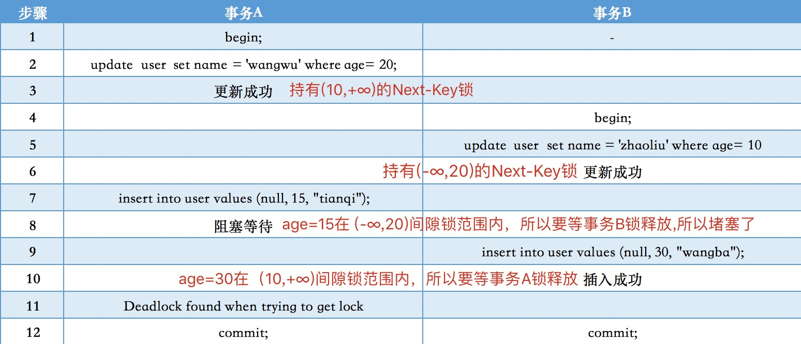

# 5.2.4 死锁

## 一、什么是MySQL死锁

死锁是指两个或两个以上的进程在执行过程中,因争夺资源而造成的一种互相等待的现象,若无外力作用,它们都将无法推进下去.此时称系统处于死锁状态或系统产生了死锁,这些永远在互相等的进程称为死锁进程。

## 二、MySQL死锁产生的原因

1. 竞争同一资源

当多个事务试图同时修改同一行数据时，就可能发生死锁。例如，事务A锁定了表中的某一行以进行修改，而事务B也试图修改这一行。如果事务B在事务A提交之前请求了锁，并且事务A也试图访问事务B已锁定的资源，就可能发生死锁。

2. 锁的升级

在MySQL中，锁可以分为共享锁（读锁）和排他锁（写锁）。当一个事务持有共享锁并试图升级为排他锁时，可能会与另一个持有共享锁的事务发生冲突，从而导致死锁。

3. 事务顺序不当

事务的执行顺序如果不当，也可能导致死锁。例如，事务A和事务B分别锁定了不同的资源，并试图获取对方锁定的资源。

4. 长事务和高隔离级别

长时间运行的事务可能会持有锁很长时间，增加了与其他事务发生冲突的可能性。此外，使用较高的隔离级别（如可重复读）也可能增加死锁的风险，因为高隔离级别意味着事务会持有更多的锁，并且持有时间更长。

## 三、如何检测MySQL死锁

在MySQL中，可以通过以下几种方式检测死锁：

- 错误日志：
  当MySQL检测到死锁时，会在错误日志中记录相关信息。你可以通过查看MySQL错误日志来确认死锁的存在。

- SHOW ENGINE INNODB STATUS：
  使用该命令可以查看InnoDB存储引擎的状态信息，其中包含了最近一次死锁的详细信息。

  ```sql
  SHOW ENGINE INNODB STATUS;
  ```

  

## 四、MySQL死锁解决的办法

- 直接干掉进程
- 手动回滚，ROLLBACK

## 五、避免死锁

- 避免大事务：尽量避免长时间运行的大事务，将大事务拆分为多个小事务，可以有效减少死锁的发生概率。
- 保持一致的锁定顺序：确保所有事务按照相同的顺序请求资源，这样可以避免不同事务间的资源竞争。
- 合理设计索引：合理的索引设计可以减少表扫描，降低锁冲突的概率。
- 使用乐观锁：通过乐观锁机制，避免数据库级别的锁竞争。例如，使用版本号控制并发更新。
- 减少锁的粒度：将表锁改为行锁，减少锁定资源的粒度，从而降低死锁的风险。

## 六、死锁演示

### 1、并发间隙锁，导致死锁

**表结构**

```sql
-- id是自增主键，age是非唯一索引，name普通字段
CREATE TABLE `user` (
  `id` int NOT NULL AUTO_INCREMENT COMMENT '主键',
  `age` int DEFAULT NULL COMMENT '年龄',
  `name` varchar(255)  DEFAULT NULL COMMENT '姓名',
  PRIMARY KEY (`id`),
  KEY `idx_age` (`age`) USING BTREE
) ENGINE=InnoDB AUTO_INCREMENT=1 DEFAULT CHARSET=utf8 COMMENT='用户信息表';
```


开启两个终端模拟事务并发情况，执行顺序以及实验现象如下：

- **事务A执行更新操作，更新成功**

```sql
mysql> update  user  set name = 'wangwu' where age= 20;
Query OK, 1 row affected (0.00 sec)
```

- **事务B执行更新操作，更新成功**

```sql
mysql> update  user  set name = 'zhaoliu' where age= 10;
Query OK, 1 row affected (0.00 sec)
```

- **事务A执行插入操作，陷入阻塞~**

```sql
mysql> insert into user values (null, 15, "tianqi");
```

- **事务B执行插入操作，插入成功，同时事务A的插入由阻塞变为死锁error。**

```sql
insert into user values (null, 30, "wangba");
Query OK, 1 row affected (0.00 sec)
```

事务A的插入操作变成报错。

上面四步操作后，我们分别对事务A和事务B进行commit操作。

我们再来看数据库中表的数据。


- 事务A产生了哪些锁

我们先来看

```sql
update  user  set name = 'wangwu' where age= 20;
```

**记录锁**，因为是等值查询，所以这里会在满足age=20的所有数据请求一个记录锁。

**间隙锁**，因为这里是非唯一索引的等值查询,所以一样会产生间隙锁(如果是唯一索引的等值查询那就不会产生间隙锁，只会有记录锁),因为这里只有2条记录，所以左边为(10,20),右边因为没有记录了，所以请求间隙锁的范围就是(20,+∞),加一起就是(10,20) +（20,+∞)。

**Next-Key锁**，Next-Key锁=记录锁+间隙锁，所以该Update语句就有了（10,+∞)的 Next-Key锁

**事务A的insert语句产生哪些锁**

```sql
INSERT INTO user VALUES (NULL, 15, "tianqi");
```

**间隙锁**，因为age 15(在10和20之间)，所以需要请求加(10,20)的间隙锁

- 事务B产生了哪些锁

**事务B的update语句产生哪些锁**，我们先来看

```sql
update  user  set name = 'zhaoliu' where age= 10
```

**记录锁**，因为是等值查询，所以这里会在满足age=10的所有数据请求一个记录锁。

**间隙锁**，因为左边没有记录,右边有一个age=20的记录，所以间隙锁的范围是(-∞,10),右边为(10,20),一起就是(-∞,10)+(10,20)。

**Next-Key锁**，Next-Key锁=记录锁+间隙锁，所以该Update语句就有了（-∞,20)的 Next-Key锁

**事务A的install语句产生哪些锁**

```sql
INSERT INTO user VALUES (NULL, 30, "wangba")
```

**间隙锁**

- 因为age 30(左边是20，右边没有值)，所以需要请求加(20,+∞)的间隙锁



### 2、行锁互斥，导致死锁

假设有两个事务在操作同一张表orders：

事务A：

```sql
BEGIN;
UPDATE orders SET status='shipped' WHERE order_id=1;
UPDATE orders SET status='shipped' WHERE order_id=2;
COMMIT;
```


事务B：

```sql
BEGIN;
UPDATE orders SET status='delivered' WHERE order_id=2;
UPDATE orders SET status='delivered' WHERE order_id=1;
COMMIT;
```

可能引发死锁的原因：事务A和事务B分别锁住了不同的行，并且尝试获取对方已经锁住的行，形成死锁。

**解决办法**：调整顺序

```sql
BEGIN;
UPDATE orders SET status='shipped' WHERE order_id=1;
UPDATE orders SET status='shipped' WHERE order_id=2;
COMMIT;

BEGIN;
UPDATE orders SET status='delivered' WHERE order_id=1;
UPDATE orders SET status='delivered' WHERE order_id=2;
COMMIT;
```

### 3、锁升级

事务A行锁失效，升级为表锁

```sql
BEGIN;
UPDATE orders SET status='shipped' WHERE order_id=1 or order_id=2;
COMMIT;
```

事务B操作order表

```sql
BEGIN;
UPDATE orders SET status='delivered' WHERE order_id=10;
COMMIT;
```


