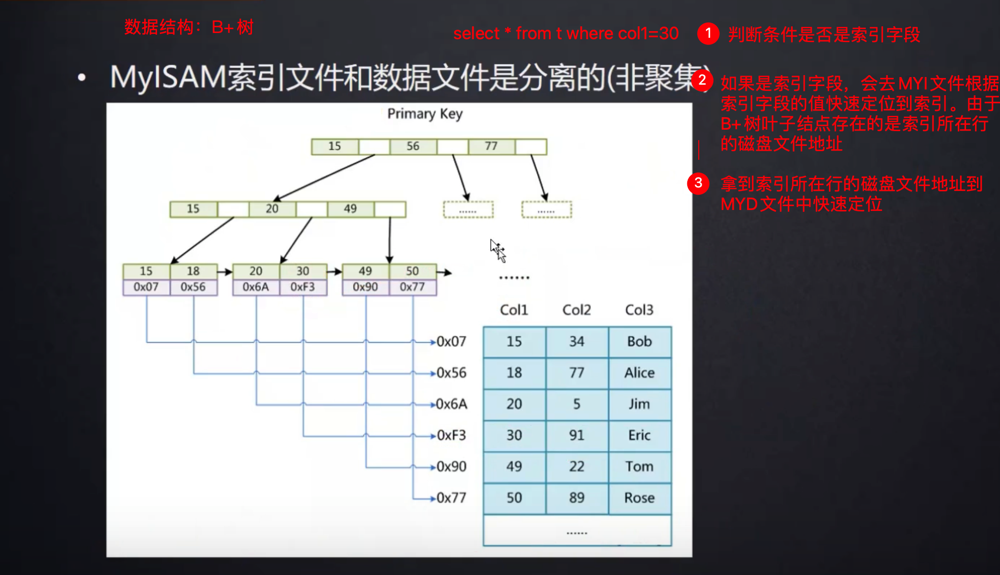
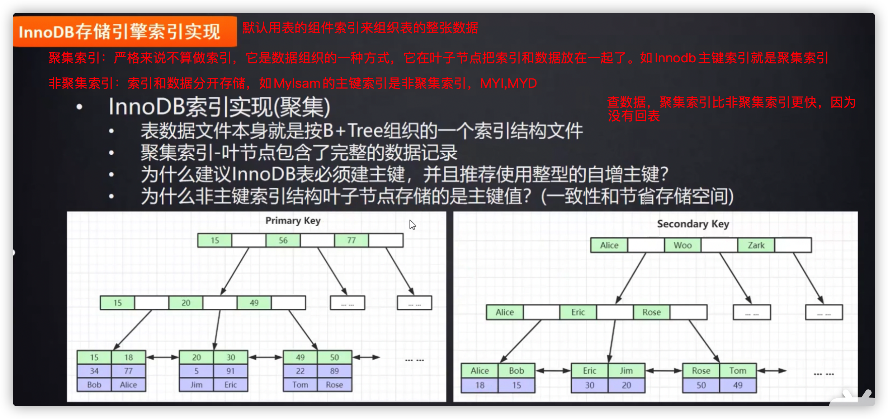

# 5.3.2 Mylsam、InnoDB存储引擎

**MyISAM不支持事务，MyISAM中的锁是表级锁；而InnoDB支持事务，并且支持行级锁。**


## 一、Mylsam存储引擎


**存储引擎是形容数据库的还是表的？**——是形容数据库表的。

Mylsam存储引擎的表有三个文件

- .frm，frame“框架”简写，存储表结构
- .MYD，Mylsam Data，存储表数据
- .MYI，index，存储索引



Mylsam引擎很少用了，现在都是用InnoDB，因为它支持行锁、事务等等。

## 二、InnoDB存储引擎

InnoDB存储引擎有两个文件

- .frm，存储表结构
- .ibd，存储索引和表数据




一般来说Innodb的主键才是聚集索引，而非主键索引（二级索引）是非聚集索引，非主键索引也是B+树数据结构，但是它的叶子节点放的是索引所在行的主键字段，如

```
Alice
18
```

18放的就是主键。

值得注意的是：

- 非叶子节点存的是**主键值**+**页地址**

- **一个非叶子节点内存放多少个索引记录，就会有多少个叶子节点**

非主键索引的查找顺序：有回表

```
二级索引->主键->主键索引树(ibd)->行记录
```

InnoDB和Mylsam最大的区别：InnoDB数据是放在叶子节点，而Mylsam叶子节点放的是索引所在行的磁盘文件地址。

一、聚集索引（聚簇索引）：
以 InnoDB 作为存储引擎的表，表中的数据都会有一个主键，即使你不创建主键，系统也会帮你创建一个隐式的主键。这是因为 InnoDB 是把数据存放在 B+ 树中的，而 B+ 树的键值就是主键，在 B+ 树的叶子节点中，存储了表中所有的数据。这种以主键作为 B+ 树索引的键值而构建的 B+ 树索引，我们称之为聚集索引。

二、非聚集索引（非聚簇索引）：
以主键以外的列值作为键值构建的 B+ 树索引，我们称之为非聚集索引。非聚集索引与聚集索引的区别在于非聚集索引的叶子节点不存储表中的数据，而是存储该列对应的主键，想要查找数据我们还需要根据主键再去聚集索引中进行查找，这个再根据聚集索引查找数据的过程，我们称为回表。

**问题1：为什么建议Innodb表必须建立主键？**

ibd文件表数据是用B+树来组织，如果没有主键则无法组织。假设自己不建立主键的话，Mysql会从表的第一列记录开始，逐个往下找可以建立唯一索引的那列，它会用这列数据来组织整张表的B+树；如果找不到，每一列都存在重复的元素，它会再维护一个数据唯一的隐藏列来组织B+树。数据库资源宝贵，所以推荐自建主键

**问题2：为什么主键要整型自增**

因为主键构成B+树需要比较大小

- 如果用uuid作为主键，由于uuid是随机字符串，需要逐位去**比较**，效率不如整型自增快
- uuid更费空间，数据库线上是存在SSD，很昂贵，所以要节约**空间**
- uuid不是自增的，会带来一些问题：mysql底层维护索引树的时候会从左到右依次递增的。如果表的索引在插入的时候本身就是自增的，索引永远是往B+树的后面加，发生节点**分裂**的概率很小；如果不是自增的，索引会往树的中间去插，如果插入节点放不下去了，该节点会分裂，变成两个节点，再把节点挤进来，节点的分裂或者转移，对树的结构和性能会有影响。


