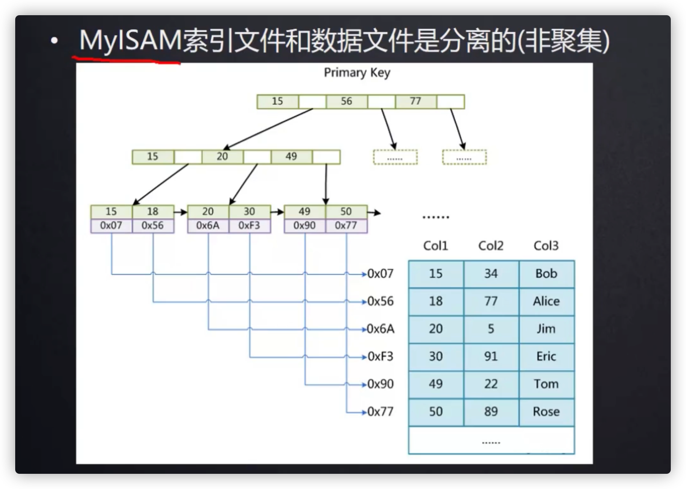
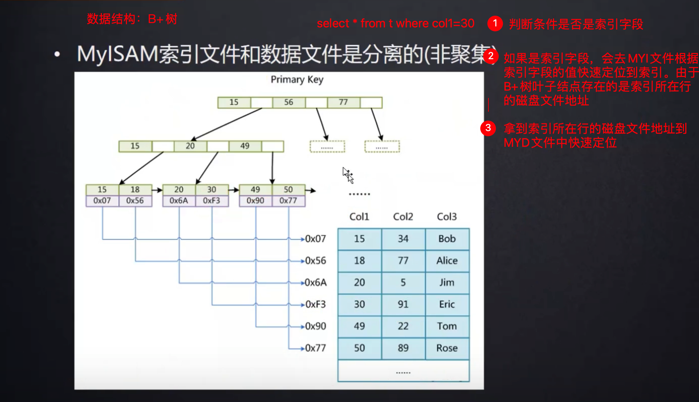
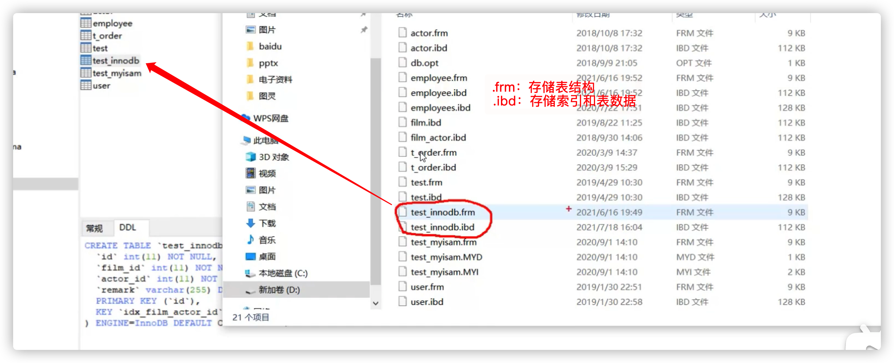
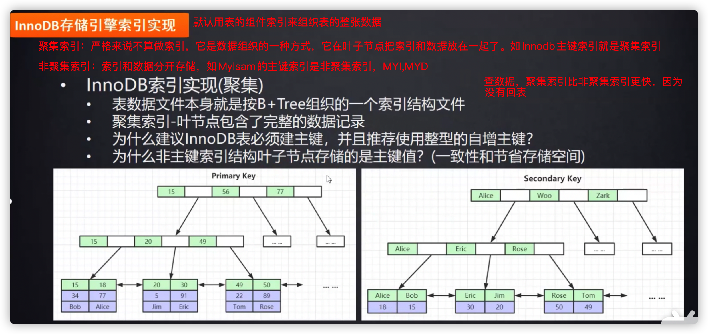

# 5.3.2 Mylsam和InnoDB存储引擎

## 一、Mylsam存储引擎

**存储引擎是形容数据库的还是表的？**——是形容数据库表的。

Mylsam存储引擎的表有三个文件

- .frm，frame“框架”简写，存储表结构
- .MYD，Mylsam Data，存储表数据
- .MYI，index，存储索引

Mylsam引擎很少用了，现在都是用InnoDB，因为它支持行锁、事务等等。

## 二、InnoDB存储引擎

InnoDB存储引擎有两个文件

- .frm，存储表结构
- .ibd，存储索引和表数据

