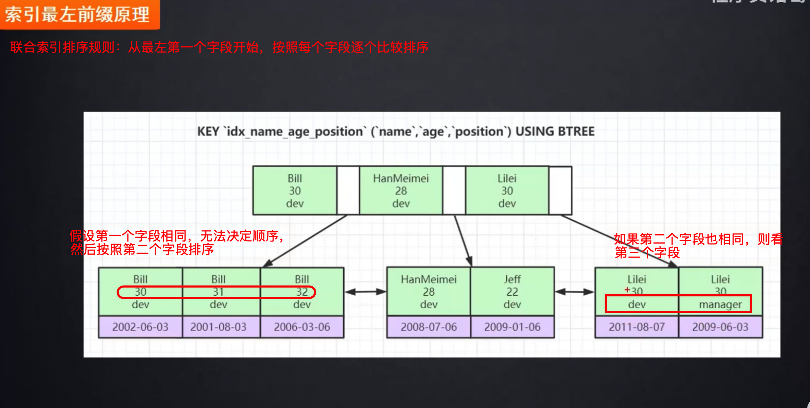
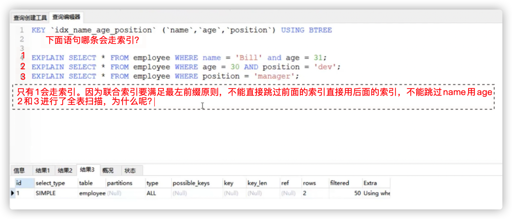
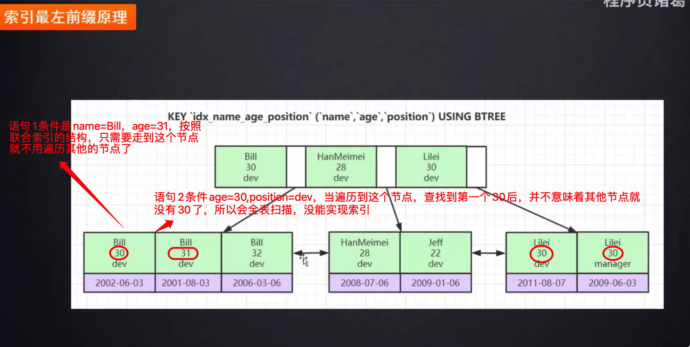
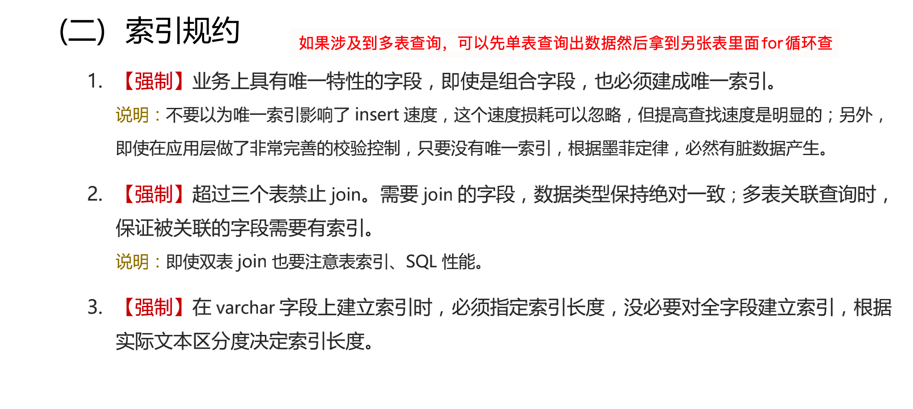

# 5.3.3 联合索引、覆盖索引

## 前言：回表

### 1、什么是回表

回表（`Look Up`）指的是在进行索引查询时，首先通过索引定位到对应页，然后再根据行的物理地址找到所需的数据行。换句话说，回表是指根据索引查询到的主键值再去访问**主键索引**，从而获取完整的数据记录。

### 2、什么情况下会回表

- **索引不覆盖所有需要查询的字段**：当查询语句中需要返回的列不在索引列上时，即使通过索引定位了相关行，仍然需要回表获取其他列的值。

- **使用了非聚簇索引**：非聚簇索引（Secondary Index）只包含了索引列的副本以及指向对应主键的引用，查询需要通过回表才能获取完整的行数据
- **使用了覆盖索引但超过了最大索引长度**：在MySQL的InnoDB存储引擎中，每个索引项的最大长度是767字节，如果查询需要返回的字段长度超过了该限制，同样会触发回表操作。

### 3、如何避免回表

- **覆盖索引**：如果查询的字段都在某个索引上，并且没有超过最大索引长度限制，MySQL可以直接从索引中获取所需数据，而无需回表。
- **使用聚簇索引**：InnoDB存储引擎的主键索引是聚簇索引，它包含了整个行的数据。当查询条件使用了主键或者通过主键查询时，MySQL可以直接从主键索引中获取所有需要的数据，无需回表。

## 一、联合索引

对于表的单列(如id)数据，是可以建立索引的，**对于多列(id和name组合,或者,name和id\**组合\**)，也可以建立索引**。联合索引，也称之为组合索引。

### 1、存储结构

**联合索引底层存储结构是怎么样的？**

### 2、联合索引好处

- **避免回表**

如在user的id列建有索引，select id from user这个不用回表，直接从索引中读取id的值，而select id,name from user中，不能返回除id列其他的值，所以必须要回表。

   如果建有了id和name列的联合索引，则可以避免回表。

   另外，建立了id和name的联合索引(id列在在前)，则select id from user可以避免回表，而不用单独建立id列的单列索引。

- **个单列查询返回行较多，同时查返回行较少，联合索引更高效**

如果select * from user where id=2 和select * from user where name='tom' 各自返回的行数比较多，而select * from user where id=2 and name='tom'返回的行数比较少，那么这个时候使用联合索引更加高效。

## 二、覆盖索引

覆盖索引是select的数据列只用从索引中就能够取得，不必读取数据行，换句话说查询列要被所建的索引覆盖。无需回表，速度更快。

explain的输出结果Extra字段为Using index时，能够触发索引覆盖。

