# 5.3.4 MySQL性能分析

MySQL常见瓶颈

- CPU：CPU在饱和的时候一般发生在数据装入内存或从磁盘上读取数据时候
- IO：磁盘I/O瓶颈发生在装入数据远大于内存容量的时候

- 服务器硬件的性能瓶颈：top，free，iostat和vmstat来查看系统的性能状态

## 一、Explain执行计划

使用方式：Explain+SQL语句

**执行计划包含的信息**

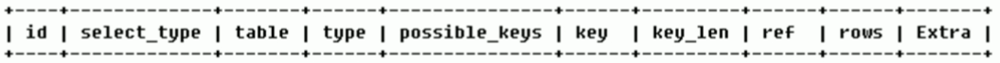

**下面是各字段解释**

### id

select查询的序列号，包含一组数字，表示查询中执行select子句或操作表的顺序

> id相同，执行顺序由上到下

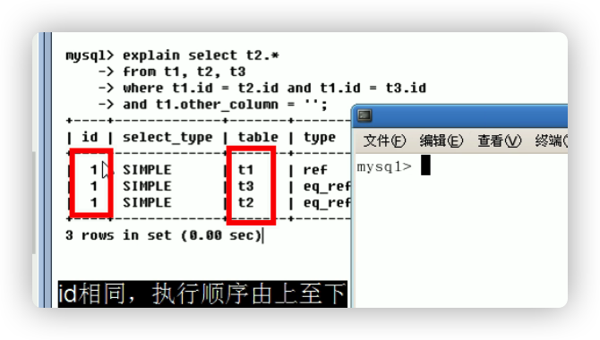

> id不同，如果是子查询，id的序号会递增，**id值越大优先级越高，越先被执行**

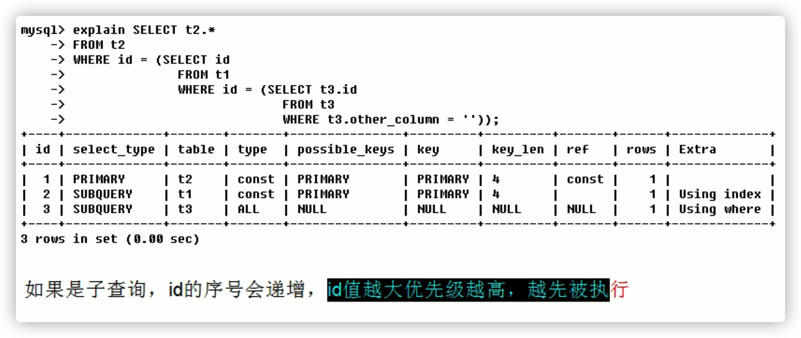

> id相同不同，同时存在

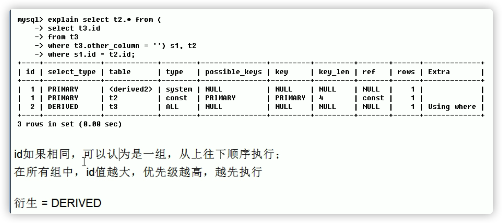

**练习**

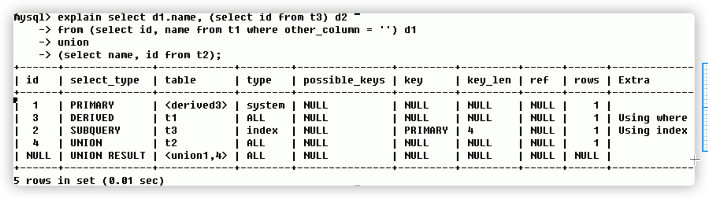

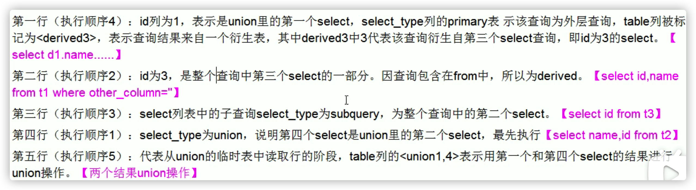

### select_type

有哪些？

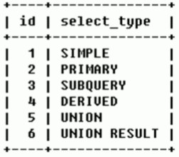

查询的类型，主要是用于区别普通查询、联合查询、子查询等的复杂查询：

> SIMPLE

简单的select查询，查询中不包含子查询或者UNION。

> PRIMARY

查询中包含复杂的子部分，最外层查询则被标记为PRIMARY

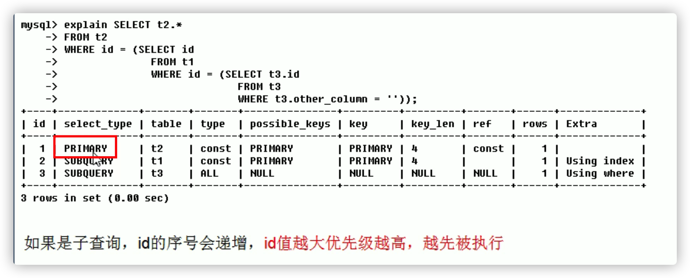

> SUBQUERY

在FROM列表中包含的子查询被标记为DERIVED（衍生），MySQL会递归执行这些子查询，把结果放在临时表里。

> DERIVED

在FROM列表中包含的子查询被标记为DERIVED（衍生）。MySQL会递归执行这些子查询，把结果放在临时表里。

> UNION

若第二个SELECT出现在UNION之后，则被标记为UNION；若UNION包含在FROM子句的子查询中，外层SELECT将被标记为：DERIVED。

> UNION RESULT

从UNION表中获取结果的SELECT。

### table

显示这一行的数据是关于哪些表的

### type

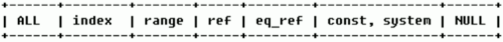

- 访问类型排序：type显示的是访问类型**，是较为重要的一个指标，结果值**从最好到最坏依次是：

  **system>const>eq_ref>ref>fulltext>ref_or_null>index_merge>unique_subquery>index_subquery>range>index>All**

- 显示查询使用了何种类型，从最好到最差依此是：**system>const>eq_ref>ref>range>index>All**，一般来说至少达到range，最好达到ref

- system：**表只有一行记录（等于系统表）**，这是const类型的特例，平时不会出现，这个也可以忽略不计

- const：**表示通过索引一次就找到了，const用于比较primary key或则unique索引**。因为**只匹配一行数据，所以很快。**如将主键置于where列表中，MySQL就能将该查询转换为一个常量。

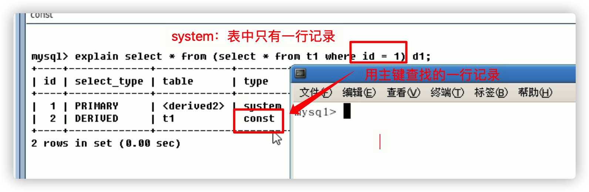

eq_ref：**唯一性索引扫描，对于每个索引键，表中只有一条记录与之匹配**（所有主键均唯一匹配）。常见于**主键或唯一索引扫描**。

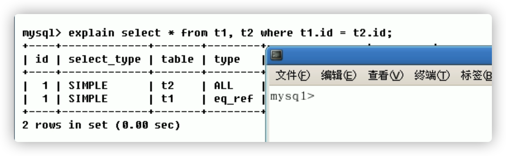

ref：**非唯一性索引扫描，返回匹配某个单独值的所有行**（通过索引查找到多行）。本质上也是一种索引访问，它返回所有匹配某个单独值的行，然而，它可能会找到多个符合条件的行，所以它应该属于查找和扫描的混合体。

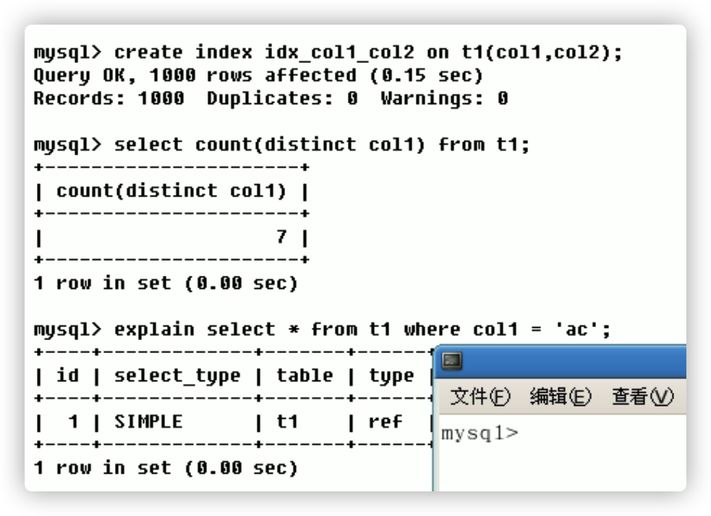

range：只检索给定范围的行，使用一个索引来选择行。**key列显示使用了哪个索引。一般就是在你的where语句中出现了between、<、>、in等的查询。**这种范围扫描索引扫描比全表扫描要好，因为它只需要开始于索引的某一点，而结束于另一点，不会扫描全部索引

index：Full Index Scan，**index与All区别为index类型只遍历索引树。**这通常比All快，因为索引文件通常比数据文件小。（也就是说虽然all和index都是读全表，但index是从索引中读取的，而all是从硬盘中读的）

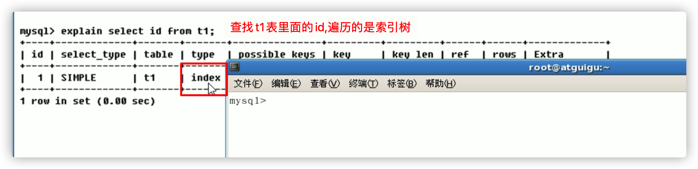

- all：Full Table Scan，将遍历全表以找到匹配的行。

一般来说，**得保证查询至少达到range级别，最好能达到ref**。

### possible_keys

显示可能应用在这张表0中的索引，一个或多个。查询涉及到的字段上若存在索引，则该索引将被列出。**但不一定被查询实际使用**。

### key

实际使用的索引。如果为NULL，则没有使用索引。**查询中若使用了覆盖索引，则该索引仅出现在key列表中，不会出现在possible_keys列表中。**（覆盖索引：查询的字段与建立的复合索引的个数一一吻合）

### key_len

表示索引中使用的字节数，可通过该列计算查询使用的索引的长度。在不损失精确性的情况下，**长度越短越好**。key_len显示的值为索引字段的最大可能长度，**并非实际使用长度**，即key_len是根据表定义计算而得，不是通过表内检索出的.

### ref

​	**显示索引的哪一列被使用了，如果可能的话，是一个常数**。哪些列或常量被用于查找索引列上的值。**查询中与其它表关联的字段，外键关系建立索引**。

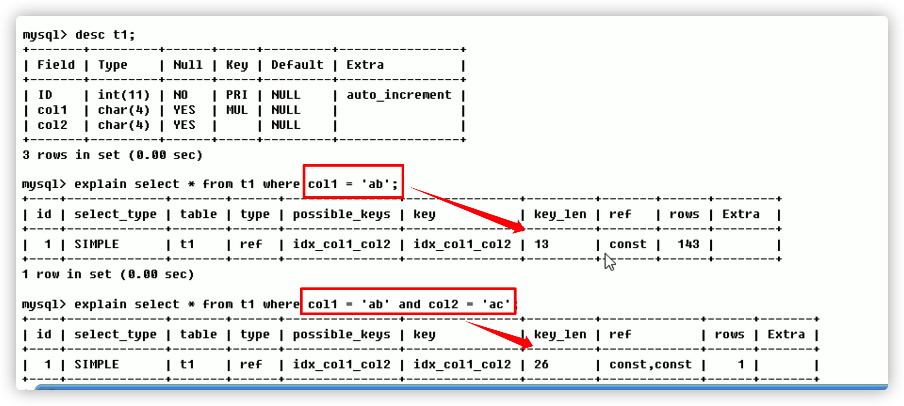

### rows

根据表统计信息及索引选用情况，大致估算出找到所需的记录所需要读取的行数

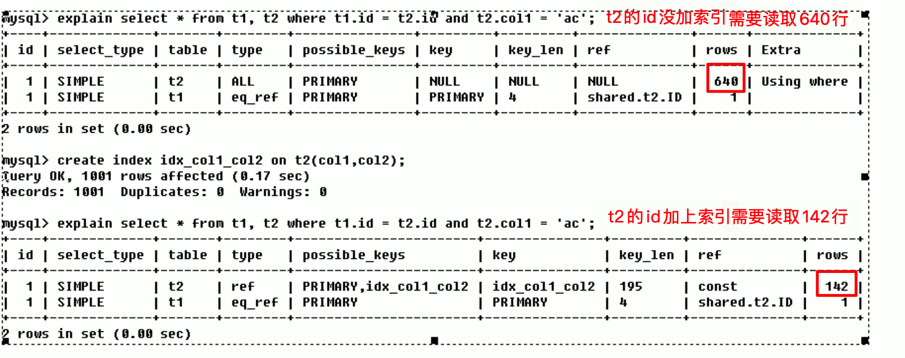

### Extra

包含不适合在其他列中显示但十分重要的额外信息。

**Using filesort：**说明mysql会对数据使用一个外部的索引排序，而不是按照表内的索引顺序进行读取。**MySQL中无法利用索引完成的排序操作成为“文件排序”。**多产生了一次排序，这样不好需要优化。**九死一生**

当无法使用索引列时，会使用`Using filesort`进行排序

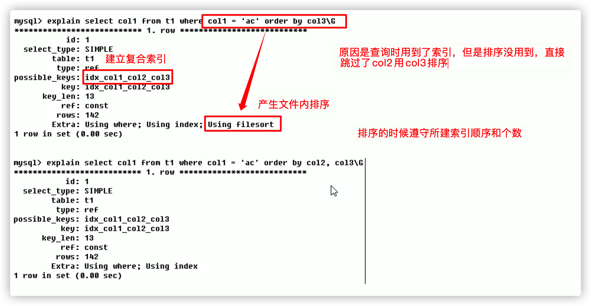

**Using temporary：**使用了临时表保存中间结果，MySQL在对查询结果排序时使用临时表。常见于排序order by和分组查询group by。**必死无疑**

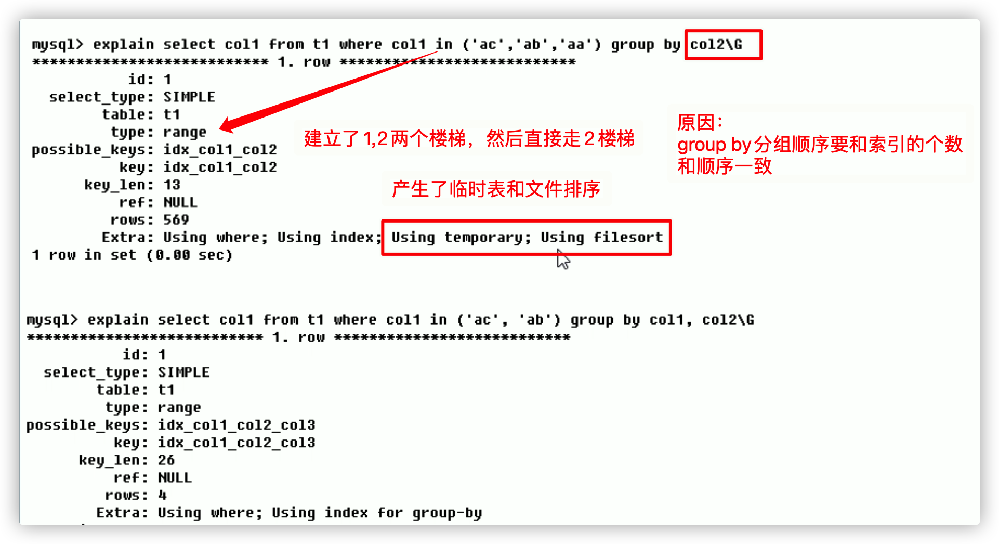

**Using index：**表示相应的select操作中使用了覆盖索引（Covering Index），避免访问了表的数据行，效率不错！如果同时出现using where，表明索引被用来执行索引键值的查找；如果没有同时出现using where，表明索引用来读取数据而非执行查找动作。

好事儿！！！

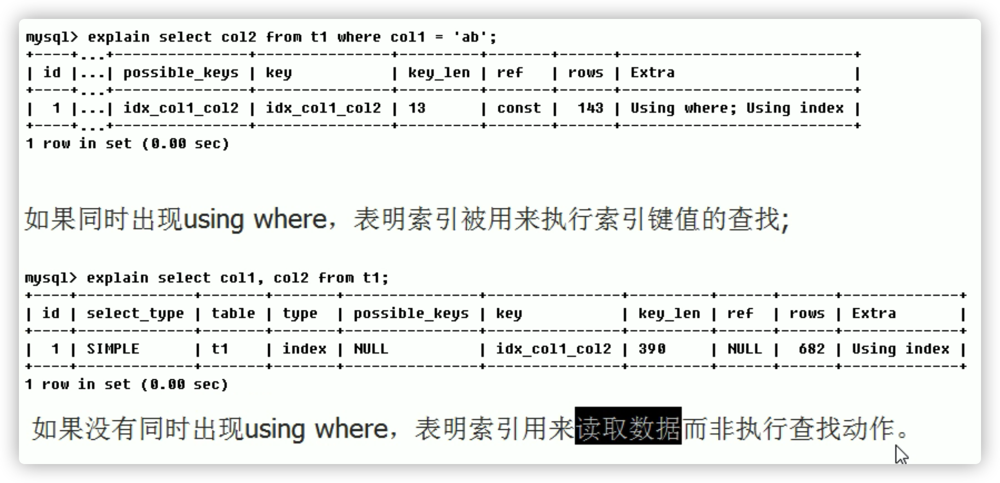

- Using join buffer：使用了连接缓存。

- impossible where：where子句的值总是false，不能用来获取任何元组。（查询语句中where的条件不可能被满足，恒为False）

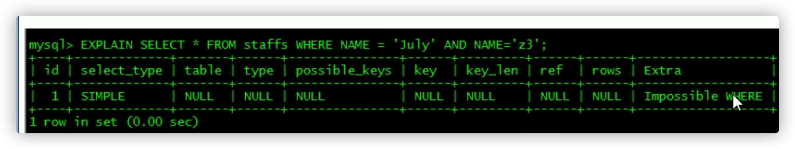

- select tables optimized away：在没有GROUPBY子句的情况下，基于索引优化MIN/MAX操作或者对于MyISAM存储引擎优化COUNT(*)操作，不必等到执行阶段再进行计算，查询执行计划生成的阶段即完成优化。
- distinct：优化distinct操作，在找到第一匹配的元组后即停止找相同值的动作。

## 二、索引优化

### 1、单表

**建表sql**

```sql
CREATE TABLE IF NOT EXISTS `article`(
`id` INT(10) UNSIGNED NOT NULL PRIMARY KEY AUTO_INCREMENT,
`author_id` INT (10) UNSIGNED NOT NULL,
`category_id` INT(10) UNSIGNED NOT NULL , 
`views` INT(10) UNSIGNED NOT NULL , 
`comments` INT(10) UNSIGNED NOT NULL,
`title` VARBINARY(255) NOT NULL,
`content` TEXT NOT NULL
);
INSERT INTO `article`(`author_id`,`category_id` ,`views` ,`comments` ,`title` ,`content` )VALUES
(1,1,1,1,'1','1'),
(2,2,2,2,'2','2'),
(3,3,3,3,'3','3');
 
SELECT * FROM ARTICLE;
```

案例：查询`category_id`为1且`comments`大于1的情况下，`views`最多的`article_id`。

直接查有两个问题影响性能。必须要优化

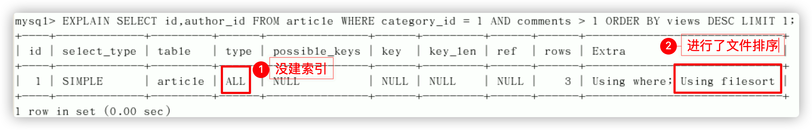

两种优化方法。

两种优化方法。

**方法一：**创建索引`idx_article_ccv`

```sql
CREATE INDEX idx_article_ccv ON article(category_id,comments,views);
```

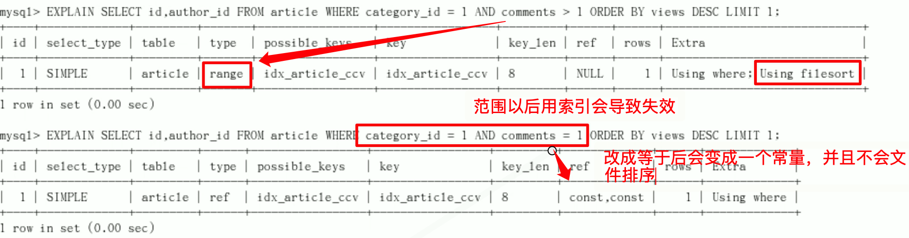

得出此种方式建立的索引不符合需求。

我们发现，创建符合索引`idx_article_ccv`之后，虽然解决了全表扫描的问题，但是在`order by`排序的时候没有用到索引，MySQL居然还是用的`Using filesort`，为什么？

推论：当`comments > 1`的时候`order by`排序`views`字段索引就用不上，但是当`comments = 1`的时候`order by`排序`views`字段索引就可以用上！！！**所以，范围之后的索引会失效。**

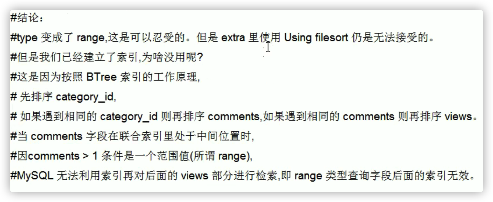

**方法二：**

我们现在知道**范围之后的索引会失效**，原来的索引`idx_article_ccv`最后一个字段`views`会失效，那么我们如果删除这个索引，创建`idx_article_cv`索引呢？？？？

```sql
/* 创建索引 idx_article_cv */
CREATE INDEX idx_article_cv ON article(category_id,views);
```

当前索引是`idx_article_cv`，来看一下SQL执行计划。

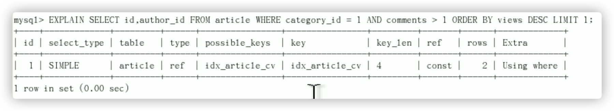

### 2、两表

**建表sql**

```sql
CREATE TABLE IF NOT EXISTS `class`(
`id` INT(10) UNSIGNED NOT NULL PRIMARY KEY AUTO_INCREMENT,
`card` INT (10) UNSIGNED NOT NULL
);
CREATE TABLE IF NOT EXISTS `book`(
`bookid` INT(10) UNSIGNED NOT NULL PRIMARY KEY AUTO_INCREMENT,
`card` INT (10) UNSIGNED NOT NULL
);
```

explain分析

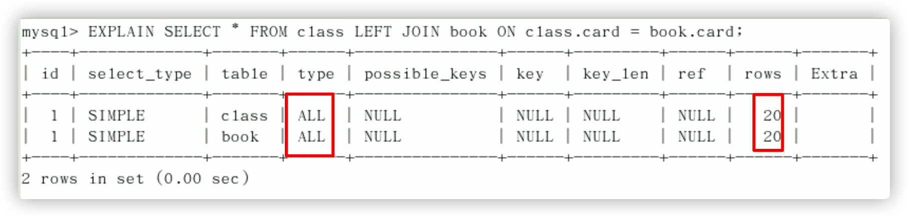

左连接和右连接始终有一个表在驱动的。`book`和`class`两张表都是没有使用索引，全表扫描，那么如果进行优化，索引是创建在`book`表还是创建在`class`表呢？下面进行大胆的尝试！

**假设一：**

给右表book的card字段添加索引。

```sql
/* 在book表创建索引 */
CREATE INDEX idx_book_card ON book(card);
```

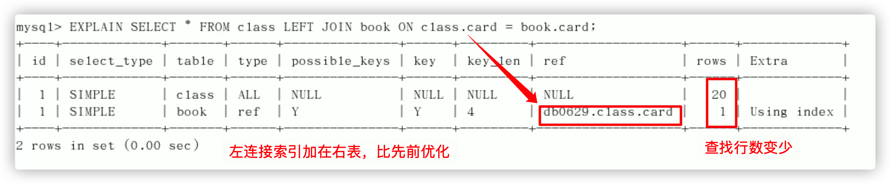

**假设二：**

给左表的class的card添加索引

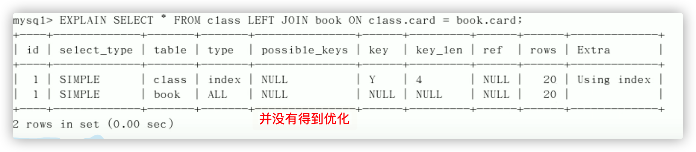

**结论：**左连接将索引创建在右表上更合适，右连接将索引创建在左表上更合适。这是由左连接特性决定的，LEFT JOIN条件用于确定如何从右表搜索行，左表一定都有。

### 3、三表

**sql脚本**

```sql
DROP TABLE IF EXISTS `phone`;

CREATE TABLE IF NOT EXISTS `phone`(
`phone_id` INT(10) UNSIGNED NOT NULL PRIMARY KEY AUTO_INCREMENT COMMENT '主键',
`card` INT(10) UNSIGNED NOT NULL COMMENT '分类' 
) COMMENT '手机';
```

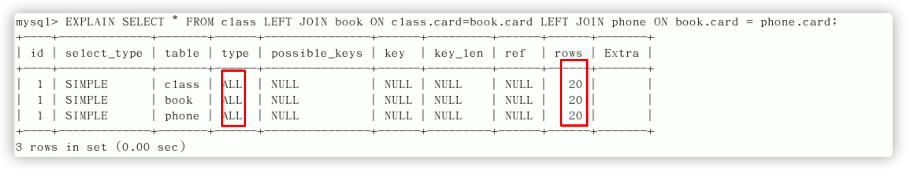

在book和phone上建立索引

```sql
/* 在book表创建索引 */
CREATE INDEX idx_book_card ON book(card);

/* 在phone表上创建索引 */
CREATE INDEX idx_phone_card ON phone(card);
```

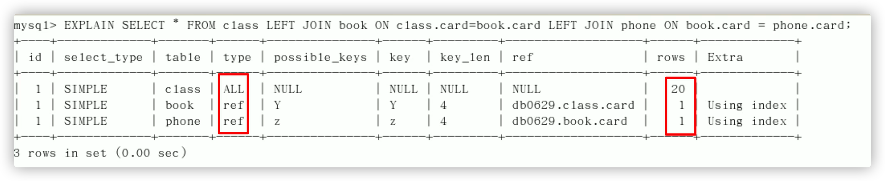

优化效果很好。

**结论：**

`JOIN`语句的优化：

- 尽可能减少`JOIN`语句中的`NestedLoop`（嵌套循环）的总次数：**永远都是小的结果集驱动大的结果集**。
- 优先优化`NestedLoop`的内层循环。

- 保证`JOIN`语句中被驱动表上`JOIN`条件字段已经被索引。
- 当无法保证被驱动表的`JOIN`条件字段被索引且内存资源充足的前提下，不要太吝惜`Join Buffer` 的设置。


