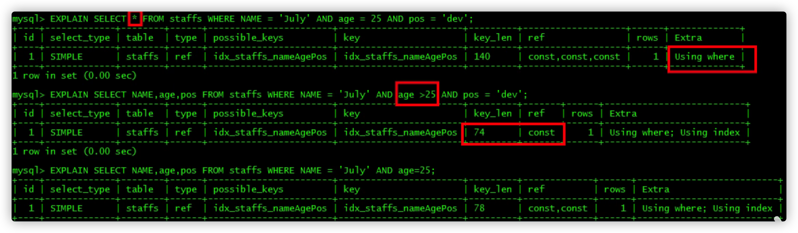

# 5.3.5 索引失效

```sql
CREATE TABLE `staffs`(
`id` INT(10) PRIMARY KEY AUTO_INCREMENT,
`name` VARCHAR(24) NOT NULL DEFAULT '' COMMENT '姓名',
`age` INT(10) NOT NULL DEFAULT 0 COMMENT '年龄',
`pos` VARCHAR(20) NOT NULL DEFAULT '' COMMENT '职位',
`add_time` TIMESTAMP NOT NULL DEFAULT CURRENT_TIMESTAMP COMMENT '入职时间'
)COMMENT '员工记录表';

INSERT INTO `staffs`(`name`,`age`,`pos`) VALUES('Ringo', 18, 'manager');
INSERT INTO `staffs`(`name`,`age`,`pos`) VALUES('张三', 20, 'dev');
INSERT INTO `staffs`(`name`,`age`,`pos`) VALUES('李四', 21, 'dev');

/* 创建索引 */
CREATE INDEX idx_staffs_name_age_pos ON `staffs`(`name`,`age`,`pos`);
```

## 一、索引失效情况

### 1、全值匹配我最爱


### 2、最佳左前缀法则

**如果索引是多字段的复合索引，要遵守最佳左前缀法则。指的是查询从索引的最左前列开始并且不跳过索引中的字段。**


### 3、不在索引列上做任何操作

不在索引列上做任何操作（计算、函数、(自动or手动)类型转换），会导致索引失效而转向全表扫描。


### 4、索引中范围条件右边的字段会全部失效


### 5、尽量使用覆盖索引

尽量使用覆盖索引（只访问索引的查询，索引列和查询列一致），减少`SELECT *`。（减少回表的消耗）




### 6、使用`!=`或者`<>`会全表扫描。

MySQL在使用`!=`或者`<>`的时候无法使用索引会导致全表扫描。


### 7、`is null`、`is not null`也无法使用索引。


### 8、`like`以通配符开头`%abc`会全表扫描。

`like`以通配符开头`%abc`索引失效会变成全表扫描（使用覆盖索引就不会全表扫描了）。


%放右边索引才不会失效

如果一定要使用 ’%xxxx%‘或者'%xx'，而且还要保证索引不失效，那么使用覆盖索引来编写SQL。

```sql
CREATE TABLE `tbl_user`(
`id` INT(11) NOT NULL AUTO_INCREMENT,
`name` VARCHAR(20) DEFAULT NULL,
`age`INT(11) DEFAULT NULL,
`email` VARCHAR(20) DEFAULT NULL,
PRIMARY KEY(`id`)
)ENGINE=INNODB AUTO_INCREMENT=1 DEFAULT CHARSET=utf8;

INSERT INTO tbl_user(`name`,`age`,`email`)VALUES('1aa1',21,'a@163.com');
INSERT INTO tbl_user(`name`,`age`,`email`)VALUES('2bb2',23,'b@163.com');
INSERT INTO tbl_user(`name`,`age`,`email`)VALUES('3cc3',24,'c@163.com');
INSERT INTO tbl_user(`name`,`age`,`email`)VALUES('4dd4',26,'d@163.com');
```

创建索引：

```sql
create index idx_user_nameAge on tbl_user(Name,age);
```


### 9、字符串不加单引号索引失效


### 10、`or`会索引失效


### 11、总结

1. 全值匹配我最爱。
2. 最佳左前缀法则。
3. 不在索引列上做任何操作（计算、函数、(自动or手动)类型转换），会导致索引失效而转向全表扫描。
4. **索引中范围条件右边的字段会全部失效**。
5. 尽量使用覆盖索引（只访问索引的查询，索引列和查询列一致），减少`SELECT *`。
6. MySQL在使用`!=`或者`<>`的时候无法使用索引会导致全表扫描。
7. `is null`、`is not null`也无法使用索引。
8. `like`以通配符开头`%abc`索引失效会变成全表扫描（使用覆盖索引就不会全表扫描了）。
9. 字符串不加单引号索引失效。
10. 少用`or`，用它来连接时会索引失效。
11. group by顺序与索引顺序一致

## 二、示例

**数据库表**

```sql
/* 创建表 */
CREATE TABLE `test03`(
`id` INT PRIMARY KEY NOT NULL AUTO_INCREMENT,
`c1` CHAR(10),
`c2` CHAR(10),
`c3` CHAR(10),
`c4` CHAR(10),
`c5` CHAR(10)
);

/* 插入数据 */
INSERT INTO `test03`(`c1`,`c2`,`c3`,`c4`,`c5`) VALUES('a1','a2','a3','a4','a5');
INSERT INTO `test03`(`c1`,`c2`,`c3`,`c4`,`c5`) VALUES('b1','b22','b3','b4','b5');
INSERT INTO `test03`(`c1`,`c2`,`c3`,`c4`,`c5`) VALUES('c1','c2','c3','c4','c5');
INSERT INTO `test03`(`c1`,`c2`,`c3`,`c4`,`c5`) VALUES('d1','d2','d3','d4','d5');
INSERT INTO `test03`(`c1`,`c2`,`c3`,`c4`,`c5`) VALUES('e1','e2','e3','e4','e5');

/* 创建复合索引 */
CREATE INDEX idx_test03_c1234 ON `test03`(`c1`,`c2`,`c3`,`c4`);
```


GROUP BY 表面上是叫做分组，但是分组之前必定排序。所以group by索引优化几乎和`ORDER BY`一致，但不一样的是group by有having，`GROUP BY`基本上都需要进行排序，，但是`GROUP BY`会有临时表的产生。


#### 总结

索引优化的一般性建议：

- 对于单值索引，尽量选择针对当前`query`过滤性更好的索引。
- 在选择复合索引的时候，当前`query`中过滤性最好的字段在索引字段顺序中，位置越靠前越好。

- 在选择复合索引的时候，尽量选择可以能够包含当前`query`中的`where`子句中更多字段的索引。
- 尽可能通过分析统计信息和调整`query`的写法来达到选择合适索引的目的。

