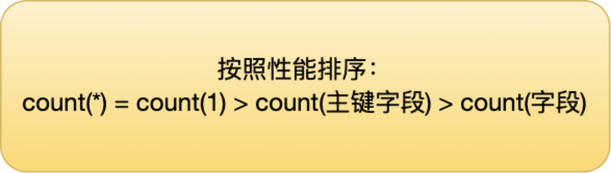

# 5.3.6 count()的用法

先说结论

在InnoDB中`COUNT(*)`和`COUNT(1)`实现上没有区别，而且效率一样，但是`COUNT(字段)`需要进行字段的非NULL判断，所以效率会低一些。

## 一、count(*)

**MyISAM**做了一个简单的优化，把表的总行数单独记录下来，如果执行`count(*)`时可以直接返回，前提是不能有where条件。MyISAM是表级锁，不会有并发的行操作，所以查到的结果是准确的。

**InnoDB**不能使用这种缓存操作，因为支持事务，大部分操作都是行级锁，行可能被并行修改，那么缓存记录不准确。但是，InnoDB还是针对COUNT(*)语句做了些优化的。InnoDB中索引分为聚簇索引（主键索引）和非聚簇索引（非主键索引），聚簇索引的叶子节点中保存的是整行记录，而非聚簇索引的叶子节点中保存的是该行记录的主键的值。

## 二、count(1)

对于`count(1)`和`count(*)`，MySQL的优化是完全一样的，根本不存在谁更快！但依旧建议使用`count(*)`，因为这是SQL92定义的标准统计行数的语法。

## 三、count(字段)

进行全表扫描，判断指定字段的值是否为`NULL`，不为`NULL`则累加。性能比`count(1)`和`count(*)`慢。

