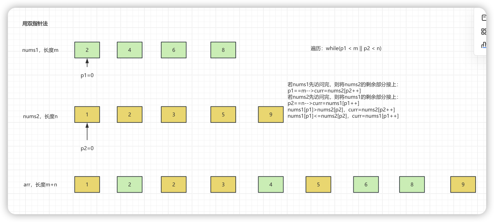

# 8.1.1 合并两个有序数组

Leetcode.88

解析：



代码：

```java
class Solution {
    public void merge(int[] nums1, int m, int[] nums2, int n) {
        int p1=0;
        int p2=0;
        int arr[]=new int[m+n];
        int curr;
        while (p1 < m || p2 < n){
            if (p1 == m){
                curr=nums2[p2++];
            }else if (p2 == n){
                curr=nums1[p1++];
            }else if (nums1[p1] > nums2[p2]){
                curr=nums2[p2++];
            }else{
                curr=nums1[p1++];
            }
            arr[p1+p2-1]=curr;
        }
        for (int i = 0; i < m + n; i++) {
            nums1[i]=arr[i];
        }
    }
}
```


