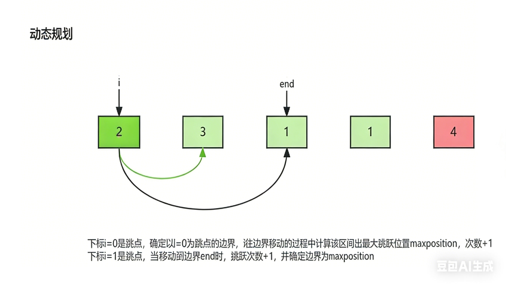

# 8.1.10 跳跃游戏II

**题目**：给定一个长度为 `n` 的 **0 索引**整数数组 `nums`。初始位置在下标 0。

每个元素 `nums[i]` 表示从索引 `i` 向后跳转的最大长度。换句话说，如果你在索引 `i` 处，你可以跳转到任意 `(i + j)` 处：

- `0 <= j <= nums[i]` 且
- `i + j < n`

返回到达 `n - 1` 的最小跳跃次数。测试用例保证可以到达 `n - 1`。


**分析**：i==end表示区间内进行了一次跳跃，选取区间元素能跳到最远距离为下一次的边界end



**代码**：

```java
class Solution {
    public int jump(int[] nums) {
        int length = nums.length;
        int maxposition=0;
        int end=0;
        int step=0;
        for (int i = 0; i < length - 1; i++) {
            maxposition=Math.max(maxposition,i+nums[i]);
            if (i==end){
                end=maxposition;
                step++;
            }
        }
        return step;
    }
}
```


