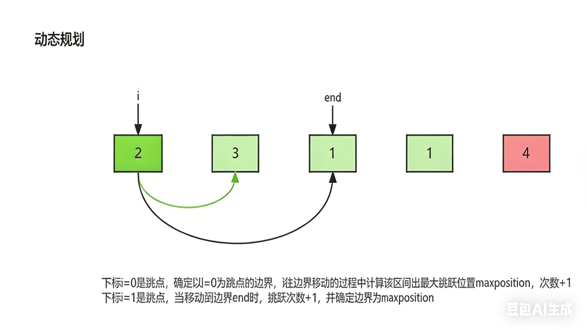

# 8.1.10 跳跃游戏II

**题目**：给定一个长度为 `n` 的 **0 索引**整数数组 `nums`。初始位置在下标 0。

每个元素 `nums[i]` 表示从索引 `i` 向后跳转的最大长度。换句话说，如果你在索引 `i` 处，你可以跳转到任意 `(i + j)` 处：

- `0 <= j <= nums[i]` 且
- `i + j < n`

返回到达 `n - 1` 的最小跳跃次数。测试用例保证可以到达 `n - 1`。


**分析**：i==end表示区间内进行了一次跳跃，选取区间元素能跳到最远距离为下一次的边界end



**代码**：

```java
class Solution {
    public int jump(int[] nums) {
        // 数组长度
        int length = nums.length;
        // 当前能到达的最远位置
        int maxposition=0;
        // 当前这一步的边界（走到这里必须跳一次）
        int end=0;
        // 记录跳跃次数
        int step=0;

        // 遍历数组，最后一个位置不用跳，所以到 length-1 为止
        for (int i = 0; i < length - 1; i++) {
            // 更新当前能到达的最远位置
            maxposition=Math.max(maxposition,i+nums[i]);
            
            // 到达当前边界，必须跳一步
            if (i==end){
                // 更新新的边界为最远位置
                end=maxposition;
                // 跳跃次数 +1
                step++;
            }
        }
        // 返回最少跳跃次数
        return step;
    }
}
```


