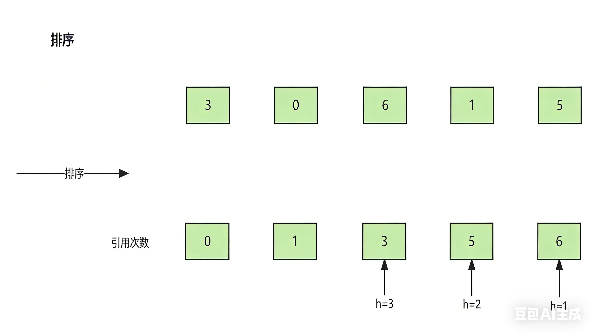

# 8.1.11 H指数

**题目**：给你一个整数数组 `citations` ，其中 `citations[i]` 表示研究者的第 `i` 篇论文被引用的次数。计算并返回该研究者的 **`h` 指数**。

根据维基百科上 [h 指数的定义](https://baike.baidu.com/item/h-index/3991452?fr=aladdin)：`h` 代表“高引用次数” ，一名科研人员的 `h` **指数** 是指他（她）至少发表了 `h` 篇论文，并且 **至少** 有 `h` 篇论文被引用次数大于等于 `h` 。如果 `h` 有多种可能的值，**`h` 指数** 是其中最大的那个。

**分析**：




**代码**：

```java
import java.util.Arrays;

class Solution {
    public int hIndex(int[] citations) {
        // 对引用次数数组进行升序排序
		Arrays.sort(citations);
        // 获取数组长度（论文总数）
        int length = citations.length;
        // 记录最终的 h 指数
        int h=0;
        
        // 从后往前遍历（从引用数最大的论文开始）
        for (int i = length-1; i >=0 ; i--) {
          // 是>，而不是>=
          // 如果当前论文的引用数 > 当前h值，说明可以构成更大的h指数
            if (citations[i]>h){
                h++;
            }
        }
        
        // 返回计算出的最大h指数
        return h;
    }
}
```

