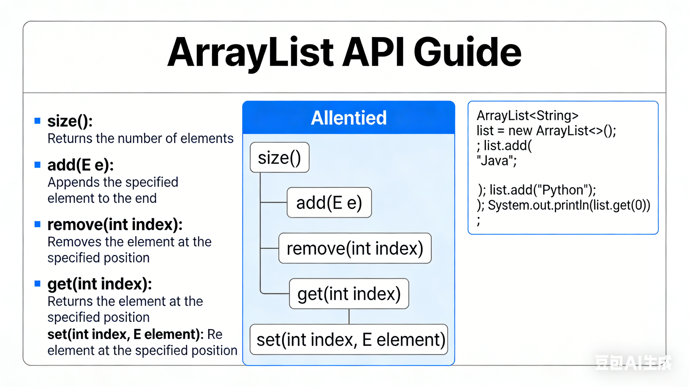

# 8.1.11 O(1) 时间插入、删除和获取随机元素

leetCode.380

**题目**：实现`RandomizedSet` 类：

- `RandomizedSet()` 初始化 `RandomizedSet` 对象
- `bool insert(int val)` 当元素 `val` 不存在时，向集合中插入该项，并返回 `true` ；否则，返回 `false` 。
- `bool remove(int val)` 当元素 `val` 存在时，从集合中移除该项，并返回 `true` ；否则，返回 `false` 。
- `int getRandom()` 随机返回现有集合中的一项（测试用例保证调用此方法时集合中至少存在一个元素）。每个元素应该有 **相同的概率** 被返回。

你必须实现类的所有函数，并满足每个函数的 **平均** 时间复杂度为 `O(1)` 。

**分析**：



**代码**：

```java
class RandomizedSet {
    List<Integer> list;
    Random random;
    Map<Integer,Integer> map;
    public RandomizedSet(){
        random=new Random();
        list=new ArrayList<>();
        map=new HashMap<>();
    }
    boolean insert(int val){
        if (map.containsKey(val)){
            return false;
        }
        int index = list.size();
        map.put(val,index);
        list.add(val);
        return true;
    }

    boolean remove(int val){
        if (!map.containsKey(val)){
            return false;
        }
        //获取val下标
        Integer index = map.get(val);
        //获取list最后一个元素
        Integer last = list.get(list.size() - 1);
        //将最后一个元素放到val位置
        list.set(index,last);
        //map里更新最后一个元素的下标
        map.put(last,index);
        //移除list的最后一个元素
        list.remove(list.size()-1);
        //移除map里的val
        map.remove(val);
        return true;
    }
    int getRandom(){
        int i = random.nextInt(list.size());
        return list.get(i);
    }
}
```


