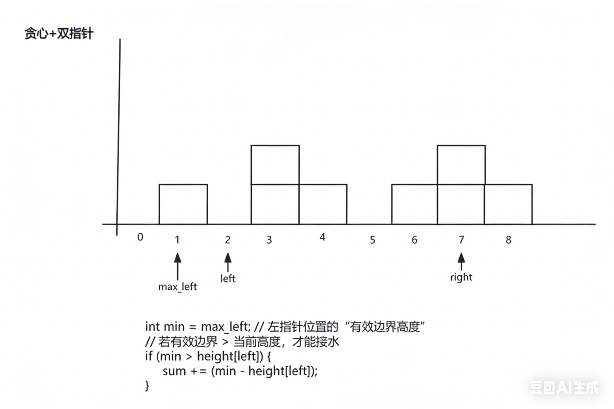

# 8.1.16 接雨水

**题目**：给定 `n` 个非负整数表示每个宽度为 `1` 的柱子的高度图，计算按此排列的柱子，下雨之后能接多少雨水。


**分析**



**代码**

```java
public int trap(int[] height) {
    int sum = 0; // 累计接雨水量
    int max_left = 0; // 左指针左侧的最大高度（不包含左指针本身）
    int max_right = 0; // 右指针右侧的最大高度（不包含右指针本身）
    int left = 1; // 左指针，从第2个位置开始（索引1）
    int right = height.length - 2; // 右指针，从倒数第2个位置开始（最后一个位置接不到水）
    
    // 遍历次数：总共有 n-2 个可接水的位置（首尾接不到水）
    for (int i = 1; i < height.length - 1; i++) {
        // 核心判断：哪边的“边界高度”更低，就处理哪边的指针
        if (height[left - 1] < height[right + 1]) {
            // 处理左指针：左边界更低，当前左指针位置的接水量由左边界决定
            // 更新左指针左侧的最大高度
            max_left = Math.max(max_left, height[left - 1]);
            int min = max_left; // 左指针位置的“有效边界高度”
            // 若有效边界 > 当前高度，才能接水
            if (min > height[left]) {
                sum += (min - height[left]);
            }
            left++; // 左指针右移
        } else {
            // 处理右指针：右边界更低，当前右指针位置的接水量由右边界决定
            // 更新右指针右侧的最大高度
            max_right = Math.max(max_right, height[right + 1]);
            int min = max_right; // 右指针位置的“有效边界高度”
            // 若有效边界 > 当前高度，才能接水
            if (min > height[right]) {
                sum += (min - height[right]);
            }
            right--; // 右指针左移
        }
    }
    return sum;
}
```


