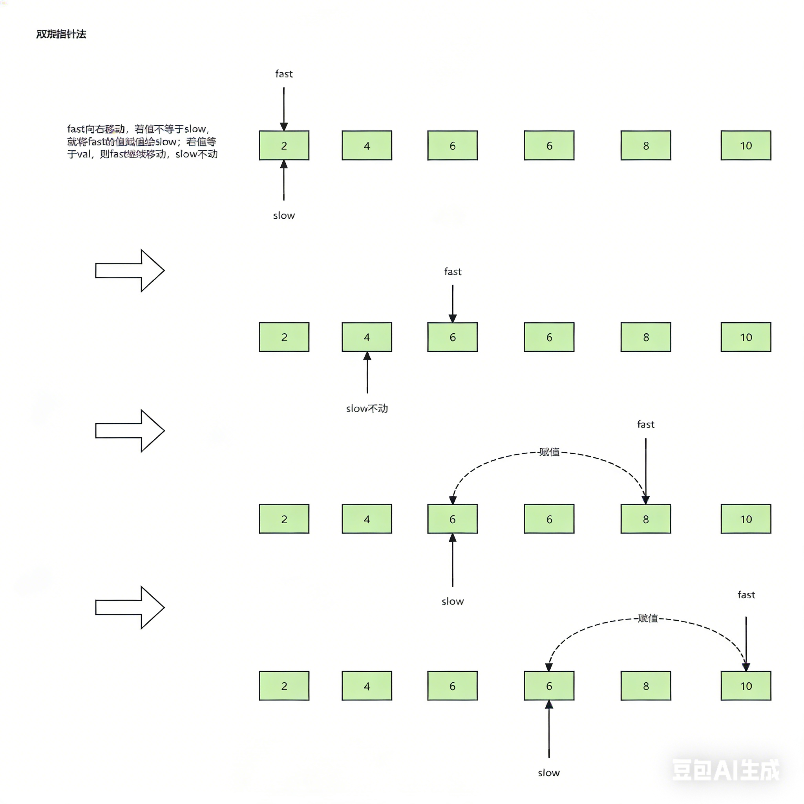

# 8.1.2 移除元素

leetCode.27

**题目**：给你一个数组 `nums` 和一个值 `val`，你需要 原地移除所有数值等于 `val` 的元素。元素的顺序可能发生改变。然后返回 `nums` 中与 `val` 不同的元素的数量。

假设 `nums` 中不等于 `val` 的元素数量为 `k`，要通过此题，您需要执行以下操作：

- 更改 `nums` 数组，使 `nums` 的前 `k` 个元素包含不等于 `val` 的元素。`nums` 的其余元素和 `nums` 的大小并不重要。
- 返回 `k`。

**分析**：



**代码**：

```java
class Solution {
    public int removeElement(int[] nums, int val) {
        int fast=0;
        int slow=0;
        while (fast < nums.length){
            if (nums[fast] != val){
                nums[slow++]=nums[fast];
            }
            fast++;
        }
        return slow;
    }
}
```

