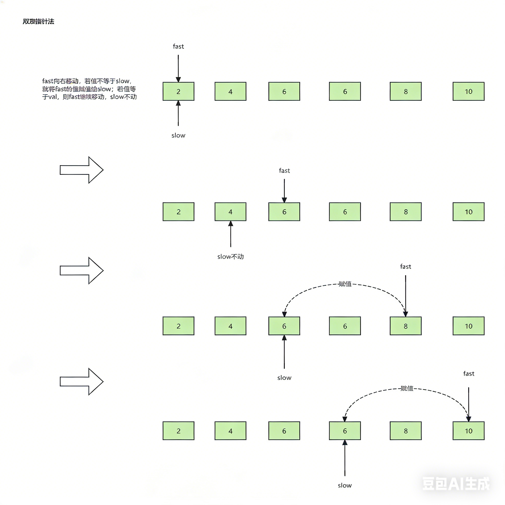

# 8.1.2 移除元素

leetCode.27

**题目**：给你一个数组 `nums` 和一个值 `val`，你需要 原地移除所有数值等于 `val` 的元素。元素的顺序可能发生改变。然后返回 `nums` 中与 `val` 不同的元素的数量。

假设 `nums` 中不等于 `val` 的元素数量为 `k`，要通过此题，您需要执行以下操作：

- 更改 `nums` 数组，使 `nums` 的前 `k` 个元素包含不等于 `val` 的元素。`nums` 的其余元素和 `nums` 的大小并不重要。
- 返回 `k`。

**分析**：



**代码**：

```java
class Solution {
    public int removeElement(int[] nums, int val) {
        // 快指针：遍历整个数组，寻找**不等于val**的元素（需要保留的元素）
        int fast = 0;
        // 慢指针：指向新数组的下标，记录有效元素应该存放的位置
        int slow = 0;

        // 快指针遍历完整个数组就停止
        while (fast < nums.length) {
            // 如果当前快指针指向的元素 不是要删除的值
            if (nums[fast] != val) {
                // 把这个有效元素 赋值给慢指针的位置
                nums[slow] = nums[fast];
                // 慢指针向后移动，准备存放下一个有效元素
                slow++;
            }
            // 无论是不是目标值，快指针都要向后走，继续遍历
            fast++;
        }

        // 慢指针最终的值 就是新数组的长度（有效元素个数）
        return slow;
    }
}
```

