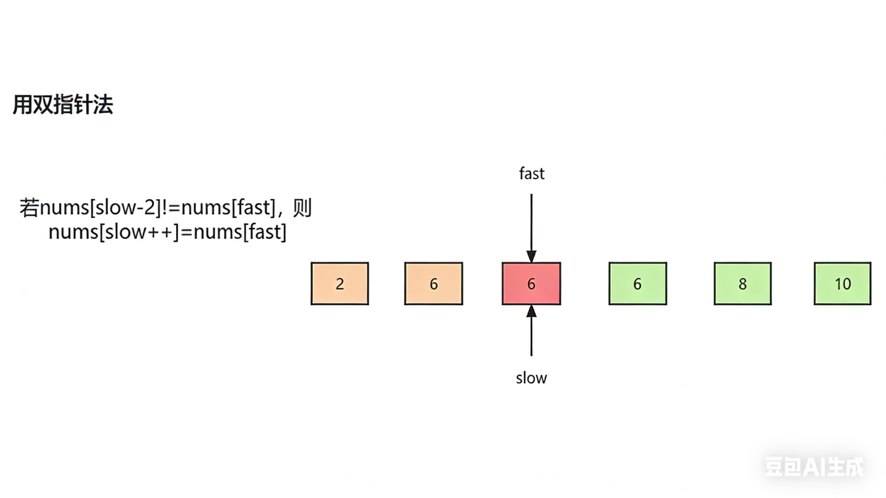

# 8.1.4 删除有序数组中的重复项II

leetCode.80

**题目**：给你一个有序数组 `nums` ，请你[ 原地](http://baike.baidu.com/item/原地算法)删除重复出现的元素，使得出现次数超过两次的元素**只出现两次** ，返回删除后数组的新长度。不要使用额外的数组空间，你必须在 [原地 ](https://baike.baidu.com/item/原地算法)修改输入数组并在使用 O(1) 额外空间的条件下完成。

**分析**：双指针，固定前两位，从第三位开始比较，比较nums[slow-2]!=nums[fast]，则nums[slow++]=nums[fast]



**代码**：

```java
class Solution {
    // LeetCode 80. 删除有序数组中的重复项 II
    // 每个元素最多出现 2 次，原地删除多余重复元素，返回新长度
    public int removeDuplicates(int[] nums) {
        // 获取数组长度
        int n = nums.length;
        // 数组长度小于等于2，本身就不会重复超过2次，直接返回
        if (n <= 2) {
            return n;
        }
        // 慢指针：指向待填充的有效元素位置
        // 前两个元素天然合法，直接从下标2开始
        int slow = 2;
        // 快指针：遍历数组，寻找符合条件的元素
        int fast = 2;

        // 快指针遍历整个数组
        while (fast < n) {
            // 核心判断：
            // slow-2 位置，是当前元素往前数第2个有效数字
            // 不相等 = 说明当前数没有出现两次以上，可以保留
            if (nums[slow - 2] != nums[fast]) {
                // 把当前合法元素存入慢指针位置，慢指针后移
                nums[slow++] = nums[fast];
            }
            // 无论是否保留，快指针都向后遍历
            fast++;
        }
        // slow 最终数值就是去重后的数组有效长度
        return slow;
    }
}
```


