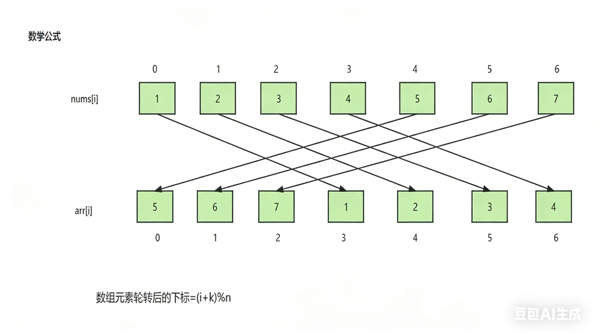

# 8.1.6 轮转数组

leetCode.189

**题目**：给定一个整数数组 `nums`，将数组中的元素向右轮转 `k` 个位置，其中 `k` 是非负数。


**分析**：




**代码**：

```java
class Solution {
    public void rotate(int[] nums, int k) {
        int n=nums.length;
        int[] arr=new int[n];
        for(int i=0;i<n;i++){
            arr[(i+k)%n]=nums[i];
        }
        for(int i=0;i<n;i++){
            nums[i]=arr[i];
        }
    }
}
```

