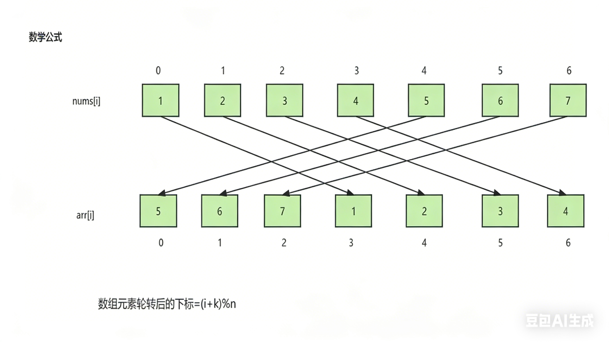

# 8.1.6 轮转数组

leetCode.189

**题目**：给定一个整数数组 `nums`，将数组中的元素向右轮转 `k` 个位置，其中 `k` 是非负数。


**分析**：




**代码**：

```java
class Solution {
    public void rotate(int[] nums, int k) {
        // 获取数组长度
        int n = nums.length;
        // 创建一个临时数组，用来存放旋转后的结果
        int[] arr = new int[n];
        
        // 遍历原数组，把每个元素放到旋转后的正确位置
        for(int i = 0; i < n; i++){
            // 计算新下标：(i + k) % n 保证下标不越界
            arr[(i + k) % n] = nums[i];
        }
        
        // 把临时数组里旋转好的结果拷贝回原数组
        for(int i = 0; i < n; i++){
            nums[i] = arr[i];
        }
    }
}
```

