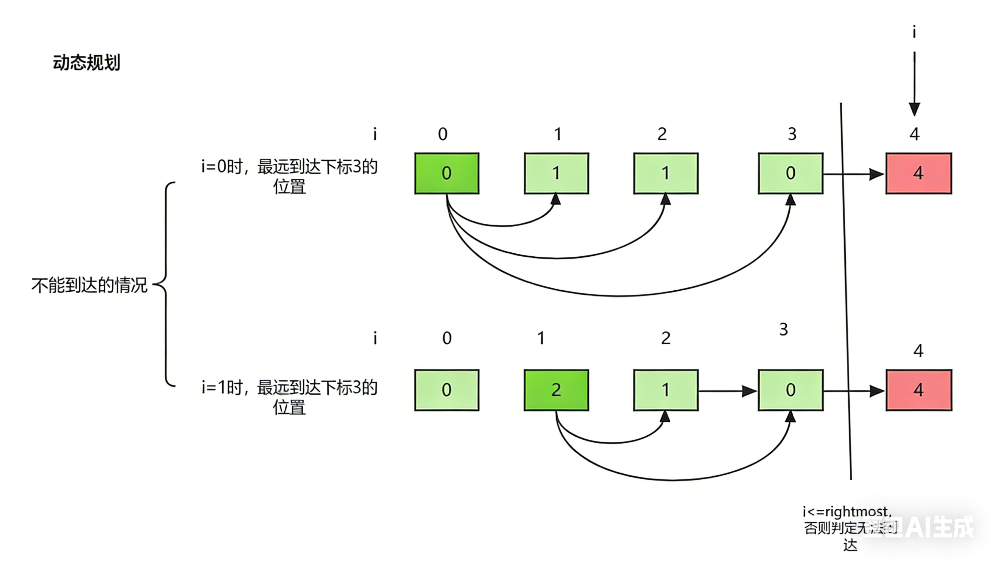

# 8.1.9 跳跃游戏

leetCode.55

**题目**：给你一个非负整数数组 `nums` ，你最初位于数组的 **第一个下标** 。数组中的每个元素代表你在该位置可以跳跃的最大长度。

判断你是否能够到达最后一个下标，如果可以，返回 `true` ；否则，返回 `false` 。

**分析**：

在遍历数组的过程中，始终维护一个 “能到达的最远位置”，只要这个最远位置能覆盖到最后一个下标，就说明可以到达；如果遍历过程中当前位置超出了最远位置，就说明走不通了。

遍历数组中的每个位置 `i`：

- 如果当前位置 `i` 已经超过了 `rightmost`，说明无法到达这个位置，直接返回 `false`。
- 计算从当前位置 `i` 能跳到的最远位置：`i + nums[i]`，并更新 `rightmost` 为两者中的较大值。
- 如果 `rightmost` 已经大于等于数组最后一个下标，直接返回 `true`（提前终止，优化效率）。

遍历结束后，检查 `rightmost` 是否覆盖最后一个下标，返回对应结果。




**代码**：

```java
class Solution {
    public boolean canJump(int[] nums) {
                int n = nums.length;
        int rightmost=0;
        for (int i = 0; i < n; i++) {
            if (i<=rightmost){
                rightmost=Math.max(i+nums[i],rightmost);
                if (rightmost>=n-1){
                    return true;
                }
            }
        }
        return false;
    }
}
```


