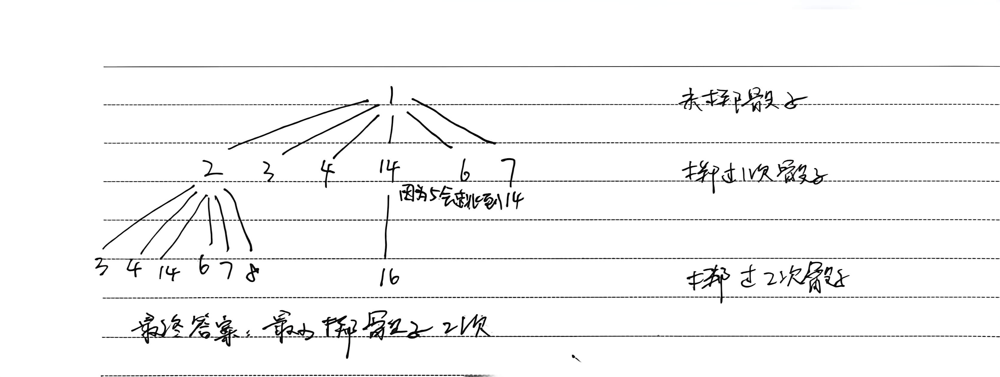

# 8.13.1 蛇梯棋

Leetcode.909

## 1、图的广度优先搜索模版

广度优先搜索以队列（deque）作为核心，其搜索核心是从始结点开始，寻找一步到达的合法可行点（可能存在其他条件限制），并加入队列，然后弹出始结点，由依次对队列中的结点执行寻找操作，直至队列为空

以下图为例：

```
				V1
			/			\
		V2				V3
	/		\			/		\
V4		V5   V6		V7
	\   /
	  V8
1.创建一个队列，将初始节点V1加入，并标记为已访问       							队列：V1
2.寻找V1邻接点（可一步到达的点），加入队列中，标记节点已访问					队列：V1 V2 V3
3.将头节点V1弹出队列																					 队列：V2 V3
4.寻找V2未被访问的邻接点，加入，标记节点已访问                     队列：V2 V3 V4 V5
5.将头节点V2弹出                                              队列：V3 V4 V5
6.寻找V3未被访问的邻接点，加入，标记节点已访问                     队列：V3 V4 V5 V6 V7
7.将头节点V3弹出                                              队列：V4 V5 V6 V7
8.寻找V4未被访问的邻接点，加入，标记节点已访问                     队列：V4 V5 V6 V7 V8
9.将头节点V4弹出                                              队列：V5 V6 V7 V8
10.找V5未被访问的邻接点，发现是V8，但是V8已访问过，故不处理，弹出V5  队列：V6 V7 V8
11.最终V6 V7 V8依次弹出，队列为空，遍历结束
```

代码模版：

```java
// 1. 定义队列 + 访问标记
Queue<节点类型> queue = new LinkedList<>();
boolean[] visited = new boolean[大小];

// 2. 起点入队
queue.offer(起点);
visited[起点] = true;
int step = 0;

// 3. BFS 主循环
while (!queue.isEmpty()) {
    // 层序遍历：一层 = 一步
    int size = queue.size();
    for (int i = 0; i < size; i++) {
        节点类型 cur = queue.poll();

        // 终点判断
        if (cur == 终点) {
            return step;
        }

        // 遍历所有邻居/下一步
        for (每个可能的下一步 next) {
            if (next 合法 && !visited[next]) {
                visited[next] = true;
                queue.offer(next);
            }
        }
    }
    step++;
}

// 无法到达
return -1;
```

图的广度优先搜索模版和二叉树的广度优先搜索很像，[8.10.1 二叉树的右视图](https://ranqingisfine.github.io/myBlog/%E5%85%AB%E3%80%81LeetCode/8.10%20%E4%BA%8C%E5%8F%89%E6%A0%91%E5%B1%82%E6%AC%A1%E9%81%8D%E5%8E%86/8.10.1%20%E4%BA%8C%E5%8F%89%E6%A0%91%E7%9A%84%E5%8F%B3%E8%A7%86%E5%9B%BE.html)


## 2.蛇梯棋

### 2.1 题目

题目太长，不易理解，略

**棋盘长啥样？**

```
1.是一个 n × n 的方格棋盘（比如 6×6=36 格）
2.编号从 1 开始，到 n² 结束
3.行走方向是 从左下角 → 向右走
4.走完一行，下一行反过来从右向左走，像蛇一样来回走
5.所以行方向是交替左右的
例如：
int[][] board = {
    {-1, -1, -1, -1},   // 行0：16 15 14 13
    {-1, -1, -1, -1},   // 行1： 9 10 11 12
    {-1, -1, -1, 14},   // 行2： 8  7  6  5 → 5 是梯子，跳 14
    {-1, -1, -1, -1}    // 行3： 1  2  3  4
};
```

**要干什么？**

```
1.每次掷骰子，会得到 1～6 之间的数：
2.你可以 向前走 1～6 格
3.只能前进，不能后退
4.走到哪一格，就停在哪一格
```

**怎么移动？**

```
1.每次掷骰子，会得到 1～6 之间的数：
2.你可以 向前走 1～6 格
3.只能前进，不能后退
4.走到哪一格，就停在哪一格
```

**什么是梯子？什么是蛇？**

```
棋盘上有些格子不是 -1，而是一个数字：
梯子：格子里的数字 比当前格大
走到这一格 → 直接往上跳到目标数字格
蛇：格子里的数字 比当前格小
走到这一格 → 直接掉下去到目标数字格
```

规则重点：**不管是梯子还是蛇，走到就必须传送，不能选择不跳！**


### 2.2 分析

最少掷骰子次数=最短路径步数，这种 “最少步数、最短路、最小变化” 问题，天生就是 BFS 的主场

举例：

- 终点：**16**
- 只有一个梯子：**5 号格 → 直接跳到 14 号**
- 其他都是普通格（-1）

所以输入 `board` 是：

```
int[][] board = {
    {-1, -1, -1, -1},   // 行0：16 15 14 13
    {-1, -1, -1, -1},   // 行1： 9 10 11 12
    {-1, -1, -1, 14},   // 行2： 8  7  6  5 → 5 是梯子，跳 14
    {-1, -1, -1, -1}    // 行3： 1  2  3  4
};
```

完整走一遍BFS

目标：从 **1 → 16**，求最少步数




### 2.3 代码

```java
class Solution {
    public int snakesAndLadders(int[][] board) {
        // 棋盘是 n x n 的正方形
        int n = board.length;
        
        // 终点就是最后一格：n*n
        int target = n * n;

        // 标记哪些数字格子已经访问过，防止重复走、死循环
        // 因为格子编号是 1 ~ target，不是 0 ~ target-1
				// 数组下标从 0 开始，为了让下标 = 格子编号，必须多开 1 位！
        boolean[] vis = new boolean[target + 1];

        // BFS 队列：存放【当前所在的数字格子】
        Deque<Integer> q = new ArrayDeque<>();

        // 游戏从 1 号格子开始
        q.offer(1);
        vis[1] = true;  // 标记已访问

        // 记录掷骰子的次数（= 步数）
        int step = 0;

        // ------------------------------
        // BFS 主循环：一层 = 一步
        // ------------------------------
        while (!q.isEmpty()) {
            // 每一层的节点数量（这一步能走到的所有位置）
            int size = q.size();

            // 遍历当前这一层所有节点
            for (int i = 0; i < size; i++) {
                // 取出当前所在格子
                int cur = q.poll();

                // 如果已经到终点，直接返回当前步数（最少步数）
                if (cur == target) return step;

                // --------------------------
                // 核心：掷骰子！1～6 六种可能
                // --------------------------
                for (int d = 1; d <= 6; d++) {
                    // 掷出 d，就往前走 d 格
                    int next = cur + d;

                    // 超出终点，不用继续看更大的骰子了
                    if (next > target) break;

                    // ==========================================
                    // 关键：把数字 next → 转换成二维坐标 (r, c)
                    // 因为棋盘是来回蛇形的，必须这样算
                    // ==========================================
                    int r = n - 1 - (next - 1) / n;
                    
                    // 判断这一行是正序还是反序
                    // 偶数行（从下数）：正序
                    // 奇数行（从下数）：反序
                    int c = ((next - 1) / n % 2 == 0) 
                            ? (next - 1) % n        // 正序
                            : n - 1 - (next - 1) % n; // 反序

                    // ==========================================
                    // 如果这个格子是 蛇 / 梯子
                    // 必须强制跳转到 board[r][c] 这个数字
                    // ==========================================
                    if (board[r][c] != -1) {
                        next = board[r][c];
                    }

                    // ==========================================
                    // 这个最终位置没访问过 → 加入队列
                    // ==========================================
                    if (!vis[next]) {
                        vis[next] = true;
                        q.offer(next);
                    }
                }
            }

            // 一层走完 = 掷了一次骰子 = 步数 +1
            step++;
        }

        // 队空了还没到终点 → 无法到达
        return -1;
    }
}
```


