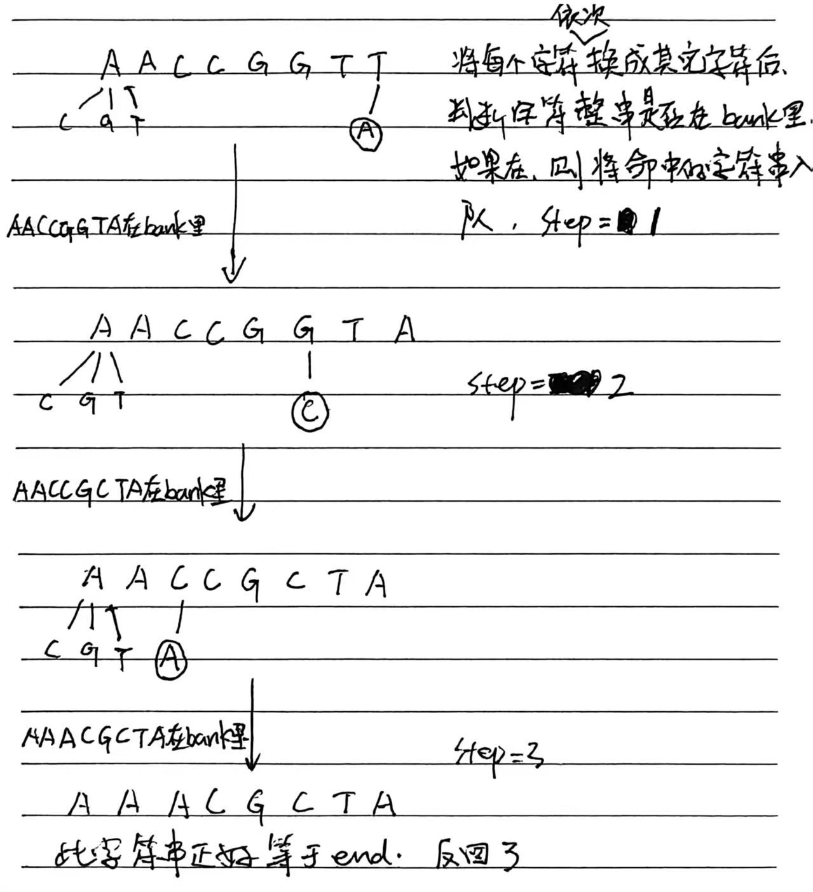

# 8.13.2 最小基因变化

Leetcode.433

## 1、题目

基因序列可以表示为一条由 8 个字符组成的字符串，其中每个字符都是 `'A'`、`'C'`、`'G'` 和 `'T'` 之一。

假设我们需要调查从基因序列 `start` 变为 `end` 所发生的基因变化。一次基因变化就意味着这个基因序列中的一个字符发生了变化。

- 例如，`"AACCGGTT" --> "AACCGGTA"` 就是一次基因变化。

另有一个基因库 `bank` 记录了所有有效的基因变化，只有基因库中的基因才是有效的基因序列。（变化后的基因必须位于基因库 `bank` 中）

给你两个基因序列 `start` 和 `end` ，以及一个基因库 `bank` ，请你找出并返回能够使 `start` 变化为 `end` 所需的最少变化次数。如果无法完成此基因变化，返回 `-1` 。

注意：起始基因序列 `start` 默认是有效的，但是它并不一定会出现在基因库中。


题目理解：

```
1.给一个起始基因 `start`，目标基因 `end`
2.每次**只能改一个字符**
3.字符只能是：`A, C, G, T`
4.改完后的基因必须在基因库 `bank` 里才算合法
5.求**最少改几次**能从 start 变成 end
6.不行就返回 -1
```


## 2、分析

其实就是一个单向图。例如：start = "AACCGGTT" end   = "AAACGCTA" bank  = ["AACCGGTA", "AACCGCTA", "AAACGCTA"]




## 3、代码

```java
class Solution {
    public int minMutation(String start, String end, String[] bank) {
        // 先把基因库放进Set，O(1)查找
        Set<String> bankSet = new HashSet<>();
        for (String s : bank) {
            bankSet.add(s);
        }
        // 目标基因不在库里，直接不可能
        if (!bankSet.contains(end)) return -1;

        // 四个可用字符
        char[] genes = {'A', 'C', 'G', 'T'};
        // BFS队列
        Deque<String> q = new ArrayDeque<>();
        // 记录访问过的，防止回头
        Set<String> visited = new HashSet<>();

        q.offer(start);
        visited.add(start);
        int step = 0;

        while (!q.isEmpty()) {
            int size = q.size();
            // 一层 = 一步
            for (int i = 0; i < size; i++) {
                String cur = q.poll();

                // 到达目标，返回步数
                if (cur.equals(end)) return step;

                // 把当前基因转成数组方便修改
                char[] curArr = cur.toCharArray();

                // 遍历每一位（基因长度固定为8）
                for (int j = 0; j < 8; j++) {
                    // 保存原来的字符
                    char old = curArr[j];

                    // 尝试换成 A/C/G/T
                    for (char c : genes) {
                        // 和原来一样就不用改
                        if (c == old) continue;

                        curArr[j] = c;
                        String next = new String(curArr);

                        // 在库里 + 没访问过 → 下一步
                        if (bankSet.contains(next) && !visited.contains(next)) {
                            visited.add(next);
                            q.offer(next);
                        }
                    }
                    // 改回原来字符，继续下一位
                    curArr[j] = old;
                }
            }
            // 一层走完，步数+1
            step++;
        }

        // 队空了还没找到
        return -1;
    }
}
```


