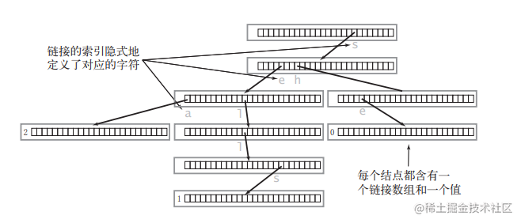

# 8.14.1 实现Trie（前缀树）

Leetcode.208

**高频**

## 1、题目

**[Trie](https://baike.baidu.com/item/字典树/9825209?fr=aladdin)**（发音类似 "try"）或者说 **前缀树** 是一种树形数据结构，用于高效地存储和检索字符串数据集中的键。这一数据结构有相当多的应用情景，例如自动补全和拼写检查。

请你实现 Trie 类：

- `Trie()` 初始化前缀树对象。
- `void insert(String word)` 向前缀树中插入字符串 `word` 。
- `boolean search(String word)` 如果字符串 `word` 在前缀树中，返回 `true`（即，在检索之前已经插入）；否则，返回 `false` 。
- `boolean startsWith(String prefix)` 如果之前已经插入的字符串 `word` 的前缀之一为 `prefix` ，返回 `true` ；否则，返回 `false` 。

## 2、分析

- 每个节点是一个 `TrieNode`

- 每个节点有 **26 个孩子**（对应 a～z），例如：TrieNode[0]!=null-->代表a，TrieNode[1]!=null-->代表b

- 每个节点有一个标记 `isEnd`：表示**这里是不是一个单词的结尾**

```java
class TrieNode {
    TrieNode[] children;
    boolean isEnd;

    public TrieNode() {
        children = new TrieNode[26];
        isEnd = false;
    }
}
```





## 3、代码

```java
class Trie {

    // ====================== 1. 定义前缀树的节点 ======================
    // 每个节点代表一个字母
    class TrieNode {
        // 子节点数组
        // 长度 26，对应 a-z 26 个小写字母
        // children[i] 不为 null 表示存在对应的字母路径
        TrieNode[] children;

        // 标记：当前节点是否是【某个单词的结束字母】
        // 比如 app 走完，最后一个 p 节点 isEnd = true
        boolean isEnd;

        // 节点构造方法
        public TrieNode() {
            // 每个节点一开始都有 26 个空位，全部是 null
            children = new TrieNode[26];
            // 默认不是单词结尾
            isEnd = false;
        }
    }

    // ====================== 2. 前缀树根节点 ======================
    // 整棵树的起点，不代表任何字母
    private TrieNode root;

    // 构造方法：创建一棵空 Trie
    public Trie() {
        root = new TrieNode();
    }

    // ====================== 3. 插入单词到前缀树 ======================
    public void insert(String word) {
        // 从根节点开始遍历
        TrieNode cur = root;

        // 逐个处理单词里的每一个字符
        for (char c : word.toCharArray()) {
            // 把字符转成 0~25 的索引 a->0, b->1 ... z->25
            int idx = c - 'a';

            // 如果当前节点的这个字母位置是空的
            // 说明这条路还没建，新建一个节点
            if (cur.children[idx] == null) {
                cur.children[idx] = new TrieNode();
            }

            // 走到下一个节点（沿着字母路径前进）
            cur = cur.children[idx];
        }

        // 单词所有字符遍历完了
        // 把最后一个节点标记为【单词结尾】
        cur.isEnd = true;
    }

    // ====================== 4. 查找【完整单词】是否存在 ======================
    public boolean search(String word) {
        TrieNode cur = root;

        // 逐个字符走路径
        for (char c : word.toCharArray()) {
            int idx = c - 'a';

            // 某一步发现没路了，说明单词不存在
            if (cur.children[idx] == null) {
                return false;
            }

            // 继续往前走
            cur = cur.children[idx];
        }

        // 路径走完了
        // 必须最后一个节点是【单词结尾】，才说明这个单词存在
        return cur.isEnd;
    }

    // ====================== 5. 查找是否有【以 prefix 开头】的单词 ======================
    public boolean startsWith(String prefix) {
        TrieNode cur = root;

        // 逐个字符走路径
        for (char c : prefix.toCharArray()) {
            int idx = c - 'a';

            // 某一步没路，说明没有这个前缀
            if (cur.children[idx] == null) {
                return false;
            }

            cur = cur.children[idx];
        }

        // 能完整走完前缀所有字符
        // 就说明前缀存在，直接返回 true
        // 不需要看 isEnd！
        return true;
    }
}
```


