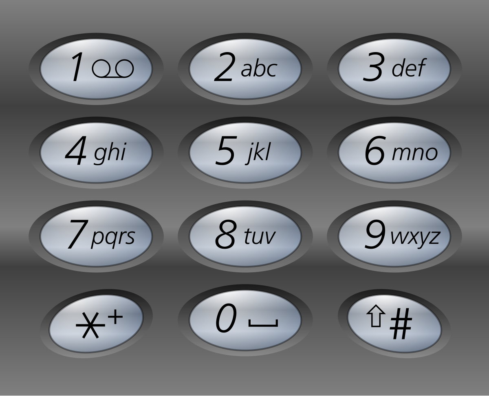
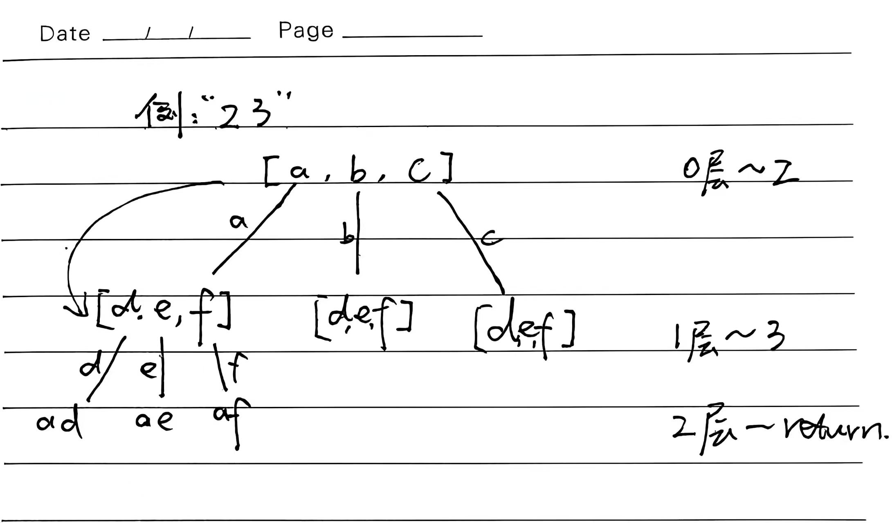

# 8.15.1 电话号码的字母组合

Leetcode.17

## 1、题目

给定一个仅包含数字 `2-9` 的字符串，返回所有它能表示的字母组合。答案可以按 **任意顺序** 返回。

给出数字到字母的映射如下（与电话按键相同）。注意 1 不对应任何字母。




## 2、分析

**回溯（DFS）枚举所有可能**

- 数字到字母做一个映射
- 按顺序每一位数字，选一个对应字母拼起来
- 拼完所有数字就加入结果



回溯这类问题可以转化为树的问题思考

## 3、代码

```java
class Solution {
    public List<String> letterCombinations(String digits) {
        List<String> res = new ArrayList<>();
        if (digits == null || digits.isEmpty()) return res;

        // 数字到字母映射
        String[] map = {
            "", "", "abc", "def", "ghi", "jkl",
            "mno", "pqrs", "tuv", "wxyz"
        };

        dfs(digits, map, 0, new StringBuilder(), res);
        return res;
    }

    // index：现在处理第几个数字
    // sb：当前拼接的字符串
    private void dfs(String digits, String[] map, int index,
                     StringBuilder sb, List<String> res) {
        // 出口：拼接完成
        if (index == digits.length()) {
            res.add(sb.toString());
            return;
        }

        // 当前数字
        int num = digits.charAt(index) - '0';
        String letters = map[num];

        // 枚举每个字母
        for (char c : letters.toCharArray()) {
            sb.append(c);            // 选
            dfs(digits, map, index + 1, sb, res); // 下一位
            sb.deleteCharAt(sb.length() - 1); // 回溯：撤销
        }
    }
}
```

