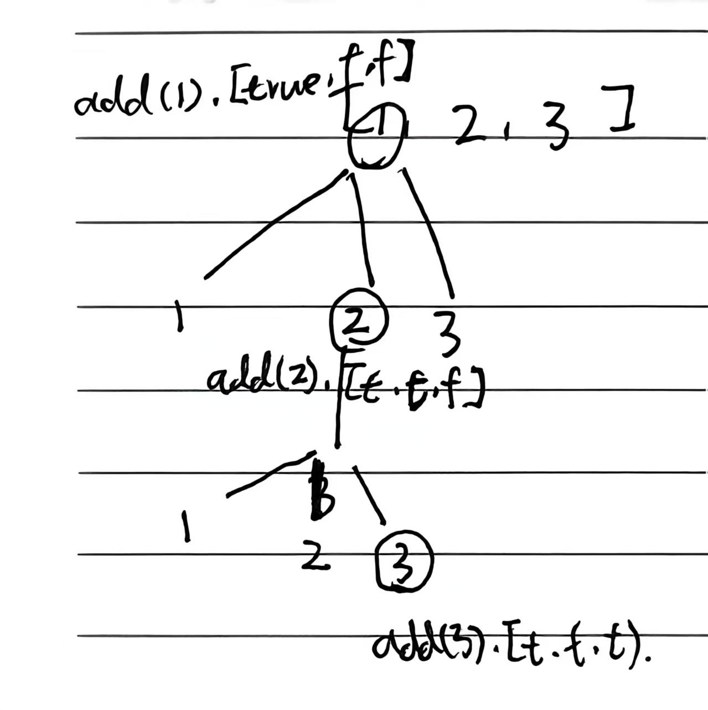

# 8.15.3 全排列

leetcode 46

## 1、题目

给定一个不含重复数字的数组 `nums` ，返回其 *所有可能的全排列* 。你可以 **按任意顺序** 返回答案。

**示例 1：**

```
输入：nums = [1,2,3]
输出：[[1,2,3],[1,3,2],[2,1,3],[2,3,1],[3,1,2],[3,2,1]]
```


## 2、分析

- 一个 `path` 记录当前排列

- 一个 `used[]` 标记**哪个数字已经被用过**

- 长度够了就加入结果



- 然后节点3后开始回溯到节点2，节点2回溯到节点1
- 节点1访问节点3
- ...

## 3、代码

```java
class Solution {
    public List<List<Integer>> permute(int[] nums) {
        List<List<Integer>> res = new ArrayList<>();
        boolean[] used = new boolean[nums.length];
        backtrack(nums, used, new ArrayList<>(), res);
        return res;
    }

    private void backtrack(int[] nums, boolean[] used, 
                          List<Integer> path, List<List<Integer>> res) {
        // 出口：长度够了
        if (path.size() == nums.length) {
            res.add(new ArrayList<>(path));
            return;
        }

        for (int i = 0; i < nums.length; i++) {
            if (used[i]) continue; // 跳过已用

            used[i] = true;
            path.add(nums[i]);

            backtrack(nums, used, path, res);

            // 回溯
            path.remove(path.size() - 1);
            used[i] = false;
        }
    }
}
```


