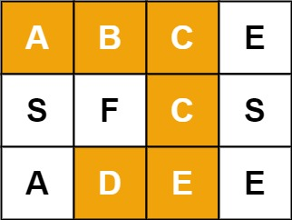

# 8.15.7 单词搜索

Leetcode.79

## 1、题目

给定一个 `m x n` 二维字符网格 `board` 和一个字符串单词 `word` 。如果 `word` 存在于网格中，返回 `true` ；否则，返回 `false` 。

单词必须按照字母顺序，通过相邻的单元格内的字母构成，其中“相邻”单元格是那些水平相邻或垂直相邻的单元格。同一个单元格内的字母不允许被重复使用。

例如：




```
输入：board = [['A','B','C','E'],['S','F','C','S'],['A','D','E','E']], word = "ABCCED"
输出：true
```

## 2、分析

**DFS 回溯 + 标记走过的位置**

1. 以**每一个格子**作为起点，开始搜索
2. 每走一步，先看字符是否匹配单词当前位
3. 匹配就继续往**上下左右**递归
4. 走过的格子**临时标记**，避免重复走
5. 递归回来后**恢复标记**（回溯）
6. 单词全部匹配完 → 返回 true

为啥要设置走过的格子为#？

**只有当前字符匹配单词，才会走到标记 # 这一步。**

而被标记成 # 的格子：

- 下一次再走到这里时
- `board[i][j]` 是 `#`
- 必然 **不等于** 单词里的字母
- 直接在第一步就被拦截，返回 false

## 3、代码

```java
class Solution {
    public boolean exist(char[][] board, String word) {
        for (int i = 0; i < board.length; i++) {
            for (int j = 0; j < board[0].length; j++) {
                if (dfs(word,0,i,j,board)){
                    return true;
                }
            }
        }
        return false;
    }
    private boolean dfs(String word,int index,int i,int j,char[][] board){
        if (index == word.length()){
            return true;
        }
        //控制方向
        if (i<0 || i>=board.length || j<0 ||j>=board[0].length || word.charAt(index) !=board[i][j]){
            return false;
        }
        char tmp = board[i][j];
        //这样可以完全保证不会再次访问
        board[i][j]='#';
        if (dfs(word,index+1,i+1,j,board)||
        dfs(word,index+1,i-1,j,board)||
        dfs(word,index+1,i,j+1,board)||
        dfs(word,index+1,i,j-1,board)) {
            return true;
        }
        board[i][j]=tmp;
        return false;
    }
}
```

