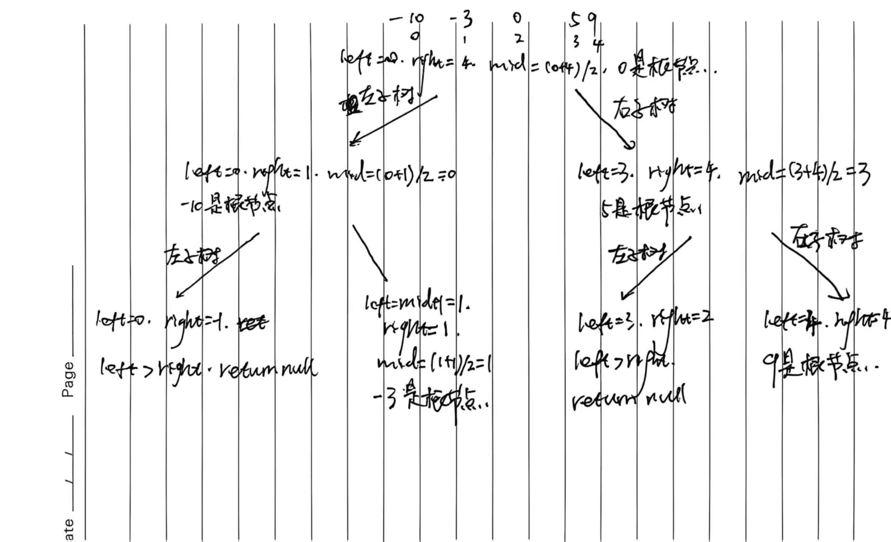

# 8.16.1 将有序数组转换为二叉搜索树

## 1、题目

给你一个整数数组 `nums` ，其中元素已经按 **升序** 排列，请你将其转换为一棵 平衡 二叉搜索树。


## 2、分析

二叉搜索树是左节点小于根节点小于右节点

升序数组本来就是**BST 的中序遍历**。

要平衡，就必须**每次选中间元素当根节点**：

- 中间左边 → 左子树
- 中间右边 → 右子树

这就是典型的**分治法 + 递归**。



## 3、代码

```java
class Solution {
    public TreeNode sortedArrayToBST(int[] nums) {
        // 递归构建整棵树，范围 0 ~ nums.length-1
        return build(nums, 0, nums.length - 1);
    }

    // 分治递归：在 [left, right] 区间构建子树
    private TreeNode build(int[] nums, int left, int right) {
        // 递归出口：区间无效
        if (left > right) {
            return null;
        }

        // 取中间位置作为根节点（保证平衡）
        int mid = (left + right) / 2;
        TreeNode root = new TreeNode(nums[mid]);

        // 左边区间构建左子树
        root.left = build(nums, left, mid - 1);
        // 右边区间构建右子树
        root.right = build(nums, mid + 1, right);

        return root;
    }
}
```

