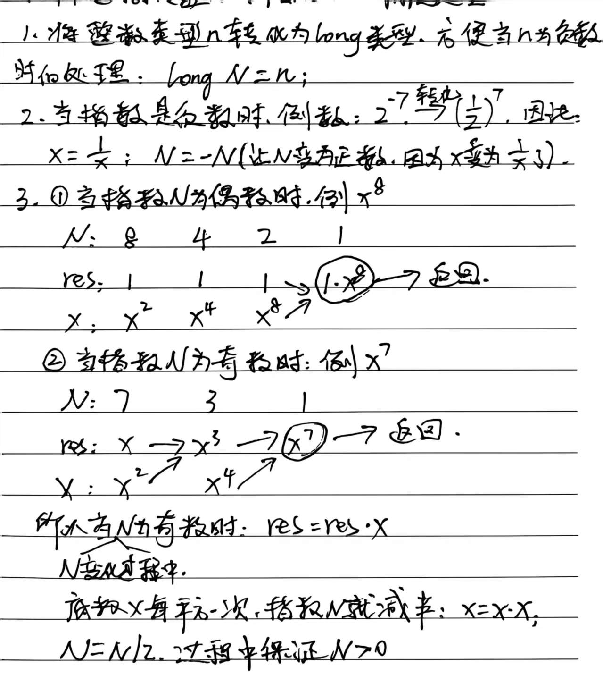

# 8.21.5 Pow(x,n)

leetcode.50

## 1、题目

实现 [pow(*x*, *n*)](https://www.cplusplus.com/reference/valarray/pow/) ，即计算 `x` 的整数 `n` 次幂函数（即，`xn` ）。

**示例 1：**

```
输入：x = 2.00000, n = 10
输出：1024.00000
```

**示例 2：**

```
输入：x = 2.10000, n = 3
输出：9.26100
```

## 2、分析



## 3、代码

```java
class Solution {
    public double myPow(double x, int n) {
        long N=n;
        if (N<0){
            x=1/x;
            N=-N;
        }
        double res=1;
        while (N>0){
            if (N%2 == 1){
                res=res*x; //奇数：多乘一个当前底数
            }
            x=x*x; // 底数平方
            N=N/2; // 指数折半
        }
        return res;
    }
}
```


