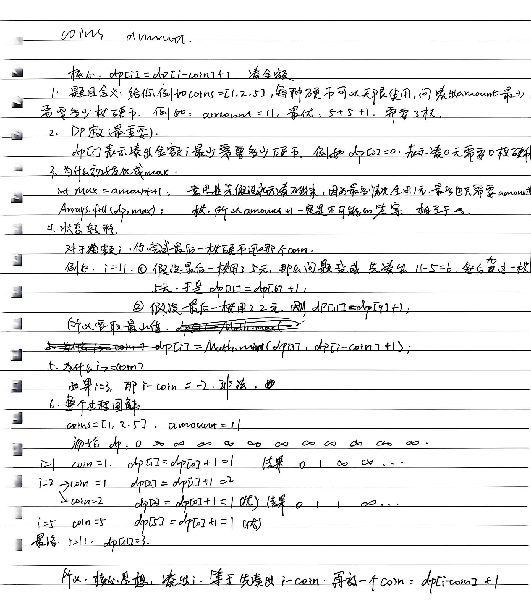

# 8.22.4 零钱兑换

leetcode.322

  ## 1、题目

给你一个整数数组 `coins` ，表示不同面额的硬币；以及一个整数 `amount` ，表示总金额。

计算并返回可以凑成总金额所需的 **最少的硬币个数** 。如果没有任何一种硬币组合能组成总金额，返回 `-1` 。

你可以认为每种硬币的数量是无限的。

## 2、分析





## 3、代码

```java
class Solution {
    public int coinChange(int[] coins, int amount) {
        int max=amount+1;
        int[] dp=new int[amount+1];
        Arrays.fill(dp,max);
        dp[0]=0;
        for (int i = 1; i <= amount; i++) {
            for (int coin : coins) {
                if(i>=coin){
                    dp[i]=Math.min(dp[i],dp[i-coin]+1);
                }
            }
        }
        return dp[amount] == max ? -1 : dp[amount];
    }
}
```

