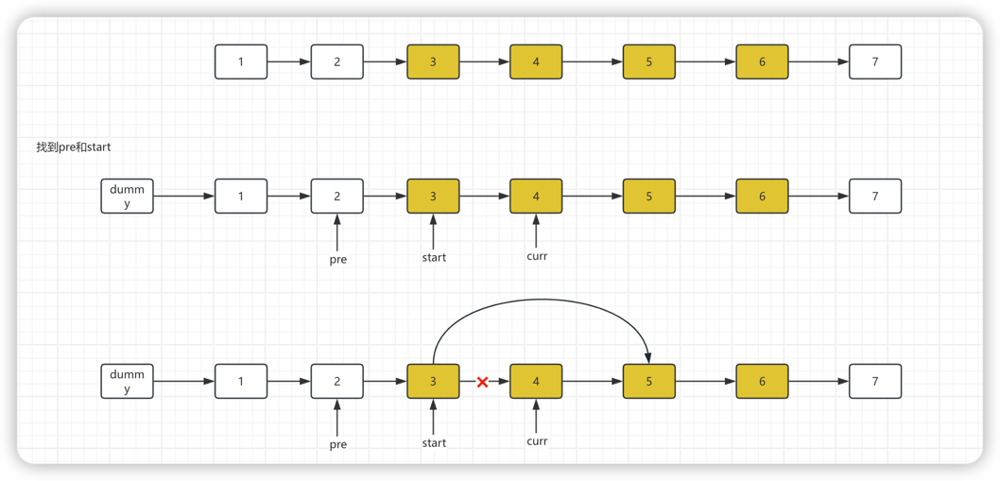
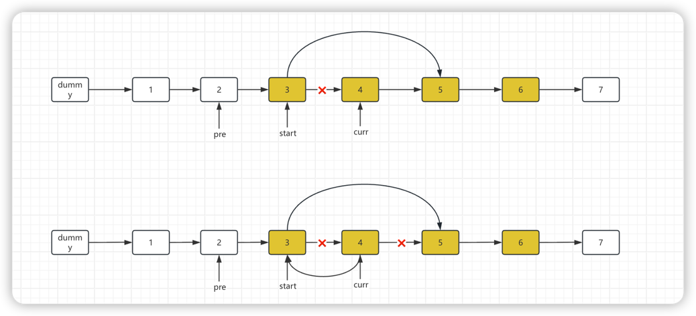
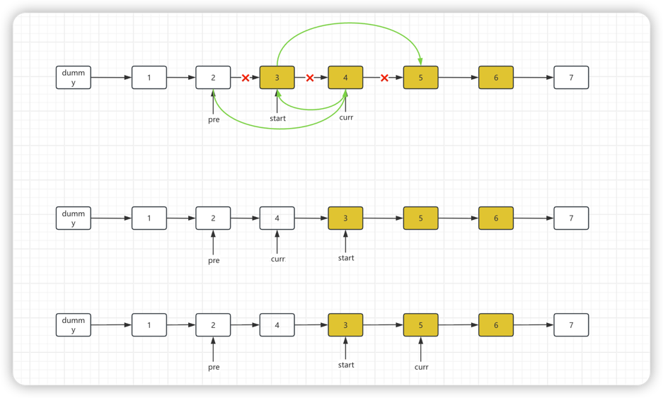
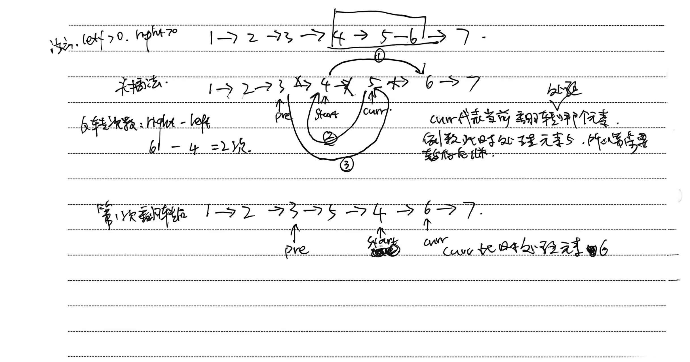

# 8.8.5 反转链表II

leetCode.92

**题目**：

给你单链表的头指针 `head` 和两个整数 `left` 和 `right` ，其中 `left <= right` 。请你反转从位置 `left` 到位置 `right` 的链表节点，返回 **反转后的链表** 。

注意left和right是从下标1开始，而不是下标0开始。

**示例 1：**


```
输入：head = [1,2,3,4,5], left = 2, right = 4
输出：[1,4,3,2,5]
```

**分析**：










**代码**：

pre节点和start位置确定过后就不动，curr往后移动

```java
/**
 * Definition for singly-linked list.
 * public class ListNode {
 *     int val;
 *     ListNode next;
 *     ListNode() {}
 *     ListNode(int val) { this.val = val; }
 *     ListNode(int val, ListNode next) { this.val = val; this.next = next; }
 * }
 */
class Solution {
    public ListNode reverseBetween(ListNode head, int left, int right) {
        // 1. 初始化虚拟头节点（解决left=1时无前驱的问题）
        ListNode dummy = new ListNode(0);
        dummy.next = head;
        
        // 2. 定位反转区间的前驱节点pre（最终停在left-1的位置）
        ListNode pre = dummy;
        for (int i = 1; i < left; i++) {
            pre = pre.next;
        }
        
        // 3. 定位反转区间的头节点start（left位置）、当前节点curr（初始=start）
        ListNode start = pre.next;
        ListNode curr = start.next;
        
        // 4. 局部反转：反转right-left次（把curr节点逐个插到pre和start之间）
        for (int i = 0; i < right - left; i++) {
            start.next = curr.next; // 步骤1：start指向curr的下一个节点（暂存后继）
            curr.next = pre.next;   // 步骤2：curr指向pre的下一个节点（反转指针）
            pre.next = curr;        // 步骤3：pre指向curr（curr成为新的区间头）
            curr = start.next;      // 步骤4：curr移动到start的下一个节点（继续反转）
        }
        
        // 5. 返回结果（虚拟头节点的next，兼容left=1的情况）
        return dummy.next;
    }
}
```


